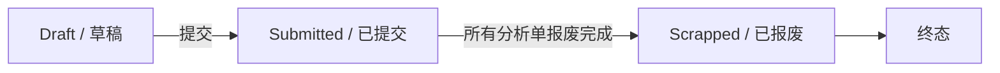

# 退货单"已报废"状态设计文档

**日期**: 2026-04-24
**作者**: AI Assistant
**状态**: 已批准

---

## 1. 需求概述

当退货单下所有关联分析单完成报废流程（达到 `workon_scrapped` 状态）时，退货单自动变更为"已报废"状态，表示该退货单及其所有售后件已完成报废流程。

### 1.1 业务背景

当前系统设计中，退货单仅有 `draft`（草稿）和 `submitted`（已提交）两个状态。报废流程在分析单（M04）层面进行，但退货单层面缺乏对应的状态标识。本设计新增 `scrapped`（已报废）状态以完善状态流转。

### 1.2 设计目标

- 自动化：最后一个分析单完成报废时，系统自动更新退货单状态
- 明确性：用户可通过退货单状态直观了解报废完成情况
- 完整性：完善退货单全生命周期状态管理

---

## 2. 状态定义

### 2.1 状态枚举

| 状态代码 | 状态名称 | 中文标签 | 样式 | 是否终态 |
|----------|----------|----------|------|----------|
| `draft` | Draft | 草稿 | 灰色 | 否 |
| `submitted` | Submitted | 已提交 | 蓝色 | 否 |
| `scrapped` | Scrapped | 已报废 | 红色 | 是 |

### 2.2 状态流转图



### 2.3 状态说明

- `draft`：退货单创建初期，可编辑、可删除
- `submitted`：退货单已提交，后续流程在分析单中进行
- `scrapped`：退货单下所有分析单已完成报废，终态，不可回退

---

## 3. 触发逻辑

### 3.1 触发条件

退货单满足以下条件时，自动变更为 `scrapped` 状态：

1. 退货单当前状态为 `submitted`
2. 该退货单下所有关联分析单的状态均为 `workon_scrapped`

### 3.2 触发时机

触发时机为分析单 WorkON 确认接口调用后：

```
POST /api/v1/analysis-orders/{id}/scrap/workon-confirm
```

后端在处理该请求时，检查该分析单所属退货单的所有关联分析单状态，若全部为 `workon_scrapped`，则自动更新退货单状态。

### 3.3 伪代码

```java
public void confirmScrap(Long analysisOrderId) {
    // 1. 更新分析单状态为 workon_scrapped
    analysisOrderRepository.updateStatus(analysisOrderId, AnalysisOrderStatus.WORKON_SCRAPPED);

    // 2. 获取该分析单所属退货单ID
    Long returnOrderId = analysisOrderRepository.getReturnOrderId(analysisOrderId);

    // 3. 检查该退货单下所有分析单是否已全部报废
    boolean allScrapped = analysisOrderRepository
        .findByReturnOrderId(returnOrderId)
        .stream()
        .allMatch(ao -> ao.getStatus() == AnalysisOrderStatus.WORKON_SCRAPPED);

    // 4. 若全部报废，更新退货单状态
    if (allScrapped) {
        returnOrderService.updateStatus(returnOrderId, ReturnOrderStatus.SCRAPPED);
    }
}
```

---

## 4. 业务限制

### 4.1 已报废状态限制

`scrapped` 状态为终态，具有以下限制：

| 操作 | 是否允许 | 说明 |
|------|----------|------|
| 编辑基本信息 | ❌ | 不允许修改任何字段 |
| 编辑售后件 | ❌ | 不允许修改关联售后件 |
| 删除 | ❌ | 不允许删除退货单 |
| 状态回退 | ❌ | 不允许回退到其他状态 |
| 查看详情 | ✅ | 允许查看，但所有表单控件禁用 |

### 4.2 权限控制

所有角色均无权编辑或删除已报废的退货单，这与退货单当前的状态权限模型一致（仅有 `draft` 和 `submitted` 状态的权限规则）。

---

## 5. 数据库变更

### 5.1 表结构

**APMS_RETURN_ORDER 表**：无需修改表结构，状态字段 `STATUS` 为 `VARCHAR2(50 CHAR)`，已有足够容量存储新状态值。

### 5.2 数据字典

需要在数据字典中新增退货单状态：

```sql
-- Flyway 脚本（可选，用于文档记录）
-- V31__add_return_order_scrapped_status.sql
-- 注释：退货单状态枚举增加 'scrapped'（已报废）
```

### 5.3 Java 枚举变更

```java
// ReturnOrderStatus.java
public enum ReturnOrderStatus {
    DRAFT("draft", "草稿"),
    SUBMITTED("submitted", "已提交"),
    SCRAPPED("scrapped", "已报废"); // 新增

    // ...
}
```

---

## 6. 后端接口变更

### 6.1 现有接口影响

| 接口 | 变更说明 |
|------|----------|
| `GET /api/v1/return-orders` | 筛选参数 `status` 增加 `scrapped` 选项 |
| `GET /api/v1/return-orders/{id}` | 返回数据中包含 `status` 字段，可能为 `scrapped` |
| `PUT /api/v1/return-orders/{id}` | 已报废状态的退货单拒绝编辑请求 |
| `DELETE /api/v1/return-orders/{id}` | 已报废状态的退货单拒绝删除请求 |

### 6.2 编辑/删除拦截

```java
// ReturnOrderService.java
public void update(Long id, ReturnOrderDTO dto) {
    ReturnOrder order = returnOrderRepository.findById(id);
    if (order.getStatus() == ReturnOrderStatus.SCRAPPED) {
        throw new BusinessException("已报废的退货单不允许编辑");
    }
    // ...
}

public void delete(Long id) {
    ReturnOrder order = returnOrderRepository.findById(id);
    if (order.getStatus() == ReturnOrderStatus.SCRAPPED) {
        throw new BusinessException("已报废的退货单不允许删除");
    }
    // ...
}
```

### 6.3 报废摘要接口（新增）

```java
// GET /api/v1/return-orders/{id}/scrapped-summary
public ScrappedSummaryDTO getScrappedSummary(Long returnOrderId) {
    // 返回该退货单的报废摘要信息
    int totalAnalysisOrders = analysisOrderService.countByReturnOrderId(returnOrderId);
    int scrappedAnalysisOrders = analysisOrderService.countScrappedByReturnOrderId(returnOrderId);
    return ScrappedSummaryDTO.builder()
        .total(totalAnalysisOrders)
        .scrapped(scrappedAnalysisOrders)
        .build();
}
```

---

## 7. 前端变更

### 7.1 列表页

**文件**: `frontend/src/views/return-orders/ReturnOrderList.vue`

| 变更内容 | 说明 |
|----------|------|
| 筛选器 | 状态下拉选项增加"已报废" |
| 列表展示 | `scrapped` 状态显示红色标签 |
| 操作列 | 已报废状态下不显示"编辑"/"删除"按钮 |

### 7.2 详情页

**文件**: `frontend/src/views/return-orders/ReturnOrderDetail.vue`

| 变更内容 | 说明 |
|----------|------|
| 状态标签 | `scrapped` 状态显示红色"已报废"标签 |
| 报废摘要 | 显示"X/Y 分析单已报废"摘要信息 |
| 表单禁用 | 已报废状态下所有表单控件禁用 |
| 操作按钮 | 隐藏"编辑"/"删除"/"提交"按钮 |

### 7.3 类型定义

**文件**: `frontend/src/types/returnOrder.ts`

```typescript
export type ReturnOrderStatus = 'draft' | 'submitted' | 'scrapped'

export interface ReturnOrder {
  // ...
  status: ReturnOrderStatus
}
```

### 7.4 国际化

**文件**: `frontend/src/locales/zh-CN.ts`

```typescript
returnOrder: {
  status: {
    draft: '草稿',
    submitted: '已提交',
    scrapped: '已报废'
  },
  scrappedSummary: '{scrapped}/{total} 分析单已报废'
}
```

---

## 8. UI/UX 设计

### 8.1 状态标签样式

| 状态 | 颜色 | 标签 |
|------|------|------|
| draft | 灰色 | 草稿 |
| submitted | 蓝色 | 已提交 |
| scrapped | 红色 | 已报废 |

与现有的 `0km` 标签样式保持一致。

### 8.2 详情页报废摘要

```
┌─────────────────────────────────────────┐
│ 退货单详情                    [已报废]  │
├─────────────────────────────────────────┤
│ 状态：已报废                             │
│ 报废摘要：3/3 分析单已报废               │
├─────────────────────────────────────────┤
│ 基本信息（只读）                         │
│ ...                                      │
└─────────────────────────────────────────┘
```

---

## 9. 测试用例

### 9.1 功能测试

| 测试项 | 测试步骤 | 预期结果 |
|--------|----------|----------|
| 自动触发 | 1. 创建退货单并提交<br>2. 所有分析单完成报废 | 退货单状态自动变更为 `scrapped` |
| 部分报废 | 1. 退货单有3个分析单<br>2. 仅2个完成报废 | 退货单状态保持 `submitted` |
| 最后一个报废 | 1. 前2个分析单已报废<br>2. 最后一个完成 WorkON 确认 | 退货单状态自动变更为 `scrapped` |

### 9.2 权限测试

| 测试项 | 测试步骤 | 预期结果 |
|--------|----------|----------|
| 编辑拒绝 | 1. 进入已报废退货单详情<br>2. 点击编辑按钮 | 提示"已报废的退货单不允许编辑" |
| 删除拒绝 | 1. 已报废退货单<br>2. 调用删除接口 | 返回错误，状态不变 |

### 9.3 UI测试

| 测试项 | 测试步骤 | 预期结果 |
|--------|----------|----------|
| 列表筛选 | 1. 列表页筛选选择"已报废" | 仅显示已报废状态退货单 |
| 详情展示 | 1. 进入已报废退货单详情 | 显示红色标签和报废摘要 |
| 表单禁用 | 1. 已报废退货单详情页 | 所有表单控件禁用 |

### 9.4 边界测试

| 测试项 | 测试步骤 | 预期结果 |
|--------|----------|----------|
| 无分析单 | 1. 退货单无关联分析单<br>2. 系统检查 | 状态保持 `submitted` |
| 并发报废 | 1. 多个分析单同时完成报废 | 仅更新一次退货单状态 |
| 重复确认 | 1. 已报废退货单<br>2. 再次触发检查 | 状态保持不变 |

---

## 10. 依赖与风险

### 10.1 依赖项

| 依赖项 | 说明 |
|--------|------|
| 分析单报废流程 | 依赖分析单（M04）的 WorkON 确认接口 |
| 状态权限模型 | 复用现有的状态权限拦截逻辑 |

### 10.2 风险评估

| 风险 | 影响 | 缓解措施 |
|------|------|----------|
| 状态不一致 | 分析单已报废但退货单状态未更新 | 增加重试机制或定时任务校验 |
| 并发更新 | 多个分析单同时报废导致重复更新 | 使用数据库乐观锁或状态检查 |

### 10.3 后续优化

- 定时任务：校验退货单状态与分析单状态的一致性
- 状态回退：如需支持已报废状态回退，需额外设计

---

## 11. 实施计划

本设计文档是实施计划的输入，下一步将生成详细的实施计划，包括：

1. 数据库迁移脚本
2. 后端代码变更（Service、Controller、Repository）
3. 前端代码变更（组件、类型、国际化）
4. 测试用例编写
5. 部署验证

---

**文档结束**
