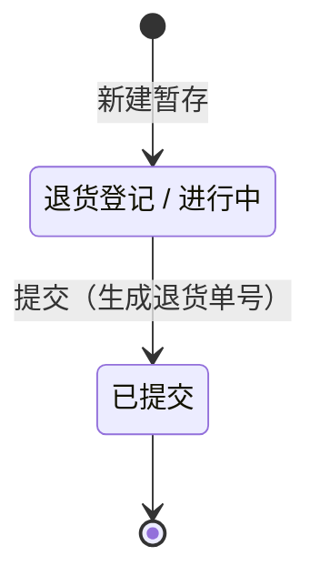
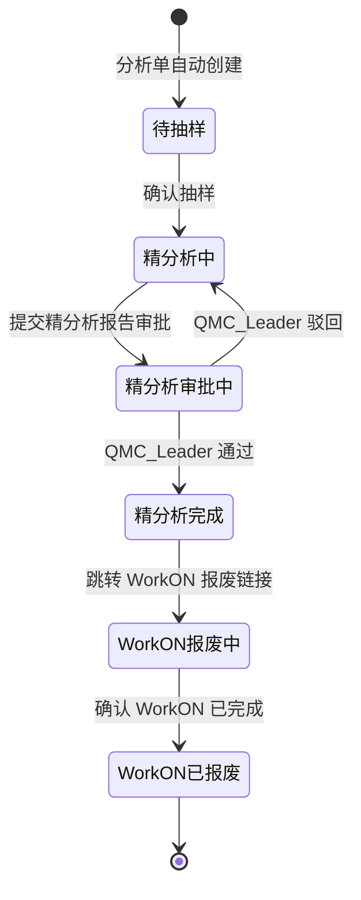

# 变更设计 v3.0

## 文档信息

| 项目 | 内容 |
|------|------|
| 变更版本 | v3.0 |
| 来源 | 用户沟通记录（`doc/00-项目规划/用户沟通1.md`） |
| 日期 | 2026-03-18 |
| 状态 | 设计草稿，待开发实现 |

---

## 变更概述

本次变更涉及三类改动：

1. **退货单简化（M02）**：字段重命名、抽样条件变更、移除抽样/报废功能、状态缩减至 2 个
2. **售后件字段调整（M03）**：移除失效类别/投诉类型，新增客户失效类型（信息卡）和博世失效类型（精分析），编号格式加 `-`，分析师改为必填
3. **新模块：分析单（M08）**：承接从退货单移出的抽样与报废功能，按「退货单 × 分析师」自动分组，分析员仅可见自己的分析单

---

## 一、退货单变更（M02）

### 1.1 字段变更

| 变更项 | 当前设计 | 变更后 |
|--------|----------|--------|
| `FAILURE_TYPE`（失效类型） | BA10~BA79，必填；BA20 代表 0km，禁止抽样 | **重命名为 `COMPLAINT_TYPE`（投诉模式）**，下拉选项不变 |
| 抽样准入条件 | BA20 禁止，其余均可 | **仅 BA40 可抽样**，其余投诉模式不可触发抽样 |
| 抽样功能 | 在退货单中提供 | **移除**，迁移至分析单（M08） |
| 报废功能 | 在退货单中提供 | **移除**，迁移至分析单（M08） |

### 1.2 BA40 详情页标签

当退货单 `COMPLAINT_TYPE = 'BA40'` 时，退货单**详情页**在投诉模式字段值后追加 **「售后件」** Tag 标签。

### 1.3 状态简化

退货单状态从 7 个缩减为 **2 个**：

| 状态值 | 触发动作 | 说明 |
|--------|----------|------|
| `退货登记/进行中` | 新建暂存 | 草稿，无退货单号 |
| `已提交` | 提交退货单 | 生成退货单号，后续流程由分析单承载 |

原 `初分析/进行中`、`精分析/进行中`、`精分析审批/进行中`、`精分析审批/完成`、`WorkOn报废/进行中`、`WorkOn报废/完成` 六个状态废除。

**新状态转换图：**



**步骤条**：简化为两步——退货登记（草稿） → 已提交。

### 1.4 移除的接口

| 移除接口 | 说明 |
|----------|------|
| `POST /api/v1/return-orders/{id}/sampling` | 迁移至分析单 |
| `POST /api/v1/return-orders/{id}/scrap` | 迁移至分析单 |
| `POST /api/v1/return-orders/{id}/scrap/workon-confirm` | 迁移至分析单 |

### 1.5 数据库变更（APMS_RETURN_ORDER）

| 操作 | 列 | Flyway SQL |
|------|----|-----------|
| 重命名 | `FAILURE_TYPE` → `COMPLAINT_TYPE` | `ALTER TABLE APMS_RETURN_ORDER RENAME COLUMN FAILURE_TYPE TO COMPLAINT_TYPE` |

---

## 二、售后件变更（M03）

### 2.1 基础信息字段移除

| 移除字段 | 原说明 |
|----------|--------|
| `FAILURE_TYPE`（失效类别） | 引用 APMS_FAILURE_CATEGORY，精分析前填写 |
| `COMPLAINT_TYPE`（投诉类型/退货类型） | BA 代码下拉 |

> **数据库处理**：若已有生产数据，Flyway 脚本中建议先评估是否保留历史列（不删除列、仅前端不展示），或通过 `ALTER TABLE APMS_PART DROP COLUMN` 物理删除，视数据迁移需求决定。

### 2.2 信息卡：新增「客户失效类型」

| 项目 | 说明 |
|------|------|
| 字段名 | `CUSTOMER_FAILURE_TYPE` |
| 位置 | 信息卡区（0km 投诉类型时隐藏，与其他信息卡字段一致） |
| 来源 | LLM 基于 `CUSTOMER_DESCRIPTION` 推导，用户可手动修改 |
| 类型 | 下拉单选 |
| 枚举值 | `NVH` / `功能` / `外观` |

**数据库列：**

```sql
ALTER TABLE APMS_PART ADD CUSTOMER_FAILURE_TYPE VARCHAR2(20 CHAR);
-- 枚举值：NVH / 功能 / 外观
```

### 2.3 精分析：新增「博世失效类型」

| 项目 | 说明 |
|------|------|
| 字段名 | `BOSCH_FAILURE_TYPE` |
| 位置 | 精分析阶段（`精分析中` 状态下可编辑，其他阶段只读） |
| 来源 | 分析师手动选择 |
| 类型 | 下拉单选 |
| 枚举值 | BA 代码完整列表（同 `COMPLAINT_TYPE`，即 BA10~BA79） |
| 存储位置 | `APMS_PART.BOSCH_FAILURE_TYPE` |

**数据库列：**

```sql
ALTER TABLE APMS_PART ADD BOSCH_FAILURE_TYPE VARCHAR2(20 CHAR);
-- 枚举值与投诉模式 BA 代码列表相同
```

### 2.4 售后件编号格式变更

| 项目 | 当前 | 变更后 |
|------|------|--------|
| 格式 | `{BU代码}{产品类别代码}{4位序号}` | `{BU代码}-{产品类别代码}-{4位序号}` |
| 示例 | `RBCABS0001` | `RBCA-BS-0001` |

### 2.5 分析师字段约束变更

| 字段 | 当前约束 | 变更后 |
|------|----------|--------|
| `ANALYST` | 可选 | **创建售后件时必填** |

分析师字段必填后，系统将在售后件提交时自动为该退货单下该分析师创建分析单（如不存在）或归入已有分析单。

### 2.6 数据库变更（APMS_PART）

| 操作 | 列 | Flyway SQL |
|------|----|-----------|
| 删除/保留 | `FAILURE_TYPE` | 视数据迁移策略决定 |
| 删除/保留 | `COMPLAINT_TYPE` | 视数据迁移策略决定 |
| 新增 | `CUSTOMER_FAILURE_TYPE` | `ADD CUSTOMER_FAILURE_TYPE VARCHAR2(20 CHAR)` |
| 新增 | `BOSCH_FAILURE_TYPE` | `ADD BOSCH_FAILURE_TYPE VARCHAR2(20 CHAR)` |

---

## 三、新模块：分析单（M08）

### 3.1 概念定义

**分析单**是退货单的子单，以「退货单 × 分析师」为粒度自动生成：

- 售后件提交时，若当前退货单下该分析师尚无分析单，则自动创建分析单；否则将售后件归入已有分析单
- 每个分析单与唯一一个退货单关联，包含该分析师在该退货单下的所有售后件
- 分析单提供抽样和报废功能，承接原退货单的对应功能

**与售后件的关联方式**：通过 `APMS_PART.ORDER_ID = APMS_ANALYSIS_ORDER.ORDER_ID AND APMS_PART.ANALYST = APMS_ANALYSIS_ORDER.ANALYST` 进行隐式关联，无需额外关联表。

### 3.2 权限

| 角色 | 可查看的分析单 |
|------|----------------|
| 分析员（Analyst） | 仅 `ANALYST = 当前用户` 的分析单 |
| 分析主管（QMC_Leader） | 全部 |
| QMC 经理（QMC_Manager） | 全部 |
| 系统管理员（SystemAdmin） | 全部 |

### 3.3 状态设计

**完整状态值：**

| 状态值 | 触发动作 |
|--------|----------|
| `待抽样` | 分析单创建后初始状态 |
| `精分析中` | 抽样确认后 |
| `精分析审批中` | 提交精分析报告审批 |
| `精分析完成` | 精分析审批通过 |
| `WorkON报废中` | 跳转 WorkON 报废链接 |
| `WorkON已报废` | 确认 WorkON 完成（终态） |

**UI 展示分组：**

| 分组 | 包含状态 | 展示文案 |
|------|----------|----------|
| 抽样 | `待抽样` | 未开始 |
| 抽样 | `精分析中` 及之后 | 已完成 |
| 精分析 | `精分析中` | 进行中 |
| 精分析 | `精分析审批中` | 审批中 |
| 精分析 | `精分析完成` | 完成 |
| 报废 | `WorkON报废中` | WorkON报废中 |
| 报废 | `WorkON已报废` | WorkON已报废 |

**状态转换图：**



### 3.4 抽样功能设计（从 M02 迁移）

**穿梭框交互规则：**

- 左侧待选列表支持按 BU 筛选（下拉框 + 筛选/重置按钮）
- **「BU 筛选」区域**与**「随机抽样」区域**互斥展开：UI 上以区域折叠方式呈现，默认展开随机抽样；点击一个区域时另一个自动收起
- 切换两种功能后，穿梭框重置为初始状态
- 穿梭框列表每行右侧提供「详情」可点击链接，点击后弹窗展示该售后件完整信息

**随机抽样逻辑**：与当前退货单中的随机抽样逻辑和 UI 交互完全一致。

### 3.5 报废功能设计（从 M02 迁移）

逻辑和 UI 交互与当前退货单报废完全一致，关联对象由退货单改为分析单（`ANALYSIS_ORDER_ID`）。

### 3.6 数据库：新表 APMS_ANALYSIS_ORDER

| 列名 | 类型 | 约束 | 说明 |
|------|------|------|------|
| ID | VARCHAR2(36) | PK | UUID |
| ORDER_ID | VARCHAR2(36) | FK→APMS_RETURN_ORDER, NOT NULL | 关联退货单 |
| ANALYST | VARCHAR2(100 CHAR) | NOT NULL | 分析师（loginName） |
| STATUS | VARCHAR2(30 CHAR) | NOT NULL | 见 3.3 状态枚举 |
| STATUS_CHANGED_AT | TIMESTAMP | — | 当前状态进入时间 |
| CREATED_BY | VARCHAR2(100) | NOT NULL | 创建人 |
| CREATED_AT | TIMESTAMP | NOT NULL | 创建时间 |
| UPDATED_BY | VARCHAR2(100) | — | 更新人 |
| UPDATED_AT | TIMESTAMP | — | 更新时间 |

**唯一约束**：`UNIQUE(ORDER_ID, ANALYST)`（每个退货单下每个分析师只能有一张分析单）

### 3.7 数据库：APMS_SAMPLING 变更

| 列名 | 变更 | Flyway SQL |
|------|------|-----------|
| `ORDER_ID` → `ANALYSIS_ORDER_ID` | FK 从退货单改指分析单 | `ALTER TABLE APMS_SAMPLING RENAME COLUMN ORDER_ID TO ANALYSIS_ORDER_ID` |

外键约束同步变更为指向 `APMS_ANALYSIS_ORDER`。

### 3.8 数据库：APMS_SCRAP_APPLICATION 变更

| 列名 | 变更 | Flyway SQL |
|------|------|-----------|
| `ORDER_ID` → `ANALYSIS_ORDER_ID` | FK 从退货单改指分析单 | `ALTER TABLE APMS_SCRAP_APPLICATION RENAME COLUMN ORDER_ID TO ANALYSIS_ORDER_ID` |

外键约束同步变更为指向 `APMS_ANALYSIS_ORDER`。

### 3.9 分析单 API 接口

| 方法 | 路径 | 说明 |
|------|------|------|
| GET | `/api/v1/analysis-orders` | 分析单列表（分析员仅返回自己的） |
| GET | `/api/v1/analysis-orders/{id}` | 分析单详情（含关联售后件列表） |
| POST | `/api/v1/analysis-orders/{id}/sampling` | 抽样提交 |
| POST | `/api/v1/analysis-orders/{id}/scrap` | 报废申请 |
| POST | `/api/v1/analysis-orders/{id}/scrap/workon-confirm` | 确认 WorkON 完成 |

---

## 四、数据库变更汇总（Flyway 迁移脚本清单）

| # | 表 | 操作 | SQL 摘要 |
|---|----|----|---------|
| 1 | APMS_RETURN_ORDER | 列重命名 | `RENAME COLUMN FAILURE_TYPE TO COMPLAINT_TYPE` |
| 2 | APMS_PART | 删除/保留列 | `FAILURE_TYPE`（原失效类别），视数据迁移策略决定 |
| 3 | APMS_PART | 删除/保留列 | `COMPLAINT_TYPE`（原投诉类型），视数据迁移策略决定 |
| 4 | APMS_PART | 新增列 | `ADD CUSTOMER_FAILURE_TYPE VARCHAR2(20 CHAR)` |
| 5 | APMS_PART | 新增列 | `ADD BOSCH_FAILURE_TYPE VARCHAR2(20 CHAR)` |
| 6 | APMS_ANALYSIS_ORDER | 新建表 | `CREATE TABLE APMS_ANALYSIS_ORDER (...)` |
| 7 | APMS_SAMPLING | 列重命名 + 外键变更 | `RENAME COLUMN ORDER_ID TO ANALYSIS_ORDER_ID`，FK→APMS_ANALYSIS_ORDER |
| 8 | APMS_SCRAP_APPLICATION | 列重命名 + 外键变更 | `RENAME COLUMN ORDER_ID TO ANALYSIS_ORDER_ID`，FK→APMS_ANALYSIS_ORDER |

---

## 五、受影响模块汇总

| 模块 | 影响类型 | 关键变更点 |
|------|----------|------------|
| M02 退货单管理 | 简化 | FAILURE_TYPE 重命名，仅 BA40 可抽样，移除抽样/报废，状态缩减到 2 个 |
| M03 分析管理（售后件） | 字段调整 | 移除失效类别/投诉类型，新增客户失效类型/博世失效类型，分析师必填，编号格式加 `-` |
| M05 审批管理 | 联动调整 | 报废审批确认 Tab 改为关联分析单（`ANALYSIS_ORDER_ID`） |
| M08 分析单管理 | **新建** | 全新模块，详见第三节 |
| 数据库 | 结构变更 | 见第四节 Flyway 清单 |
| 权限矩阵 | 更新 | M08 分析单按角色隔离可见范围 |
