# RBCC WFAM 售后件管理系统 — 开发设计文档

## 文档信息

| 项目 | 内容 |
|------|------|
| 项目名称 | RBCC WFAM 售后件管理系统 |
| 文档版本 | v4.16 |
| 创建日期 | 2026-03-02 |
| 文档状态 | 草稿（含少量待确认项） |

> v4.16 更新内容（2026-05-27）：
> - 退货单「阶段闸口」设计：`draft`（可加零件、不建分析单）→ `submitted`（不可加零件、批量建分析单）→ `scrapped`；分析单创建时机从「零件提交时」改为「退货单提交时」按分析师分组批量创建；导入流程不受影响
>
> v4.15 更新内容（2026-05-26）：
> - 精分析模板 `FIELD_DEFINITIONS` 列从 `VARCHAR2(4000)` 扩展为 `CLOB`（V48 迁移），修复字段数量多时的 ORA-12899 溢出
> - `ReportTemplate` JPA 实体对应字段改用 `@Lob` 注解
> - 精分析模板新增 `photo`（单张图片）和 `photolist`（多张图片列表）两种字段类型，图片通过 SMB 存储
>
> v4.14 更新内容：
> - 前端双源用户信息机制：`?dev=1` 使用 mock 用户（UserSwitcher 切换），wujie 嵌入模式从 `accessToken`（JWT）payload 提取 `roleNames`（逗号分隔多角色）和 `username`
> - 新增 `src/utils/jwt.ts`（JWT base64 解析）、扩展 `userInfo` store（roleNames/username 字段 + `setUserProfileFromToken` action）
> - `usePermissions.ts` 统一权限判断：wujie 模式使用 `includes()` 匹配多角色字符串，`isAnalyst` 含排他逻辑（与后端一致）
> - `AnalysisOrderList.vue`、`PartList.vue` 分析师默认筛选改用 `usePermissions().currentUserUsername`
>
> v4.13 更新内容：
> - 新增邮件通知功能设计（2.2.9）：5 类邮件通知（2 事件触发 + 3 定时任务），新增 APMS_NOTIFICATION_LOG 表，application.yml 通知阈值配置，移除前端通知配置 Tab
> - 前端设置页移除「通知配置」Tab，通知阈值改为 application.yml 配置
>
> v4.12 更新内容：
> - 退货单新增 `scrapped`（已报废）状态：当所有关联分析单完成 WorkON 确认（报废）后自动触发；终态不可回退；红色标签展示；列表支持筛选；详情页显示报废摘要；编辑/删除操作被拦截
>
> v4.11 更新内容：
> - 售后件列表排序改为后端数据库排序：`GET /api/v1/parts` 支持 `sortBy/sortOrder`，后端按白名单字段执行真实分页排序（默认 `createdAt desc`）
>
> v4.10 更新内容：
> - 导入售后件创建时即生成编号，规则统一为 `{BU代码}-{产品平台代码}-{4位序号}`（例如 `RBCABS-WSA-0001`）；当 BU 或产品平台为空时使用 `BLANK` 占位
>
> v4.9 更新内容：
> - 导入任务新增"活动心跳"：导入处理中会实时更新导入时间；超时判断基于该实时更新时间，避免大任务正常执行时被误判超时
>
> v4.8 更新内容：
> - 售后件编号规则补充：当 BU 代码或产品平台代码为空时，使用 `BLANK` 作为占位符生成编号（示例：`BLANK-WSA-0001`、`BLANK-BLANK-0001`）
>
> v4.7 更新内容：
> - 导入超时阈值调整为 60 分钟（按请求触发状态收敛时生效）
>
> v4.6 更新内容：
> - 导入写入时间规则调整：导入生成的退货单/售后件 `createdAt` 取“Excel 文件名中的年份 + 表格行内月份 + 当月 1 日 00:00:00”
>
> v4.5 更新内容：
> - 数据库 `APMS_PART.BOSCH_FAILURE_TYPE` 字段长度扩展为 255，避免导入长文本失效描述报错
>
> v4.4 更新内容：
> - 导入明细“删除本次导入数据”改为异步任务（JDK 21 虚拟线程），新增 `deleting`（正在删除）状态并支持前端轮询
> - 导入详情“导入时间”展示格式优化为可读日期时间字符串
> - 导入写入前统一执行字符串 trim
> - 数据库 `APMS_PART.VEHICLE_VIN` 字段长度扩展为 255，避免导入长 VIN 报错
>
> v4.3 更新内容：
> - 导入详情页新增“删除本次导入数据”能力：支持一键删除当前导入记录成功写入的业务数据（售后件/可安全删除的退货单）
>
> v4.2 更新内容：
> - 售后件导入支持“单个 Excel 内多个退货单号”场景，改为按文件内退货单号分组自动创建退货单后再导入对应售后件
>
> v4.1 更新内容：
> - 售后件导入改为“按 Excel 内容自动创建真实退货单，再导入该文件售后件”，退货单号优先使用 Excel 中的退货单号字段
> - 退货单客户名从文件名 `DATA_..._Amount` 片段提取；快递单号为空时自动生成占位符 `IMPORT-{退货单号}`
> - 售后件导入中的事业部/产品平台改为通过零件号主数据映射；QC 列为 12 位纯数字时自动写入 QC 号
> - 导入/识别异步执行器切换为 JDK 21 虚拟线程（Virtual Threads）
>
> v4.0 更新内容：
> - 导入记录列表接口改为轻量返回（列表不携带大体量日志字段），降低导入管理页面卡顿
> - 导入日志新增标准化字段（fileName、errorCode），提升排障可读性
> - 新增“导入详情页”：按文件夹/文件维度查看导入明细日志
>
> v3.9 更新内容：
> - 导入模块新增“售后件按文件夹递归导入”能力：支持输入后端可访问目录路径，递归扫描子目录中的 .xls/.xlsx 文件并异步导入
>
> v3.8 更新内容：
> - 精分析模板删除增加后端前置引用校验：若已被精分析报告引用，返回冲突并提示“该模板已被使用，不能删除”

---

## 目录

1. [系统概述](#1-系统概述)
2. [功能模块设计](#2-功能模块设计)
3. [数据库设计](#3-数据库设计)
4. [其他设计](#4-其他设计)
5. [附录](#5-附录)
6. [更改记录](#6-更改记录)

---

## 1. 系统概述

### 1.1 系统目标

RBCC WFAM 售后件管理系统用于管理退货单和售后件的全生命周期，覆盖从退货登记、初分析、抽样、精分析、审批、报废的完整业务流程，并提供数据统计与分析功能。

核心目标：
- 提供退货单与售后件的全流程可视化追溯
- 通过 OCR 图像识别提高数据录入效率
- 支持基于 Excel 模板的精分析报告动态表单与导出
- 提供多维度统计报表，辅助质量改进决策

### 1.2 系统架构（必填）

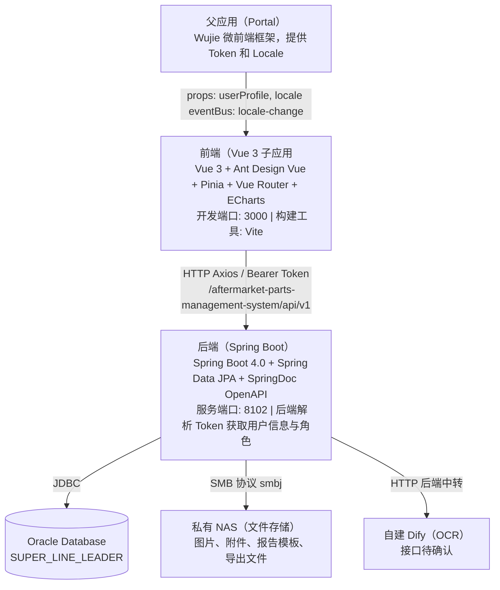

**部署架构：**

| 容器 | 基础镜像 | 说明 |
|------|------|------|
| 前端 | nginx:alpine | Vite 构建产物静态托管 |
| 后端 | JDK 21 | Spring Boot Fat JAR |

### 1.3 关键组件与模块划分

#### 前端组件划分

```
src/
├── views/          页面组件（按模块分目录）
├── components/     通用 UI 组件
├── composables/    业务逻辑复用（useOCR、useApprovalColumns 等）
├── services/       API 请求层（每模块独立文件）
├── stores/         Pinia 状态管理（userInfo）
├── router/         路由配置与守卫
├── i18n/           国际化（zh-CN / en-US）
├── types/          TypeScript 全局类型定义
└── layouts/        应用布局（MainLayout）
```

#### 后端包划分

```
com.bosch.rbcc.aftermarketpartsmanagementsystem
├── config/         配置类（WebMvc、JPA Auditor、SMB 连接池）
├── controller/     REST 控制器（按模块子包）
├── service/        业务逻辑层
├── repository/     Spring Data JPA Repository
├── entity/         JPA 实体
├── dto/            数据传输对象
├── util/           SMBFileHandler（文件读写）
├── header/         Token 解析与用户信息管理
└── interceptor/    拦截器
```

### 1.4 系统约束条件与假设（必填）

**技术约束：**

| 约束项 | 说明 |
|------|------|
| 浏览器 | Chrome 90+ / Edge 90+ / Firefox 88+ |
| 分辨率 | 最低 1366×768，推荐 1920×1080 |
| 文件上传 | 单张图片 ≤ 10 MB，最多 20 张；附件 ≤ 10 MB |
| 列表分页 | 单页最多 100 条 |

**系统假设：**

| 假设项 | 说明 |
|------|------|
| 认证 | 运行于 Wujie 微前端框架中，Token 由父应用注入；后端解析 Token 获取用户 ID、姓名、角色 |
| 角色管理 | 用户角色通过 IDM 与 AEP 统一分配，系统不维护用户注册与角色授权 |
| WorkON 集成 | 报废流程通过跳转链接集成 WorkON，不调用 WorkON API |
| 精分析报告导出 | 仅导出 Excel（.xlsx），不需要 Word/PDF |
| 预警超期配置 | 时限写在配置文件中，不在页面展示 |
| 数据统计 | 统计结果每日更新，会存在一天的更新延迟 |

**待确认事项：**

| # | 问题 | 影响模块 | 优先级 |
|---|------|---------|------|
| 1 | NAS 连接信息（host、share-name、用户名/密码/domain） | 文件存储 | 高 |
| 2 | Dify OCR 接口信息（URL、鉴权、请求/响应格式） | OCR 扫描 | 中 |

---

## 2. 功能模块设计

### 2.1 功能模块清单（必填）

| 模块编号 | 模块名称 | 菜单路径 | 可访问角色 |
|------|------|------|------|
| M01 | 工作台 | /dashboard | 全部角色 |
| M02 | 退货单管理 | /return-orders | 除访客外全部角色 |
| M03 | 售后件管理 | /parts | 除访客外全部角色 |
| M04 | 分析单管理 | /analysis-orders | 分析员（仅自己的）、分析主管、QMC 经理、系统管理员 |
| M05 | 精分析报告与模板系统 | /parts/:id/analysis | 分析员、分析主管、QMC 经理、系统管理员 |
| M06 | 审批管理 | /approval | 分析主管、系统管理员 |
| M07 | 统计报表 | /reports | 全部角色 |
| M08 | 配置管理 | /settings | 系统管理员 |

**角色定义：**

| IDM 角色名称 | 描述 | 菜单权限 |
|------|------|------|
| W_RBCC_AEP_WFAM_Customer_Quality | 客户质量工程师 | M01 M02 M03 M04 M05 M07 |
| W_RBCC_AEP_WFAM_Analyst | 分析员 | M01 M02 M03 M04 M05 M06 M07 |
| W_RBCC_AEP_WFAM_QMC_Leader | 分析主管（数据校订权） | M01 M02 M03 M04 M05 M06 M07 M08 |
| W_RBCC_AEP_WFAM_QMC_Manager | QMC 经理 | M01 M02 M03 M04 M05 M07 |
| R_RBCC_AEP_WFAM_Visitor | 访客（只读） | M01 M07 |
| W_RBCC_AEP_WFAM_SystemAdmin | 系统管理员 | 全部模块 |

**AEP 用户接口字段映射：**

| AEP 字段 | 用途 | 示例 |
|------|------|------|
| `username` | 唯一标识（存储用） | `85819761` |
| `name` | 展示名称 | `XU Feiran (EM/MFD1-AP)` |
| `email` | 邮箱 | `Feiran.XU@cn.bosch.com` |

**功能权限矩阵：**

| 功能 | 客户质量工程师 | 分析员 | 分析主管 | QMC 经理 | 访客 | 系统管理员 |
|------|:---:|:---:|:---:|:---:|:---:|:---:|
| 查看工作台 | ✅ | ✅ | ✅ | ✅ | ✅ | ✅ |
| 查看退货单列表/详情 | ✅ | ✅ | ✅ | ✅ | ❌ | ✅ |
| 新建/编辑退货单 | ❌ | ✅ | ❌ | ❌ | ❌ | ✅ |
| 查看售后件详情 | ✅ | ✅ | ✅ | ✅ | ❌ | ✅ |
| 新建/编辑售后件 | ❌ | ✅ | ❌ | ❌ | ❌ | ✅ |
| 精分析报告审批 | ❌ | ❌ | ✅ | ❌ | ❌ | ✅ |
| 查看统计报表 | ✅ | ✅ | ✅ | ✅ | ✅ | ✅ |
| 配置管理 | ❌ | ❌ | ❌ | ❌ | ❌ | ✅ |
| 修改已提交表单（数据校订） | ❌ | ❌ | ✅ | ❌ | ❌ | ✅ |
| 查看分析单（自己的） | ❌ | ✅ | ✅ | ✅ | ❌ | ✅ |
| 查看分析单（全部） | ❌ | ❌ | ✅ | ✅ | ❌ | ✅ |
| 分析单抽样/报废操作 | ❌ | ✅ | ✅ | ❌ | ❌ | ✅ |

### 2.2 核心功能模块详细设计

#### 2.2.1 工作台（M01）

##### 2.2.1.1 功能描述（必填）

工作台为系统首页，提供全局数据概览、任务中心和快捷操作入口。

- **数据卡片**：退货单总量 / 售后件总量 / 待处理任务数 / 分析完成率（%），点击跳转对应列表
- **趋势图表**：退货单数量趋势、售后件数量趋势，支持日/周/月/年粒度切换
- **任务中心**：按类型汇总待处理任务数量，标注优先级（紧急/高/中），点击跳转并自动应用筛选

| 任务类型 | 触发条件 | 优先级 |
|------|------|------|
| 待初分析 | 退货单提交后 | 中 |
| 待精分析 | 抽样确认后 | 中 |
| 精分析预警 | 进入精分析中状态 ≥ warning-days | 高（橙色） |
| 精分析超期 | 进入精分析中状态 ≥ overdue-days | 紧急（红色） |
| 精分析报告待审批 | 精分析报告提交后 | 中 |

- **快捷入口**：内部跳转（新建退货单、新增售后件、统计报表）+ 外部链接（WorkON、IQIS、SAP、Lessons Learned）

##### 2.2.1.2 输入/输出数据流（必填）

| 接口 | 输入 | 输出 |
|------|------|------|
| GET /dashboard/stats | 无 | `{ returnOrderCount, partCount, pendingTaskCount, completionRate }` |
| GET /dashboard/trends | `type=order/part`, `granularity=day/week/month/year` | `[{ date, count }]` |
| GET /dashboard/tasks | 无 | `[{ taskType, count, priority }]`，预警/超期通过比较当前时间与 `STATUS_CHANGED_AT` 实时计算 |

##### 2.2.1.3 状态转换图（必填）

NA（工作台本身无状态）

##### 2.2.1.4 操作流程图（必填）

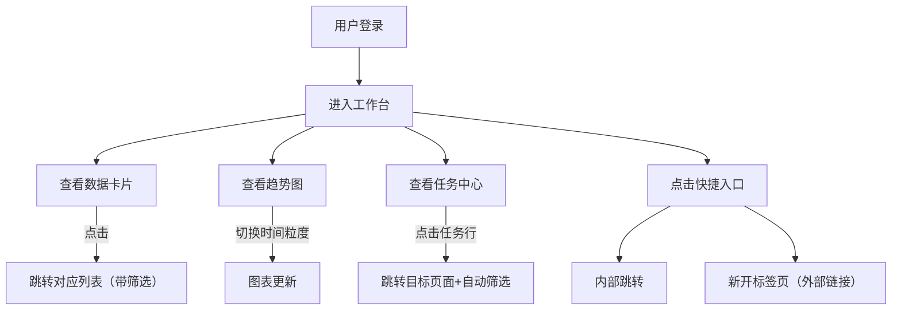

##### 2.2.1.5 数据实体（必填）

工作台数据为聚合查询，无专属实体表。数据来源：

- `APMS_RETURN_ORDER`（退货单总量、趋势）
- `APMS_PART`（售后件总量、趋势、预警/超期任务）
- `APMS_ANALYSIS_REPORT`（完成率、待审批任务）

##### 2.2.1.6 与其他模块的交互（必填）

| 交互目标模块 | 交互方式 |
|------|------|
| 退货单管理（M02） | 读取退货单数量与状态；点击卡片/任务跳转至退货单列表（带筛选） |
| 售后件管理（M03） | 读取售后件数量与状态；预警/超期任务跳转至售后件详情 |
| 审批管理（M06） | 待审批任务数跳转至审批管理页 |
| 统计报表（M07） | 快捷入口跳转 |

##### 2.2.1.7 调用的内外部接口（必填）

| 接口类型 | 接口 | 说明 |
|------|------|------|
| 内部 | GET `/api/v1/dashboard/stats` | 统计卡片数据；超时3秒降级返回默认值 `{totalOrders:0, totalParts:0, pendingTasks:0, completionRate:0}` |
| 内部 | GET `/api/v1/dashboard/trends` | 趋势图数据；超时2秒降级返回空趋势（请求天数默认30） |
| 内部 | GET `/api/v1/dashboard/tasks` | 任务中心数据；超时3秒降级返回空列表 `[]` |
| 内部 | GET `/api/v1/dashboard/trend?days=N` | 趋势数据聚合查询，数据库侧按天聚合（使用函数索引 `IDX_APMS_PART_TRUNC_CREATED_AT`） |
| 外部链接 | WorkON URL | 浏览器新标签页打开 |
| 外部链接 | Lessons Learned URL | 浏览器新标签页打开 |

---

#### 2.2.2 退货单管理（M02）

##### 2.2.2.1 功能描述（必填）

管理退货单的完整生命周期，包含：

- **列表与查询**：支持退货单号（模糊）、客户（精确）、收件日期范围、投诉日期范围过滤；分页展示
- **CRUD**：新建（暂存/提交）、编辑（草稿状态或 SystemAdmin）、删除（草稿状态）、复制、导入/导出
- **投诉模式**：创建退货单时需选择投诉模式（必填），从 BA10-BA79 标准代码中选择。**仅 BA40 可触发抽样**，其余投诉模式的退货单不能进行抽样操作。BA40 退货单详情页在投诉模式字段后展示「售后件」标签。
- **售后件列表**：退货单详情页内嵌售后件列表，使用共享组件 `PartsListCard` 渲染，传入 `orderId` prop，通过 `#headerExtra` 插槽在列表标题右侧放置「新增售后件」按钮。组件采用服务端分页，通过 `GET /api/v1/return-orders/{id}/parts` 接口获取分页数据（`PageResponse<PartDTO>`），支持搜索（keyword 搜索零件编号和零件代码，businessUnit、productPlatform、status 筛选）、排序、分页、点击行跳转售后件详情功能
- **流程追溯**：步骤条可视化当前状态

**退货单号规则**：提交时生成 `{年份后两位}QMC{4位序号}`，如 `26QMC0001`；草稿阶段无编号。

##### 2.2.2.2 输入/输出数据流（必填）

**新建/暂存退货单：**
- 输入：客户、收件日期、投诉日期、退回方式、快递单号（条件必填）、退回数量、失效类型（必填）
- 输出：ReturnOrderDTO（id、status=`退货登记/进行中`，无 ORDER_NUMBER）
- **日期关联规则**：快递退回方式下，投诉日期自动与收件日期一致，不可手动修改；自提退回方式下，收件日期与投诉日期独立填写

**提交退货单：**
- 输入：id
- 输出：ReturnOrderDTO（ORDER_NUMBER=`26QMC0001`，status=`初分析/进行中`）

##### 2.2.2.3 状态转换图（必填）

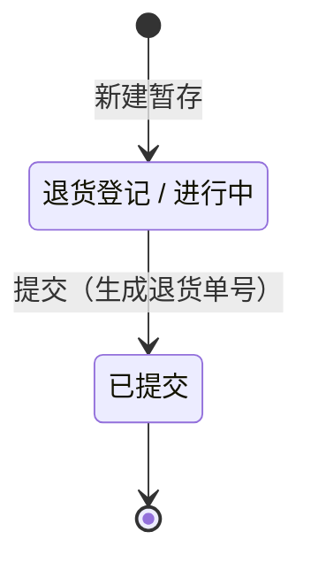

> **说明**：退货单提交后，后续精分析、抽样、报废等流程均在分析单（M04）中进行，退货单仅保留草稿和已提交两个状态。

##### 2.2.2.4 操作流程图（必填）

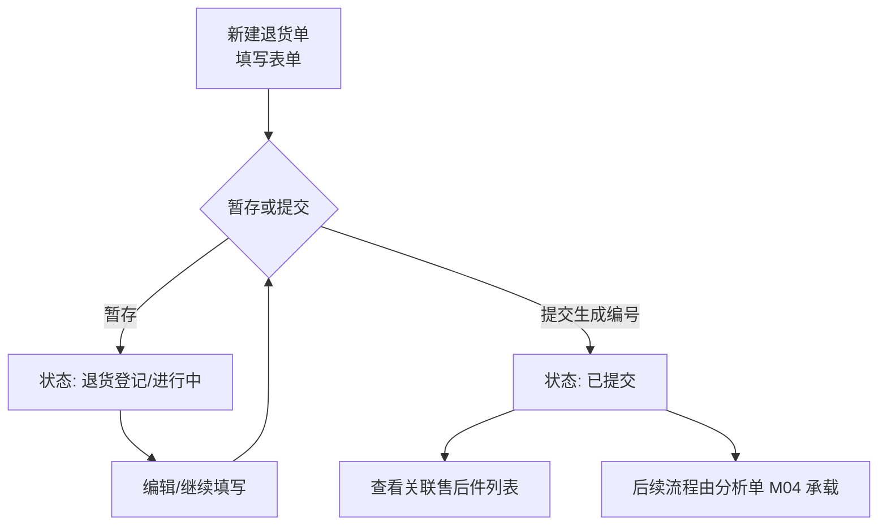

> **说明**：抽样、报废等流程已迁移至分析单管理（M04），退货单仅负责创建与提交。

##### 2.2.2.5 数据实体（必填）

| 实体表 | 说明 |
|------|------|
| APMS_RETURN_ORDER | 退货单主表（详见 3.3） |

##### 2.2.2.6 与其他模块的交互（必填）

| 交互目标模块 | 交互说明 |
|------|------|
| 售后件管理（M03） | 退货单内嵌售后件列表 |
| 分析单管理（M04） | 退货单提交后，后续抽样/报废流程由分析单承载 |
| 工作台（M01） | 退货单数量、状态数据被 Dashboard 聚合展示 |

##### 2.2.2.7 调用的内外部接口（必填）

| 类型 | 接口 | 说明 |
|------|------|------|
| 内部 | GET/POST/PUT/DELETE `/api/v1/return-orders` | 退货单 CRUD |
| 内部 | POST `/api/v1/return-orders/{id}/submit` | 提交生成编号 |
| 内部 | GET `/api/v1/return-orders/{id}/parts` | 退货单下的售后件分页列表（`PageResponse<PartDTO>`），支持 `page`、`size`、`sort` 分页参数和 `keyword`（同时搜索零件编号和零件代码）、`businessUnit`、`productPlatform`、`status`、`analyst` 筛选参数 |
| 内部 | GET `/api/v1/return-orders/import/template` | 下载导入模板 |
| 内部 | POST `/api/v1/return-orders/import` | 批量导入（multipart/form-data） |
| 内部 | GET `/api/v1/return-orders/export` | 条件导出 Excel |
| 内部 | GET `/api/v1/customers` | 客户下拉（数据字典） |

---

#### 2.2.3 售后件管理（M03）

##### 2.2.3.1 功能描述（必填）

管理售后件的录入、信息采集与初分析，包含：

- **列表与查询**：支持退货单号（模糊）、零件号、业务单元、产品平台、状态、QC录入（已录/未录）、分析师（模糊）等筛选；列表显示分析师列
- **售后件列表卡片组件（PartsListCard）**：提取为共享组件 `frontend/src/components/PartsListCard.vue`，在退货单详情页（M02）、分析单详情页（M04）中复用。组件接收 `orderId` prop（必填，指定所属退货单）和可选 `analyst` prop（分析单场景下按分析师过滤）。采用服务端分页模式，通过 `GET /api/v1/return-orders/{id}/parts` 接口获取分页数据（`PageResponse<PartDTO>`），支持搜索（keyword 同时搜索零件编号和零件代码，businessUnit、productPlatform、status 筛选）、排序、分页、点击行跳转售后件详情等功能。零件编号未提交时显示灰色不可点击，已提交时显示蓝色链接可点击跳转
- **CRUD**：新建（暂存/提交）、编辑（受权限控制）、删除（草稿状态）
- **基础信息录入**：零件号为文本输入，输入后自动匹配数据字典（APMS_PART_CODE）；匹配成功时产品平台自动填充且不可编辑，匹配失败时产品平台为空（业务单元与产品平台均为非必填，可为空保存）；退货类型（BA 代码，即 COMPLAINT_TYPE）；失效类别（有失效描述时必填）；责任工程师、分析师（下拉选系统用户）；维修站号/投诉地（合并字段）；**关联退货单**：新建模式下仅显示状态为 `draft` 或 `submitted` 的退货单；编辑模式下，若当前关联的退货单状态非 `draft`/`submitted`，则该字段禁用并提示用户
- **信息卡（客诉信息）**：0km 类型隐藏；支持 OCR 识别自动填入各字段——拍照区提供「拍照」（调用设备相机）与「上传图片」两个入口；识别成功后字段自动写入，识别失败时降级为手动填写；已上传图片可点击查看大图
- **照片上传**：最多 20 张，上传至 SMB NAS
- **售后件编号规则**：提交时生成 `{BU代码}-{产品平台代码}-{4位序号}`，如 `RBCABS-WSA-0001`；若 BU 或产品平台为空，则使用 `BLANK` 占位

##### 2.2.3.2 输入/输出数据流（必填）

**新建/暂存售后件：**
- 输入：orderId、partCode（零件号，必须匹配 APMS_PART_CODE.CODE）、businessUnitId、complaintType（退货类型）、failureCategoryId、customerDescription、repairStationLocation（维修站号/投诉地，合并字段）、responsibleEngineer、analyst、vehicleInfo（非0km时）
- 输出：PartDTO（id、partCode、productPlatform（由后端根据 partCode 自动查 APMS_PART_CODE 填充）、status=`初分析/进行中`（售后件 BA40/BA41）或 `精分析已跳过`（0km，即非 BA40/BA41），无 PART_NUMBER）
- 校验：partCode 必须存在于 APMS_PART_CODE 且 ENABLED=1，否则拒绝保存

**提交售后件：**
- 输入：id
- 输出：PartDTO（PART_NUMBER=`BU1-PLT1-0001`，status=`初分析/进行中`）
- 注：提交后 status 不变仍为 `初分析/进行中`，通过 PART_NUMBER 是否为空区分草稿与已提交

**OCR 识别（异步任务模式）：**
- 创建任务：`POST /api/v1/ocr/tasks`，输入：图片文件（multipart/form-data）+ 可选 partId（编辑模式立即绑定）；图片保存至系统临时目录；立即返回 `{ taskId, status: "CREATED" }`
- 轮询状态：`GET /api/v1/ocr/tasks/{taskId}`，前端每 3 秒轮询一次；后端 mock 延迟约 30 秒，30% 概率随机整体失败（降级）
- 任务状态流转：`CREATED → PROCESSING → SUCCESS | FAILED`
- 识别成功输出：`OcrResultDTO { vehicleProductionDate, vehiclePurchaseDate, vehicleFailureDate, vehicleVIN, vehicleMileage, customerDescription }`（null 字段表示未识别）
- 后端写入：识别成功且 partId 已绑定时，后端自动将识别结果写入 `APMS_PART` 对应字段（null 字段不覆盖原有值）
- 新建模式绑定：Part 创建时通过 `?ocrTaskId=xxx` 传入任务 ID；若任务已完成则立即写入，若仍在处理中则等待完成后自动写入

**照片上传：**
- 输入：partId、图片文件
- 输出：`{ imageId, nasPath, fileName }`

##### 2.2.3.3 状态转换图（必填）

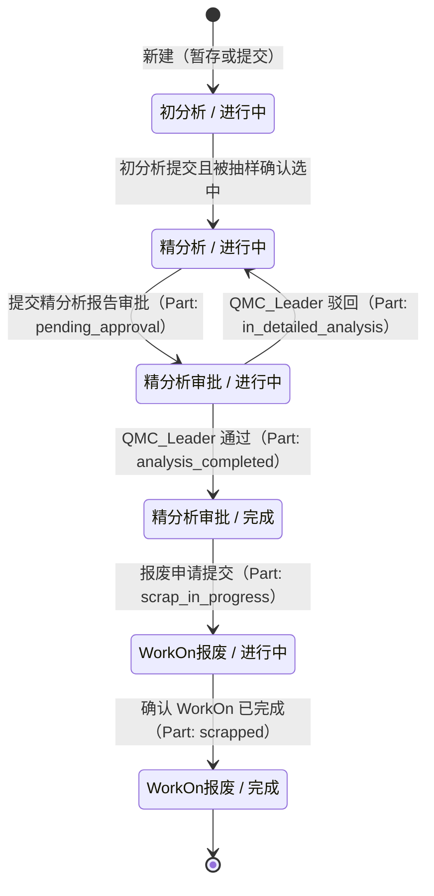

##### 2.2.3.4 操作流程图（必填）

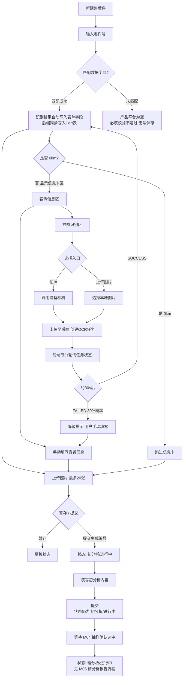

##### 2.2.3.5 数据实体（必填）

| 实体表 | 说明 |
|------|------|
| APMS_PART | 售后件主表（详见 3.3） |
| APMS_PART_IMAGE | 售后件照片（存 NAS 相对路径） |
| APMS_OCR_TASK | OCR 任务表（详见 3.x）；字段：ID、PART_ID（可空）、FILE_PATH（临时目录）、STATUS、RESULT_JSON（CLOB）、ERROR_MESSAGE |

##### 2.2.3.6 与其他模块的交互（必填）

| 交互目标模块 | 交互说明 |
|------|------|
| 退货单管理（M02） | 售后件隶属于退货单；抽样由 M02 触发 |
| 精分析报告（M05） | 售后件进入 `精分析/进行中` 后触发精分析报告录入 |
| 工作台（M01） | 售后件数量、状态、预警信息被 Dashboard 聚合 |
| 文件存储 | 照片上传至 SMB NAS，路径存 DB |

##### 2.2.3.7 调用的内外部接口（必填）

| 类型 | 接口 | 说明 |
|------|------|------|
| 内部 | GET/POST/PUT/DELETE `/api/v1/parts` | 售后件 CRUD |
| 内部 | POST `/api/v1/parts/{id}/submit` | 提交生成编号 |
| 内部 | POST `/api/v1/parts/{id}/images` | 上传照片 |
| 内部 | DELETE `/api/v1/parts/{id}/images/{imageId}` | 删除照片 |
| 内部 | GET `/api/v1/parts/import/template` | 下载导入模板 |
| 内部 | POST `/api/v1/parts/import` | 批量导入（multipart/form-data） |
| 内部 | GET `/api/v1/parts/export` | 条件导出 Excel |
| 内部 | PUT `/api/v1/parts/{id}/qc-no` | 录入 QC No.（仅状态≥精分析审批/完成） |
| 内部 | POST `/api/v1/ocr/tasks` | 创建 OCR 任务（上传图片+可选 partId），立即返回 taskId |
| 内部 | GET `/api/v1/ocr/tasks/{taskId}` | 轮询 OCR 任务状态（前端每 3s 调用） |
| 内部 | POST `/api/v1/parts?ocrTaskId=` | 新建售后件时可携带 ocrTaskId 完成任务绑定 |
| 内部 | GET `/api/v1/part-codes` | 零件主数据查询（前端输入零件号后调用匹配，返回 productCategory、productPlatform） |
| 内部 | GET `/api/v1/business-units` | 业务单元下拉（数据字典） |
| 内部 | GET `/api/v1/failure-categories` | 失效类别下拉（数据字典） |
| 内部 | GET `/api/v1/users` | 获取系统用户列表（供责任工程师/分析师下拉） |

#### 2.2.4 分析单管理（M04）

##### 2.2.4.1 功能描述（必填）

分析单是退货单的子单，以「退货单 × 分析师」为粒度自动生成，承接从退货单移出的抽样与报废功能：

- **批量创建**：退货单提交（结束录入）时，按分析师分组批量创建分析单；0km 退货单初始状态为 `analysis_completed`，售后件退货单初始状态为 `pending_sampling`；零件创建阶段不触发分析单创建
- **列表与查询**：分析员仅可见自己的分析单，分析主管/QMC 经理/系统管理员可见全部；列表显示退货单号（可点击跳转）、分析师、状态、创建时间、更新时间列
- **抽样功能**：独立 SamplingModal 弹窗组件，支持抽样/不抽样两种方式选择；抽样模式下提供抽样比例/数量双向联动控制、随机抽样按钮、穿梭框手动选择；穿梭框每行提供「查看」按钮弹窗展示售后件详情；已完成抽样后以只读模式查看抽样结果，QMC Leader 可切换至编辑模式进行重新抽样
- **报废功能**：直接操作报废（无需审批），跳转 WorkON 报废链接，确认 WorkON 完成后状态流转至终态；执行报废时，分析单下**所有**关联售后件（含抽样件和未抽样件）状态同步更新为 `scrap_in_progress`；**报废前置校验**：所有售后件必须满足"未抽样"或"已抽样且精分析审批完成"条件，否则拒绝报废并返回不满足条件的售后件列表
- **关联售后件列表**：分析单详情页使用共享组件 `PartsListCard` 展示关联售后件，传入 `orderId` prop 和 `analyst` prop（按分析师过滤），并传入 `showSampleStatus` prop 以显示抽样状态列（已抽样/未抽样）。组件采用服务端分页，通过 `GET /api/v1/return-orders/{id}/parts` 接口获取分页数据（`PageResponse<PartDTO>`），支持搜索（keyword 同时搜索零件编号和零件代码，businessUnit、productPlatform、status 筛选）、排序、分页、点击行跳转售后件详情功能
- **3 步状态步骤条**（合并后）：初分析/已完成 → 精分析（进行中/审批中/已完成） → WorkON报废（进行中/已完成）

##### 2.2.4.2 输入/输出数据流（必填）

**分析单列表：**
- 输入：分页参数、筛选条件（退货单号、分析师、状态）
- 输出：`[{ id, orderId, orderNumber, analyst, analystDisplayName, status, statusChangedAt, createdAt }]`
- 注：分析员请求自动过滤 `ANALYST = 当前用户`

**分析单详情：**
- 输入：analysisOrderId
- 输出：`{ id, orderId, orderNumber, analyst, status, statusChangedAt }`
- 注：关联售后件通过 `GET /api/v1/return-orders/{orderId}/parts?analyst={analyst}` 独立分页加载（PartsListCard 组件负责调用）

**抽样提交：**
- 输入：analysisOrderId、`{ sampledPartIds: [...] }`
- 输出：`{ status: '精分析中', sampledCount, totalCount }`

**报废申请：**
- 输入：analysisOrderId
- 输出：`{ status: 'WorkON报废中' }`

**WorkON 确认：**
- 输入：analysisOrderId
- 输出：`{ status: 'WorkON已报废' }`

##### 2.2.4.3 状态转换图（必填）

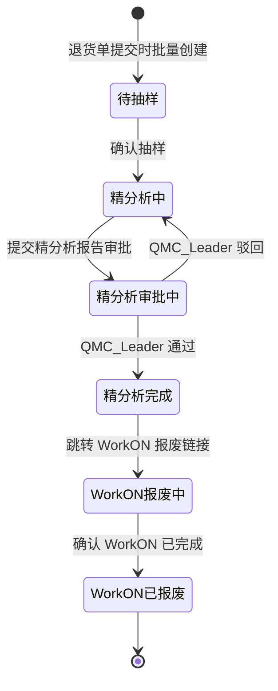

##### 2.2.4.4 操作流程图（必填）

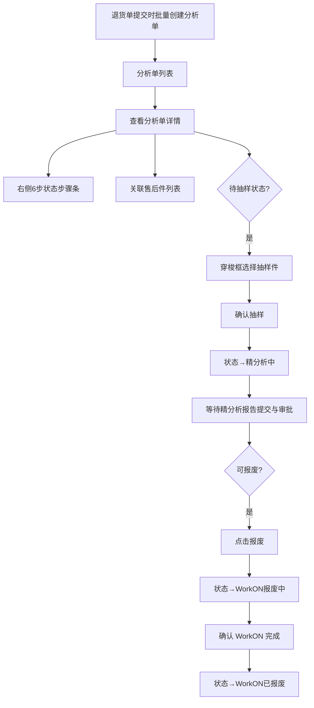

##### 2.2.4.5 数据实体（必填）

| 实体表 | 说明 |
|------|------|
| APMS_ANALYSIS_ORDER | 分析单主表（详见 3.3） |
| APMS_SAMPLING | 抽样记录（`ANALYSIS_ORDER_ID` 关联分析单） |

##### 2.2.4.6 与其他模块的交互（必填）

| 交互目标模块 | 交互说明 |
|------|------|
| 退货单管理（M02） | 分析单通过 `ORDER_ID` 关联退货单 |
| 售后件管理（M03） | 分析单通过 `ORDER_ID + ANALYST` 隐式关联售后件；抽样结果更新售后件 `IS_SAMPLE` 字段；报废申请/确认时联动更新所有关联售后件状态（`scrap_in_progress` / `scrapped`） |
| 精分析报告（M05） | 精分析报告 submit/approve/reject 联动更新 Part 状态（`pending_approval`/`analysis_completed`/`in_detailed_analysis`）；当所有抽样件状态满足条件时自动推进分析单状态 |
| 审批管理（M06） | 精分析报告审批结果触发分析单状态联动 |

##### 2.2.4.7 调用的内外部接口（必填）

| 类型 | 接口 | 说明 |
|------|------|------|
| 内部 | GET `/api/v1/analysis-orders` | 分析单列表（分析员仅返回自己的） |
| 内部 | GET `/api/v1/analysis-orders/{id}` | 分析单详情（含关联售后件列表） |
| 内部 | POST `/api/v1/analysis-orders/{id}/sampling` | 抽样提交 |
| 内部 | POST `/api/v1/analysis-orders/{id}/scrap` | 报废申请 |
| 内部 | POST `/api/v1/analysis-orders/{id}/scrap/workon-confirm` | 确认 WorkON 完成 |

---

#### 2.2.5 精分析报告与模板系统（M05）

##### 2.2.5.1 功能描述（必填）

基于 Excel 模板的动态精分析报告录入与导出系统：

- **模板驱动表单**：系统管理员上传含占位符的 Excel 模板，后端解析占位符生成 JSON 字段描述，前端动态渲染对应表单
- **报告录入**：分析员选择模板，填写动态表单，支持暂存草稿
- **报告提交**：提交后自动路由给 `QMC_Leader` 角色进行审批
- **报告导出**：后端从 NAS 读取模板，将用户填写内容渲染回 Excel 单元格并返回文件流

**占位符格式：**

```
[[type:name:labelZh:labelEn:required:options]]
```

支持字段类型：`text` / `textarea` / `select` / `date` / `image` / `list_text` / `list_image`

占位符示例：

```
[[text:failureMode:失效模式:Failure Mode:true:]]
[[textarea:rootCause:根本原因分析:Root Cause Analysis:true:]]
[[select:responsibleDept:责任部门:Responsible Dept.:true:BU1|BU2|BU3|BU4]]
[[date:expectedDate:预计完成时间:Expected Completion Date:false:]]
[[image:partPhoto:零件照片:Part Photo:false:]]
[[list_text:improvementSteps:改进措施列表:Improvement Steps:false:]]
[[list_image:evidencePhotos:证据照片:Evidence Photos:false:]]
```

##### 2.2.5.2 输入/输出数据流（必填）

**上传模板（SystemAdmin）：**
- 输入：Excel 文件（.xlsx）、模板名称
- 输出：模板元数据（id、name、nasPath）+ 解析出的 FIELDS_JSON 存入 DB
- FIELDS_JSON 示例：
```json
[
  { "name": "failureMode", "labelZh": "失效模式", "labelEn": "Failure Mode",
    "type": "text", "required": true, "options": null, "sheetIndex": 0, "cellRef": "B3" },
  { "name": "responsibleDept", "labelZh": "责任部门", "labelEn": "Responsible Dept.",
    "type": "select", "required": true, "options": ["BU1","BU2","BU3","BU4"], "sheetIndex": 0, "cellRef": "B5" }
]
```

**获取模板详情（前端渲染表单）：**
- 输入：templateId
- 输出：`{ id, name, fieldsJson: [...] }`

**提交精分析报告：**
- 输入：partId、templateId、content（JSON）、summary、attachmentPaths[]
- content 示例：`{ "failureMode": "噪音", "responsibleDept": "BU2", "improvementSteps": ["步骤1", "步骤2"] }`
- 输出：AnalysisReportDTO（status=`submitted`）

**导出精分析报告：**
- 输入：partId / reportId
- 输出：Excel 文件流（Content-Disposition: attachment）

##### 2.2.5.3 状态转换图（必填）

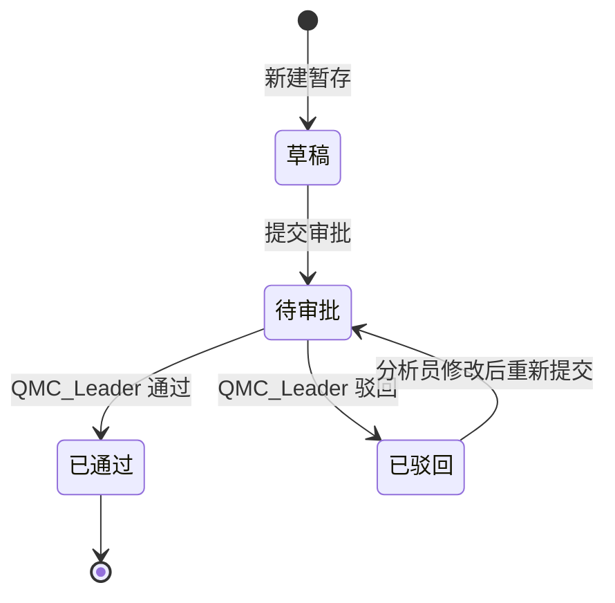

##### 2.2.5.4 操作流程图（必填）

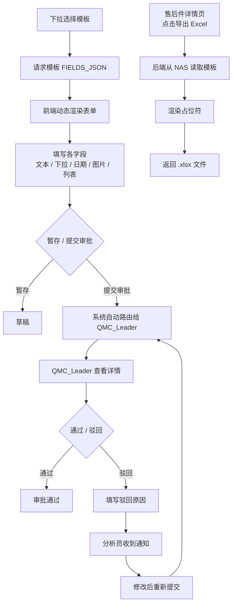

##### 2.2.5.5 数据实体（必填）

| 实体表 | 说明 |
|------|------|
| APMS_ANALYSIS_REPORT | 精分析报告（含 CONTENT_JSON、status） |
| APMS_REPORT_TEMPLATE | 报告模板元数据（含 FIELDS_JSON） |
| APMS_REPORT_ATTACHMENT | 报告附件（NAS 路径） |

##### 2.2.5.6 与其他模块的交互（必填）

| 交互目标模块 | 交互说明 |
|------|------|
| 售后件管理（M03） | 报告关联 Part；submit/approve/reject 联动更新 Part 状态（`pending_approval`/`analysis_completed`/`in_detailed_analysis`）；当所有抽样件状态满足条件时自动推进分析单状态 |
| 审批管理（M06） | 提交后报告进入 M06 审批队列 |
| 配置管理（M08） | 模板由 M08 上传维护，M05 消费 |
| 文件存储 | 模板文件和附件存于 SMB NAS |

##### 2.2.5.7 调用的内外部接口（必填）

| 类型 | 接口 | 说明 |
|------|------|------|
| 内部 | GET `/api/v1/templates/{id}` | 获取模板及 FIELDS_JSON |
| 内部 | POST `/api/v1/parts/{id}/analysis` | 保存/更新报告（暂存） |
| 内部 | POST `/api/v1/parts/{id}/analysis/submit` | 提交审批 |
| 内部 | GET `/api/v1/parts/{id}/analysis` | 查看报告详情 |
| 内部 | GET `/api/v1/parts/{id}/analysis/export` | 导出 Excel |
| 内部 | POST `/api/v1/files/upload` | 报告附件上传 |

---

#### 2.2.6 审批管理（M06）

##### 2.2.6.1 功能描述（必填）

仅 `QMC_Leader` 和 `SystemAdmin` 可访问：

- **精分析报告审批**：查看待审批报告列表 → 查看报告详情 → 审批通过 / 驳回（需填驳回原因）

##### 2.2.6.2 输入/输出数据流（必填）

**审批通过：**
- 输入：reportId
- 输出：AnalysisReportDTO（status=`approved`）；关联 Part 状态变为 `精分析审批/完成`；关联 ReturnOrder 状态变为 `精分析审批/完成`

**审批驳回：**
- 输入：reportId、rejectReason
- 输出：AnalysisReportDTO（status=`rejected`）；关联 Part 状态回退到 `精分析/进行中`；关联 ReturnOrder 状态回退到 `精分析/进行中`

##### 2.2.6.3 状态转换图（必填）

NA（状态变更在 AnalysisReport 和 ReturnOrder 实体中，见 2.2.5.3 和 2.2.2.3）

##### 2.2.6.4 操作流程图（必填）

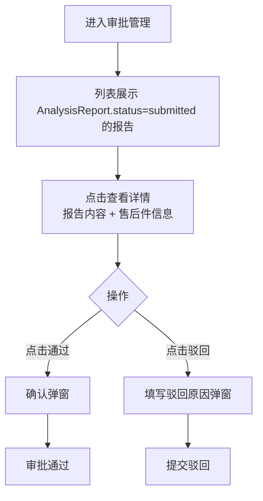

##### 2.2.6.5 数据实体（必填）

| 实体表 | 涉及字段 |
|------|------|
| APMS_ANALYSIS_REPORT | STATUS、APPROVED_BY、APPROVED_AT、REJECT_REASON |

##### 2.2.6.6 与其他模块的交互（必填）

| 交互目标模块 | 交互说明 |
|------|------|
| 精分析报告（M05） | 审批操作直接修改 AnalysisReport 状态 |
| 售后件管理（M03） | 审批结果触发 Part 状态联动 |
| 工作台（M01） | 待审批任务数由 M06 数据提供 |

##### 2.2.6.7 调用的内外部接口（必填）

| 类型 | 接口 | 说明 |
|------|------|------|
| 内部 | GET `/api/v1/approvals/analysis` | 待审批报告列表 |
| 内部 | POST `/api/v1/approvals/analysis/{reportId}/approve` | 审批通过 |
| 内部 | POST `/api/v1/approvals/analysis/{reportId}/reject` | 审批驳回 |

---

#### 2.2.7 统计报表（M07）

##### 2.2.7.1 功能描述（必填）

提供多维度数据可视化报表，全部角色均可查看。详细需求见 `doc/报表需求.md`。

**数据架构：**

系统数据库中的数据分为两类：

| 数据类型 | 产生方式 | 存储位置 | 说明 |
|---------|---------|---------|------|
| 业务数据 | 用户日常操作（CRUD） | 各业务表（APMS_RETURN_ORDER、APMS_PART 等） | 退货单、售后件、分析报告等原始数据 |
| 统计数据 | 每日定时任务计算 | 统计快照表（APMS_REPORT_SNAPSHOT） | 预聚合的报表数据，供前端直接读取 |

统计报表页面的所有图表数据均来自定时任务的计算结果（统计数据），不直接查询业务表。这样做的好处：
- 报表查询性能稳定，不受业务数据量增长影响
- 复杂聚合逻辑集中在定时任务中，报表 API 仅做简单读取
- 业务表与报表查询解耦，互不影响

**定时任务设计：**

| 项目 | 说明 |
|------|------|
| 执行频率 | 每日一次（建议凌晨执行，避开业务高峰） |
| 计算范围 | 全量重新计算当前有效数据 |
| 输出 | 写入 APMS_REPORT_SNAPSHOT 表，按 `REPORT_TYPE` + `DIMENSION_KEY` 分行存储 |
| 实现方式 | Spring `@Scheduled` 定时任务 |
| 数据时效 | 报表数据存在最多一天的延迟，页面需展示「数据更新时间」 |

**图表清单：**

| # | 指标分类 | 图表类型 | 同比 |
|------|------|------|------|
| 1 | 退货单 | KPI 卡片（总数） | — |
| 2 | 退货单 | 玫瑰图（按客户分布） | — |
| 3 | 退货单 | 折线图（按周期趋势，可筛选客户） | ✅ |
| 4 | 售后件 | KPI 卡片（总数） | — |
| 5 | 售后件 | 动态堆叠柱状图（YTD，主副维度可配置） | ✅ |
| 6 | 抽样件（精分析件） | KPI 卡片（总数） | — |
| 7 | 抽样件（精分析件） | 动态堆叠柱状图（YTD，含失效模式/责任判定维度） | ✅ |
| 8 | 分析时长 | 柱状图（YTD，Y 轴=平均时长） | ✅ |
| 9 | 售后件状态 | 柱状图（X 轴固定为状态，快照视图） | — |

**全局交互：**
- 页面顶部全局筛选栏（日期范围、客户、BU、产品平台、Mis 时间段），作用于所有图表和明细列表
- YoY 同比：全局开关 + 每图独立开关
- 每图可独立导出 Excel
- 页面底部固定显示售后件列表明细（字段与 M03 一致，支持分页和查看详情）

##### 2.2.7.2 输入/输出数据流（必填）

**通用查询参数（所有图表接口共享）：**

| 参数 | 类型 | 说明 |
|------|------|------|
| `dateStart` / `dateEnd` | 日期 | 日期范围过滤 |
| `customerId` | UUID | 客户过滤 |
| `businessUnitId` | UUID | BU 过滤 |
| `productPlatformId` | UUID | 产品平台过滤 |
| `misLevel` | 字符串 | Mis 时间段（mis1/mis2/mis3/…，区间定义待确认） |
| `yearOverYear` | Boolean | 是否返回上一年同期数据 |

**动态柱状图额外参数（#5 售后件 / #7 抽样件）：**

| 参数 | 类型 | 说明 |
|------|------|------|
| `primaryDimension` | 枚举 | X 轴维度：`period` / `customer` / `businessUnit` / `productPlatform` / `misLevel` / `failureCategory` / `responsibilityJudgment` |
| `secondaryDimension` | 枚举 | 堆叠颜色维度（可选，同 primaryDimension 可选值） |
| `period` | 枚举 | 周期粒度（`week` / `month` / `quarter` / `year`），primaryDimension=period 时有效 |
| `failureCategoryId` | UUID | 失效模式额外过滤（#7 专用） |
| `responsibilityJudgment` | 字符串 | 责任判定额外过滤（#7 专用） |

**API 接口与响应：**

| 接口 | 说明 | 响应结构 |
|------|------|------|
| GET `/api/v1/reports/return-orders/count` | 退货单卡片 | `{ count }` |
| GET `/api/v1/reports/return-orders/by-customer` | 玫瑰图 | `[{ customer, count }]` |
| GET `/api/v1/reports/return-orders/trend` | 折线图 | `{ current: [{period, count}], yoy?: [{period, count}] }` |
| GET `/api/v1/reports/parts/count` | 售后件卡片 | `{ count }` |
| GET `/api/v1/reports/parts/distribution` | 售后件柱状图 | `{ xLabels, series:[{name,data[]}], yoy? }` |
| GET `/api/v1/reports/sampled-parts/count` | 抽样件卡片 | `{ count }` |
| GET `/api/v1/reports/sampled-parts/distribution` | 抽样件柱状图 | 同上 |
| GET `/api/v1/reports/analysis-duration` | 分析时长柱状图 | `{ xLabels, series:[{name,data[]}], yoy? }` |
| GET `/api/v1/reports/part-status` | 售后件状态柱状图 | `[{ status, count }]` |
| GET `/api/v1/reports/export` | 当前图表导出 Excel | 文件流 |

##### 2.2.7.3 状态转换图（必填）

NA（统计报表无状态）

##### 2.2.7.4 操作流程图（必填）

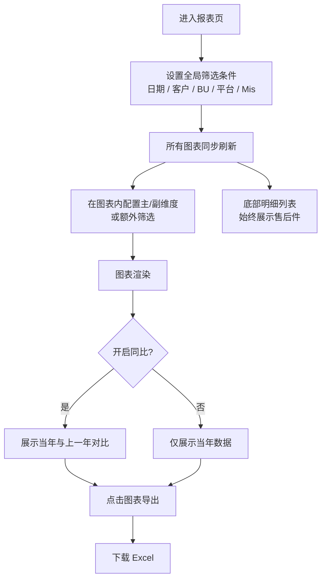

##### 2.2.7.5 数据实体（必填）

| 实体表 | 用途 |
|------|------|
| `APMS_REPORT_SNAPSHOT` | 统计快照表（报表 API 的唯一数据来源） |

报表 API 仅读取 `APMS_REPORT_SNAPSHOT`，不直接查询业务表。定时任务负责从业务表聚合计算并写入快照。

**定时任务读取的业务表（仅定时任务内部使用）：**

| 业务表 | 聚合用途 |
|------|------|
| `APMS_RETURN_ORDER` | 退货单数量、按客户分布、趋势 |
| `APMS_PART` | 售后件数量、分布、状态、抽样件统计 |
| `APMS_ANALYSIS_REPORT` | 分析时长、责任判定 |
| `APMS_FAILURE_CATEGORY` | 失效模式维度 |
| `APMS_BUSINESS_UNIT` / `APMS_PART_CODE` | BU / 产品类别·产品平台维度 |
| `APMS_CUSTOMER` | 客户维度 |

**Mis 计算**：派生字段，由 `FLOOR((VEHICLE_FAILURE_DATE - VEHICLE_PURCHASE_DATE) / 30)` 计算，仅适用于非 0km 投诉类型。

##### 2.2.7.6 与其他模块的交互（必填）

统计报表为只读模块，不修改其他模块数据。报表数据来源于定时任务预计算的统计快照（APMS_REPORT_SNAPSHOT），不直接查询业务表。底部列表"查看详情"导航至 M03 售后件详情页。页面顶部展示「数据更新时间」提示用户数据时效。

##### 2.2.7.7 调用的内外部接口（必填）

见 2.2.7.2 输入/输出数据流中的 API 接口表。

---

#### 2.2.8 配置管理（M08）

##### 2.2.8.1 功能描述（必填）

仅 `SystemAdmin` 可访问，负责系统数据字典和精分析报告模板的维护：

**数据字典管理：**
- **客户管理**：客户数据字典的增删改查，客户名称唯一性校验
- **零件主数据管理**：零件号、产品类别、产品平台三字段统一维护（同一张表），零件号代码唯一性校验；选择零件号后自动带出产品类别和产品平台
- **业务单元管理**：业务单元（BU）的增删改查
- **失效类别管理**：失效类别的增删改查

**精分析报告模板管理：**
- **上传模板**：上传 Excel（.xlsx）文件，后端自动解析占位符并持久化 FIELDS_JSON
- **查看列表**：展示所有已上传模板（名称、上传时间、状态）
- **下载模板**：下载原始 Excel 文件
- **删除模板**：软删除（ENABLED=0），已使用模板不物理删除

**模板解析流程（后端）：**
1. Apache POI 遍历所有 Sheet 的所有单元格
2. 正则匹配 `\[\[([^\]]+)\]\]` 提取占位符
3. 按 `[[type:name:labelZh:labelEn:required:options]]` 解析为结构化 JSON
4. 存入 `APMS_REPORT_TEMPLATE.FIELDS_JSON`

##### 2.2.8.2 输入/输出数据流（必填）

**客户管理：**
| 操作 | 输入 | 输出 |
|------|------|------|
| 新增客户 | `{ name, code }` | CustomerDTO（id、name、code） |
| 编辑客户 | `{ id, name, code }` | CustomerDTO |
| 删除客户 | customerId | 无 |
| 客户列表 | 无 | `[{ id, name, code, ... }]` |

**零件主数据管理：**
| 操作 | 输入 | 输出 |
|------|------|------|
| 新增/编辑零件 | `{ code, productCategory, productPlatform }` | PartCodeDTO（id、code、productCategory、productPlatform） |
| 删除零件 | partCodeId | 无 |
| 零件列表 | 无 | `[{ id, code, productCategory, productPlatform, ... }]` |

**业务单元管理：**
| 操作 | 输入 | 输出 |
|------|------|------|
| 新增/编辑业务单元 | `{ name, code }` | BusinessUnitDTO |
| 删除业务单元 | buId | 无 |
| 业务单元列表 | 无 | `[{ id, name, code, ... }]` |

**失效类别管理：**
| 操作 | 输入 | 输出 |
|------|------|------|
| 新增/编辑失效类别 | `{ name, code }` | FailureCategoryDTO |
| 删除失效类别 | categoryId | 无 |
| 失效类别列表 | 无 | `[{ id, name, code, ... }]` |

**模板管理：**
- 输入：Excel 文件（multipart/form-data）、模板名称
- 输出：ReportTemplateDTO（id、name、nasPath、fieldsJson）

**模板列表：**
- 输入：无（分页可选）
- 输出：`[{ id, name, createdAt, enabled }]`

##### 2.2.8.3 状态转换图（必填）

NA（模板无状态流转，仅 enabled/disabled 开关）

##### 2.2.8.4 操作流程图（必填）

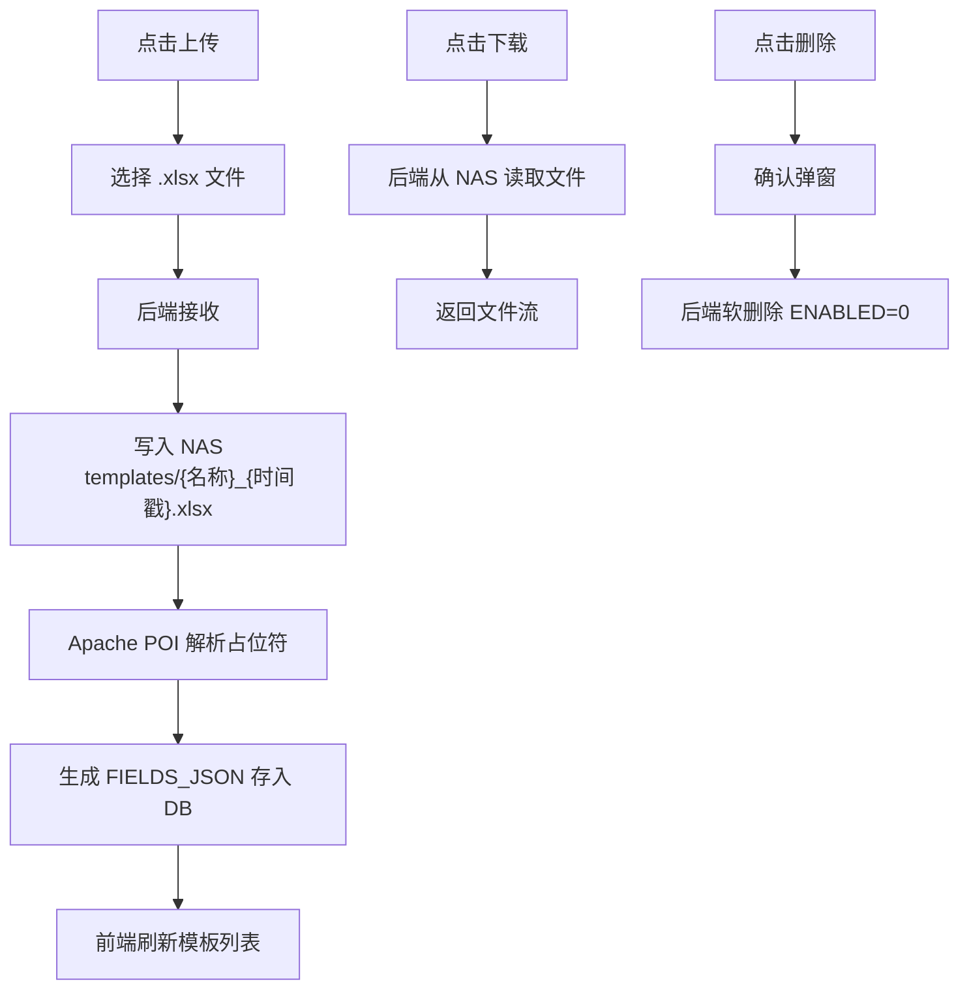

##### 2.2.8.5 数据实体（必填）

| 实体表 | 说明 |
|------|------|
| APMS_CUSTOMER | 客户数据字典（name、code，name唯一） |
| APMS_PART_CODE | 零件主数据字典（code、productCategory、productPlatform，code唯一） |
| APMS_BUSINESS_UNIT | 业务单元数据字典（name、code） |
| APMS_FAILURE_CATEGORY | 失效类别数据字典（name、code） |
| APMS_REPORT_TEMPLATE | 模板元数据（name、nasPath、FIELDS_JSON、enabled） |
| APMS_EMAIL_CONFIGURATION | 邮件服务器配置（smtpHost、smtpPort、emailFrom、emailPassword等） |

##### 2.2.8.6 与其他模块的交互（必填）

| 交互目标模块 | 交互说明 |
|------|------|
| 退货单管理（M02） | 客户下拉选项来源客户数据字典 |
| 售后件管理（M03） | 零件主数据（零件号→产品平台自动带出）、业务单元、失效类别下拉选项来源数据字典 |
| 精分析报告（M05） | M05 消费 M08 上传并解析的模板 FIELDS_JSON |
| 文件存储 | 模板文件上传/下载通过 SMB NAS |

##### 2.2.8.7 调用的内外部接口（必填）

| 类型 | 接口 | 说明 |
|------|------|------|
| 内部 | GET `/api/v1/customers` | 客户列表 |
| 内部 | POST `/api/v1/customers` | 新增客户 |
| 内部 | PUT `/api/v1/customers/{id}` | 编辑客户 |
| 内部 | DELETE `/api/v1/customers/{id}` | 删除客户 |
| 内部 | GET `/api/v1/part-codes` | 零件号列表 |
| 内部 | POST `/api/v1/part-codes` | 新增零件号 |
| 内部 | PUT `/api/v1/part-codes/{id}` | 编辑零件号 |
| 内部 | DELETE `/api/v1/part-codes/{id}` | 删除零件号 |
| 内部 | GET `/api/v1/business-units` | 业务单元列表 |
| 内部 | POST `/api/v1/business-units` | 新增业务单元 |
| 内部 | PUT `/api/v1/business-units/{id}` | 编辑业务单元 |
| 内部 | DELETE `/api/v1/business-units/{id}` | 删除业务单元 |
| 内部 | GET `/api/v1/failure-categories` | 失效类别列表 |
| 内部 | POST `/api/v1/failure-categories` | 新增失效类别 |
| 内部 | PUT `/api/v1/failure-categories/{id}` | 编辑失效类别 |
| 内部 | DELETE `/api/v1/failure-categories/{id}` | 删除失效类别 |
| 内部 | GET `/api/v1/templates` | 模板列表 |
| 内部 | POST `/api/v1/templates` | 上传模板 |
| 内部 | GET `/api/v1/templates/{id}` | 模板详情（含 fieldsJson） |
| 内部 | DELETE `/api/v1/templates/{id}` | 删除模板 |
| 内部 | GET `/api/v1/templates/{id}/download` | 下载原始文件 |
| 内部 | POST `/api/v1/files/upload` | 写入 NAS |
| 内部 | GET `/api/v1/files/**` | 从 NAS 读取文件 |
| 内部 | GET `/api/v1/email-configuration` | 获取邮件配置 |
| 内部 | POST `/api/v1/email-configuration` | 保存邮件配置 |
| 内部 | POST `/api/v1/email-configuration/test` | 测试邮件连接 |

##### 2.2.8.8 邮件服务器配置

**功能说明：**

提供 SMTP 邮件服务器配置功能，用于系统发送通知邮件等。支持企业内部邮箱配置，包含以下功能：

- **SMTP 配置**：配置 SMTP 服务器地址、端口、用户名、密码
- **发件人设置**：配置发件人邮箱地址和显示名称
- **端口选择**：支持标准端口 25（SMTP）、587（STARTTLS）、465（SSL）
- **认证支持**：支持 SMTP 认证，支持域认证（NTLM）
- **连接测试**：发送测试邮件验证配置正确性
- **配置重置**：重置可选项为默认值（保留核心配置）

**输入/输出数据流：**

| 操作 | 输入 | 输出 |
|------|------|------|
| 获取配置 | 无 | `EmailConfigurationDTO` |
| 保存配置 | `EmailConfigurationDTO` | `EmailConfigurationDTO` |
| 测试连接 | testEmail（收件人邮箱） | `{ status, message }` |

**状态转换图：** NA

**操作流程图：**

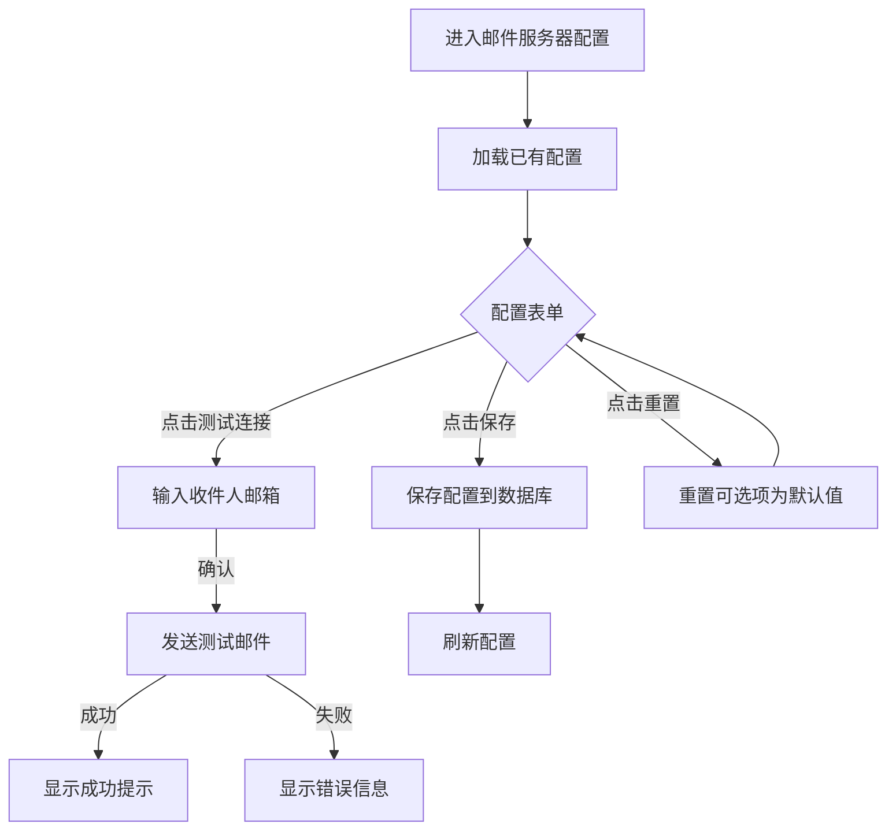

**数据实体：**

| 实体表 | 说明 |
|------|------|
| APMS_EMAIL_CONFIGURATION | 邮件服务器配置表 |

**字段说明：**
- `SMTP_HOST`：SMTP 服务器地址
- `SMTP_PORT`：SMTP 端口（25/587/465）
- `SMTP_USERNAME`：SMTP 认证用户名
- `SMTP_DOMAIN`：SMTP 认证域
- `EMAIL_FROM`：发件人邮箱地址
- `EMAIL_FROM_DISPLAY_NAME`：发件人显示名称
- `EMAIL_PASSWORD`：邮箱密码
- `ENABLE_SSL`：是否启用 SSL 加密

**与其他模块的交互：**

| 交互目标模块 | 交互说明 |
|------|------|
| 通知配置 | 邮件服务器配置作为邮件发送的基础配置 |
| 精分析报告 | 支持发送精分析完成邮件通知 |

**调用的内外部接口：**

| 类型 | 接口 | 说明 |
|------|------|------|
| 内部 | GET `/api/v1/email-configuration` | 获取邮件配置 |
| 内部 | POST `/api/v1/email-configuration` | 保存邮件配置 |
| 内部 | POST `/api/v1/email-configuration/test` | 测试邮件连接 |

##### 2.2.8.9 邮件通知

**功能说明：**

系统通过邮件通知机制，在关键业务节点自动发送邮件提醒相关人员。通知分为两类：**事件触发型**（立即发送，单次）和**定时任务型**（凌晨扫描，循环发送）。

**角色映射：**

| 业务称呼 | 系统字段/角色 |
|---------|-------------|
| 分析师 | `APMS_PART.ANALYST`（loginName） |
| 客户质量工程师 | `APMS_PART.RESPONSIBLE_ENGINEER`（loginName） |
| 部门主管 | IDM 角色 `W_RBCC_AEP_WFAM_QMC_Leader`（需查用户表） |

**事件触发型通知（2 条）：**

| # | 邮件标题 | 触发点 | 收件人 | 抄送 | 说明 |
|---|---------|--------|--------|------|------|
| 1 | 责任判定 B/O 通知 | 精分析报告保存时 `RESPONSIBILITY` 为 B 或 O | `ANALYST` + `RESPONSIBLE_ENGINEER` | QMC_Leader | 责任判定结果通知 |
| 2 | 0公里退货通知 | 售后件创建时 `complaintType` 不在 {BA40, BA41} 内（即 0km 类型） | `RESPONSIBLE_ENGINEER` | — | 0公里退货提醒 |

**定时任务型通知（3 条）：**

| # | 邮件标题 | 扫描条件 | 频次 | 收件人 | 抄送 | 说明 |
|---|---------|---------|------|--------|------|------|
| 3 | 时限预警通知 | `APMS_PART.STATUS = '精分析/进行中'` 且 `SYSDATE - STATUS_CHANGED_AT ≥ warning-days` | 1天/次 | `ANALYST` | — | 精分析即将超时，汇总发送 |
| 4 | 时限超时通知 | `APMS_PART.STATUS = '精分析/进行中'` 且 `SYSDATE - STATUS_CHANGED_AT ≥ overdue-days` | 3天/次 | `ANALYST` | QMC_Leader | 精分析已超时，汇总发送 |
| 5 | 审批超期提醒 | `APMS_PART.STATUS = '精分析审批/进行中'` 且 `SYSDATE - STATUS_CHANGED_AT ≥ approval-overdue-days` | 3天/次 | QMC_Leader | — | 审批超时未处理，汇总发送 |

**通知频率控制：**

定时任务通过查询 `APMS_NOTIFICATION_LOG` 表判断是否需要发送：当某售后件某类通知的最后一次发送时间距今超过配置的频率天数时，才触发发送。

```
发送条件 = 满足扫描条件
    AND (该 PART_ID + NOTIFICATION_TYPE 无历史记录
         OR MAX(SENT_AT) + 频率天数 ≤ 当前时间)
```

**操作流程图：**

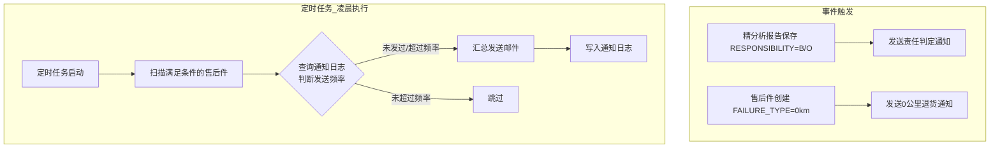

**输入/输出数据流：**

| 操作 | 输入 | 输出 |
|------|------|------|
| 事件触发通知 | 业务事件（报告保存/售后件提交） | 发送邮件 + 写入日志 |
| 定时扫描通知 | 无（定时触发） | 发送邮件 + 写入日志 |

**数据实体：**

| 实体表 | 说明 |
|------|------|
| APMS_NOTIFICATION_LOG | 通知发送记录表 |

**application.yml 配置：**

```yaml
custom:
  notification:
    analysis:
      warning-days: 13               # 精分析预警天数：进入精分析中状态后达到此天数触发预警邮件
      overdue-days: 21               # 精分析超期天数：进入精分析中状态后达到此天数触发超期邮件
    approval:
      overdue-days: 3                # 审批超期天数：提交审批后达到此天数未处理触发提醒
    cron: "0 0 0 * * ?"              # 定时任务执行时间（默认每日凌晨0点）
    frequency:
      warning: 1                     # 预警邮件发送频率（天）
      overdue: 3                     # 超期邮件发送频率（天）
      approval-reminder: 3           # 审批提醒发送频率（天）
```

**与其他模块的交互：**

| 交互目标模块 | 交互说明 |
|------|------|
| 邮件服务器配置（2.2.8.8） | 邮件发送依赖 SMTP 配置，未配置时静默跳过 |
| 精分析报告（M05） | 责任判定通知由报告保存触发 |
| 售后件管理（M03） | 0km 通知由售后件创建/提交触发 |
| 工作台（M01） | Dashboard 任务中心展示预警/超期数量，与通知逻辑共享阈值配置 |

**前端变更：**

- 设置页移除「通知配置」Tab，通知阈值统一由 `application.yml` 配置，不在页面展示

---

## 3. 数据库设计

### 3.1 数据库选型（必填）

| 项目 | 内容 |
|------|------|
| 数据库类型 | Oracle Database |
| 版本管理 | Flyway（迁移脚本存于 `src/main/resources/db/migration/`） |
| 主键策略 | VARCHAR2(36) UUID，由应用层生成 |

### 3.2 关系模型设计（必填）

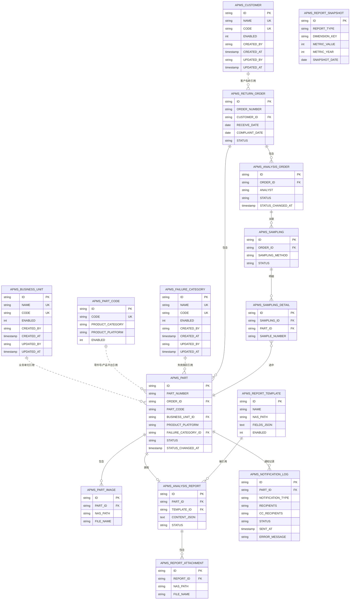

### 3.3 数据表结构设计（必填）

#### APMS_RETURN_ORDER（退货单）

| 列名 | 类型 | 约束 | 说明 |
|------|------|------|------|
| ID | VARCHAR2(36) | PK | UUID |
| ORDER_NUMBER | VARCHAR2(20) | UNIQUE, NULL | 提交时生成，如 `26QMC0001`（年份后两位+QMC+四位序号） |
| CUSTOMER_ID | VARCHAR2(36) | FK→APMS_CUSTOMER | 客户ID |
| CUSTOMER | VARCHAR2(100) | NOT NULL | 客户名称（引用 APMS_CUSTOMER.NAME，冗余用于显示） |
| RECEIVE_DATE | DATE | NOT NULL | 收件日期 |
| COMPLAINT_DATE | DATE | NOT NULL | 投诉日期 |
| RETURN_METHOD | VARCHAR2(20) | NOT NULL | express/pickup/other |
| TRACKING_NUMBER | VARCHAR2(50) | — | 快递单号 |
| RETURN_QUANTITY | NUMBER(10) | NOT NULL | 退回数量 |
| FAILURE_TYPE | VARCHAR2(20) | NOT NULL | 失效类型（BA10-BA79标准代码）。BA20（0-km, uninstalled）代表0km退货单，不能抽样，只能走报废流程。 |
| INITIAL_ANALYSIS_QTY | NUMBER(10) | DEFAULT 0 | 初分析数量 |
| DETAILED_ANALYSIS_QTY | NUMBER(10) | DEFAULT 0 | 精分析数量（计算值） |
| SCRAPPED_QTY | NUMBER(10) | DEFAULT 0 | 已报废数量（计算值） |
| QC_CREATED_QTY | NUMBER(10) | DEFAULT 0 | 已创 QC 数量 |
| QC_NOT_CREATED_QTY | NUMBER(10) | DEFAULT 0 | 未创 QC 数量（计算值） |
| DESCRIPTION | VARCHAR2(500) | — | 退货描述 |
| STATUS | VARCHAR2(50 CHAR) | NOT NULL | 阶段/子状态格式（见 3.4），如 `初分析/进行中` |
| CREATED_BY | VARCHAR2(100) | NOT NULL | 创建人 |
| CREATED_AT | TIMESTAMP | NOT NULL | 创建时间 |
| UPDATED_BY | VARCHAR2(100) | — | 更新人 |
| UPDATED_AT | TIMESTAMP | — | 更新时间 |

**客户字段引用说明：**
- 客户字段 (`CUSTOMER`) 存储客户名称，引用自数据字典 (`APMS_CUSTOMER.NAME`)
- 前端通过 `customerApi.list()` 获取客户列表供用户选择
- 客户名称在 `APMS_CUSTOMER` 表中唯一，确保引用有效性
- 相比外键引用，存储客户名称便于数据导出和历史数据追溯

#### APMS_PART（售后件）

| 列名 | 类型 | 约束 | 说明 |
|------|------|------|------|
| ID | VARCHAR2(36) | PK | UUID |
| PART_NUMBER | VARCHAR2(30) | UNIQUE, NULL | 提交时生成，如 `RBCABS-WSA-0001` |
| ORDER_ID | VARCHAR2(36) | FK→APMS_RETURN_ORDER | 关联退货单 |
| PART_CODE | VARCHAR2(50) | NOT NULL | 零件号 |
| BUSINESS_UNIT | VARCHAR2(100) | — | 业务单元名称（引用 APMS_BUSINESS_UNIT.NAME） |
| PRODUCT_PLATFORM | VARCHAR2(100) | — | 产品平台名称（引用 APMS_PART_CODE.PRODUCT_PLATFORM） |
| FAILURE_TYPE | VARCHAR2(100) | — | 失效类别名称（引用 APMS_FAILURE_CATEGORY.NAME） |
| PART_PRODUCTION_DATE | DATE | — | 零件生产日期 |
| PRODUCTION_SHIFT | VARCHAR2(20) | — | 生产班次 |
| COMPLAINT_TYPE | VARCHAR2(20) | NOT NULL | BA10~BA79 / Co-investigation |
| VEHICLE_PRODUCTION_DATE | DATE | — | 汽车生产日期 |
| VEHICLE_PURCHASE_DATE | DATE | — | 汽车购买日期 |
| VEHICLE_FAILURE_DATE | DATE | — | 汽车失效日期 |
| BOSCH_FAILURE_TYPE | VARCHAR2(255 CHAR) | — | 博世失效类型 |
| VEHICLE_VIN | VARCHAR2(255 CHAR) | — | VIN 码 |
| VEHICLE_MILEAGE | NUMBER(10) | — | 行驶里程（km） |
| CUSTOMER_DESCRIPTION | VARCHAR2(500) | — | 客户失效描述 |
| OTHER_DESCRIPTION | VARCHAR2(500) | — | 其他描述 |
| REPAIR_STATION_LOCATION | VARCHAR2(200 CHAR) | — | 维修站号/投诉地（合并字段） |
| RESPONSIBLE_ENGINEER | VARCHAR2(100 CHAR) | — | 责任工程师（存 loginName） |
| ANALYST | VARCHAR2(100 CHAR) | — | 分析师（存 loginName） |
| QC_NO | VARCHAR2(50 CHAR) | — | QC 单号（精分析审批通过后录入） |
| IS_SAMPLE | NUMBER(1) | DEFAULT 0 | 是否被选为抽样样本 |
| STATUS_CHANGED_AT | TIMESTAMP | — | 当前状态进入时间（用于预警计算） |
| STATUS | VARCHAR2(50 CHAR) | NOT NULL | 阶段/子状态格式（见 3.4），如 `精分析/进行中` |
| CREATED_BY | VARCHAR2(100) | NOT NULL | 创建人 |
| CREATED_AT | TIMESTAMP | NOT NULL | 创建时间 |
| UPDATED_BY | VARCHAR2(100) | — | 更新人 |
| UPDATED_AT | TIMESTAMP | — | 更新时间 |

**数据字典字段引用说明：**
- 零件号 (`PART_CODE`)、产品平台 (`PRODUCT_PLATFORM`) 两字段来源于 `APMS_PART_CODE` 表，选择零件号后自动带出产品平台
- 业务单元 (`BUSINESS_UNIT`) 存储业务单元名称，引用自 `APMS_BUSINESS_UNIT.NAME`
- 失效类别 (`FAILURE_TYPE`) 存储失效类别名称，引用自 `APMS_FAILURE_CATEGORY.NAME`
- 前端通过对应的数据字典 API 获取下拉选项供用户选择 |

#### APMS_PART_IMAGE（售后件照片）

| 列名 | 类型 | 约束 | 说明 |
|------|------|------|------|
| ID | VARCHAR2(36) | PK | UUID |
| PART_ID | VARCHAR2(36) | FK→APMS_PART, NOT NULL | 关联售后件 |
| NAS_PATH | VARCHAR2(500) | NOT NULL | NAS 相对路径 |
| FILE_NAME | VARCHAR2(200) | NOT NULL | 原始文件名 |
| FILE_SIZE | NUMBER(15) | — | 文件大小（字节） |
| SORT_ORDER | NUMBER(5) | DEFAULT 0 | 排序 |
| CREATED_BY | VARCHAR2(100) | NOT NULL | 上传人 |
| CREATED_AT | TIMESTAMP | NOT NULL | 上传时间 |

#### APMS_SAMPLING（抽样主记录）

| 列名 | 类型 | 约束 | 说明 |
|------|------|------|------|
| ID | VARCHAR2(36) | PK | UUID |
| ORDER_ID | VARCHAR2(36) | FK→APMS_RETURN_ORDER, NOT NULL | 关联退货单 |
| SAMPLING_METHOD | VARCHAR2(20) | NOT NULL | standard/designated/none |
| SAMPLED_BY | VARCHAR2(100) | NOT NULL | 抽样人 |
| SAMPLED_AT | TIMESTAMP | NOT NULL | 抽样时间 |
| TOTAL_COUNT | NUMBER(10) | NOT NULL | 抽样数量 |
| STATUS | VARCHAR2(20) | NOT NULL | draft/confirmed |
| CREATED_AT | TIMESTAMP | NOT NULL | 创建时间 |

#### APMS_SAMPLING_DETAIL（抽样明细）

| 列名 | 类型 | 约束 | 说明 |
|------|------|------|------|
| ID | VARCHAR2(36) | PK | UUID |
| SAMPLING_ID | VARCHAR2(36) | FK→APMS_SAMPLING, NOT NULL | 关联抽样 |
| PART_ID | VARCHAR2(36) | FK→APMS_PART, NOT NULL | 关联售后件 |
| SAMPLE_NUMBER | VARCHAR2(30) | NOT NULL | 样本编号 |
| SORT_ORDER | NUMBER(5) | DEFAULT 0 | 排序 |

#### APMS_ANALYSIS_ORDER（分析单）

| 列名 | 类型 | 约束 | 说明 |
|------|------|------|------|
| ID | VARCHAR2(36) | PK | UUID |
| ORDER_ID | VARCHAR2(36) | FK→APMS_RETURN_ORDER, NOT NULL | 关联退货单 |
| ANALYST | VARCHAR2(100 CHAR) | NOT NULL | 分析师（loginName） |
| STATUS | VARCHAR2(30 CHAR) | NOT NULL | 见分析单状态枚举（3.4） |
| STATUS_CHANGED_AT | TIMESTAMP | — | 当前状态进入时间 |
| CREATED_BY | VARCHAR2(100) | NOT NULL | 创建人 |
| CREATED_AT | TIMESTAMP | NOT NULL | 创建时间 |
| UPDATED_BY | VARCHAR2(100) | — | 更新人 |
| UPDATED_AT | TIMESTAMP | — | 更新时间 |

**唯一约束**：`UNIQUE(ORDER_ID, ANALYST)`（每个退货单下每个分析师只能有一张分析单）

#### APMS_ANALYSIS_REPORT（精分析报告）

| 列名 | 类型 | 约束 | 说明 |
|------|------|------|------|
| ID | VARCHAR2(36) | PK | UUID |
| PART_ID | VARCHAR2(36) | FK→APMS_PART, NOT NULL | 关联售后件 |
| TEMPLATE_ID | VARCHAR2(36) | FK→APMS_REPORT_TEMPLATE | 使用的模板 |
| CONTENT_JSON | CLOB | NOT NULL | 用户填写内容 JSON |
| SUMMARY | VARCHAR2(500) | — | 报告摘要 |
| STATUS | VARCHAR2(20) | NOT NULL | draft/submitted/approved/rejected |
| SUBMITTED_BY | VARCHAR2(100) | — | 提交人 |
| SUBMITTED_AT | TIMESTAMP | — | 提交时间 |
| APPROVED_BY | VARCHAR2(100) | — | 审批人 |
| APPROVED_AT | TIMESTAMP | — | 审批时间 |
| REJECT_REASON | VARCHAR2(500) | — | 驳回原因 |
| CREATED_BY | VARCHAR2(100) | NOT NULL | 创建人 |
| CREATED_AT | TIMESTAMP | NOT NULL | 创建时间 |
| UPDATED_BY | VARCHAR2(100) | — | 更新人 |
| UPDATED_AT | TIMESTAMP | — | 更新时间 |

#### APMS_REPORT_TEMPLATE（报告模板）

| 列名 | 类型 | 约束 | 说明 |
|------|------|------|------|
| ID | VARCHAR2(36) | PK | UUID |
| NAME | VARCHAR2(200) | NOT NULL | 模板名称 |
| PRODUCT_PLATFORM | VARCHAR2(50) | — | 适用产品平台（用于模板匹配） |
| FAILURE_TYPE | VARCHAR2(50) | — | 适用失效类型（用于模板匹配） |
| FILE_PATH | VARCHAR2(500) | NOT NULL | 原始 Excel SMB 存储路径 |
| FILE_NAME | VARCHAR2(200) | NOT NULL | 原始文件名 |
| FIELD_DEFINITIONS | CLOB | — | 占位符解析结果 JSON 数组（V48 迁移从 VARCHAR2(4000) 扩展） |
| ENABLED | NUMBER(1) | DEFAULT 1 | 是否启用（软删除） |
| CREATED_BY | VARCHAR2(100) | NOT NULL | 上传人 |
| CREATED_AT | TIMESTAMP | NOT NULL | 上传时间 |

**模板匹配逻辑：**

精分析报告模板通过 `PRODUCT_PLATFORM` 和 `FAILURE_TYPE` 字段进行匹配：

1. **精确匹配**：`PRODUCT_PLATFORM` + `FAILURE_TYPE` 均匹配
2. **平台匹配**：仅 `PRODUCT_PLATFORM` 匹配（`FAILURE_TYPE` 为空或匹配）
3. **默认模板**：`PRODUCT_PLATFORM` 和 `FAILURE_TYPE` 均为空

匹配优先级：精确匹配 > 类别匹配 > 默认模板

#### APMS_REPORT_ATTACHMENT（报告附件）

| 列名 | 类型 | 约束 | 说明 |
|------|------|------|------|
| ID | VARCHAR2(36) | PK | UUID |
| REPORT_ID | VARCHAR2(36) | FK→APMS_ANALYSIS_REPORT, NOT NULL | 关联报告 |
| NAS_PATH | VARCHAR2(500) | NOT NULL | 附件 NAS 路径 |
| FILE_NAME | VARCHAR2(200) | NOT NULL | 原始文件名 |
| FILE_SIZE | NUMBER(15) | — | 文件大小（字节） |
| CREATED_BY | VARCHAR2(100) | NOT NULL | 上传人 |
| CREATED_AT | TIMESTAMP | NOT NULL | 上传时间 |

#### APMS_CUSTOMER（客户数据字典）

| 列名 | 类型 | 约束 | 说明 |
|------|------|------|------|
| ID | VARCHAR2(36) | PK | UUID |
| NAME | VARCHAR2(100) | UNIQUE, NOT NULL | 客户名称（唯一，用于退货单客户字段） |
| CODE | VARCHAR2(50) | UNIQUE, NOT NULL | 客户代码（唯一） |
| ENABLED | NUMBER(1) | DEFAULT 1 | 是否启用（软删除） |
| CREATED_BY | VARCHAR2(100) | NOT NULL | 创建人 |
| CREATED_AT | TIMESTAMP | NOT NULL | 创建时间 |
| UPDATED_BY | VARCHAR2(100) | — | 更新人 |
| UPDATED_AT | TIMESTAMP | — | 更新时间 |

#### APMS_PART_CODE（零件主数据字典）

| 列名 | 类型 | 约束 | 说明 |
|------|------|------|------|
| ID | VARCHAR2(36) | PK | UUID |
| CODE | VARCHAR2(50) | UNIQUE, NOT NULL | 零件号代码（唯一） |
| PRODUCT_CATEGORY | VARCHAR2(50) | NOT NULL | 产品类别（如 WSA/WSM/PCE 等） |
| PRODUCT_PLATFORM | VARCHAR2(100) | NOT NULL | 产品平台名称 |
| ENABLED | NUMBER(1) | DEFAULT 1 | 是否启用（软删除） |
| CREATED_BY | VARCHAR2(100) | NOT NULL | 创建人 |
| CREATED_AT | TIMESTAMP | NOT NULL | 创建时间 |
| UPDATED_BY | VARCHAR2(100) | — | 更新人 |
| UPDATED_AT | TIMESTAMP | — | 更新时间 |

#### APMS_BUSINESS_UNIT（业务单元数据字典）

| 列名 | 类型 | 约束 | 说明 |
|------|------|------|------|
| ID | VARCHAR2(36) | PK | UUID |
| NAME | VARCHAR2(100) | UNIQUE, NOT NULL | 业务单元名称 |
| CODE | VARCHAR2(20) | UNIQUE, NOT NULL | 业务单元代码 |
| ENABLED | NUMBER(1) | DEFAULT 1 | 是否启用（软删除） |
| CREATED_BY | VARCHAR2(100) | NOT NULL | 创建人 |
| CREATED_AT | TIMESTAMP | NOT NULL | 创建时间 |
| UPDATED_BY | VARCHAR2(100) | — | 更新人 |
| UPDATED_AT | TIMESTAMP | — | 更新时间 |

#### APMS_FAILURE_CATEGORY（失效类别数据字典）

| 列名 | 类型 | 约束 | 说明 |
|------|------|------|------|
| ID | VARCHAR2(36) | PK | UUID |
| NAME | VARCHAR2(100) | UNIQUE, NOT NULL | 失效类别名称 |
| CODE | VARCHAR2(50) | UNIQUE, NOT NULL | 失效类别代码 |
| ENABLED | NUMBER(1) | DEFAULT 1 | 是否启用（软删除） |
| CREATED_BY | VARCHAR2(100) | NOT NULL | 创建人 |
| CREATED_AT | TIMESTAMP | NOT NULL | 创建时间 |
| UPDATED_BY | VARCHAR2(100) | — | 更新人 |
| UPDATED_AT | TIMESTAMP | — | 更新时间 |

#### APMS_REPORT_SNAPSHOT（统计报表快照）

| 列名 | 类型 | 约束 | 说明 |
|------|------|------|------|
| ID | VARCHAR2(36) | PK | UUID |
| REPORT_TYPE | VARCHAR2(50) | NOT NULL | 报表类型（return_order_count / return_order_by_customer / return_order_trend / part_count / part_distribution / sampled_part_count / sampled_part_distribution / analysis_duration / part_status） |
| DIMENSION_KEY | VARCHAR2(200) | NOT NULL | 维度键（如客户ID、BU+周期、状态值等，用于区分同一 REPORT_TYPE 下不同维度的数据行） |
| DIMENSION_LABEL | VARCHAR2(200) | — | 维度显示文本（如客户名称、BU 名称等） |
| METRIC_VALUE | NUMBER(15,2) | NOT NULL | 指标数值（数量/时长/百分比等） |
| METRIC_YEAR | NUMBER(4) | NOT NULL | 数据所属年份（用于同比） |
| SNAPSHOT_DATE | DATE | NOT NULL | 快照日期（定时任务执行日期） |
| CREATED_AT | TIMESTAMP | NOT NULL | 创建时间 |

**索引**：`IDX_SNAPSHOT_TYPE_DATE` ON `(REPORT_TYPE, SNAPSHOT_DATE)` — 报表 API 主要查询路径

#### APMS_NOTIFICATION_LOG（通知发送记录）

| 列名 | 类型 | 约束 | 说明 |
|------|------|------|------|
| ID | VARCHAR2(36) | PK | UUID |
| PART_ID | VARCHAR2(36) | FK→APMS_PART, NOT NULL | 关联售后件 |
| NOTIFICATION_TYPE | VARCHAR2(30) | NOT NULL | 通知类型：WARNING / OVERDUE / APPROVAL_REMINDER / RESPONSIBILITY / ZERO_KM |
| RECIPIENTS | VARCHAR2(500) | NOT NULL | 收件人列表（分号分隔） |
| CC_RECIPIENTS | VARCHAR2(500) | — | 抄送人列表（分号分隔） |
| STATUS | VARCHAR2(10) | NOT NULL | 发送状态：SUCCESS / FAILED |
| SENT_AT | TIMESTAMP | NOT NULL | 发送时间 |
| ERROR_MESSAGE | VARCHAR2(500) | — | 失败原因（STATUS=FAILED 时记录） |

**索引**：`IDX_NOTIFICATION_PART_TYPE` ON `(PART_ID, NOTIFICATION_TYPE)` — 定时任务查询发送频率

#### 字典表

```sql
APMS_CUSTOMER           (ID VARCHAR2(36) PK, NAME VARCHAR2(100) UNIQUE NOT NULL,
                          CODE VARCHAR2(50) UNIQUE NOT NULL, ENABLED NUMBER(1) DEFAULT 1,
                          CREATED_BY VARCHAR2(100) NOT NULL, CREATED_AT TIMESTAMP NOT NULL,
                          UPDATED_BY VARCHAR2(100), UPDATED_AT TIMESTAMP)
APMS_PART_CODE          (ID VARCHAR2(36) PK, CODE VARCHAR2(50) UNIQUE NOT NULL,
                          PRODUCT_CATEGORY VARCHAR2(50) NOT NULL,
                          PRODUCT_PLATFORM VARCHAR2(100) NOT NULL,
                          ENABLED NUMBER(1) DEFAULT 1,
                          CREATED_BY VARCHAR2(100) NOT NULL, CREATED_AT TIMESTAMP NOT NULL,
                          UPDATED_BY VARCHAR2(100), UPDATED_AT TIMESTAMP)
APMS_BUSINESS_UNIT      (ID VARCHAR2(36) PK, NAME VARCHAR2(100) UNIQUE NOT NULL,
                          CODE VARCHAR2(20) UNIQUE NOT NULL, ENABLED NUMBER(1) DEFAULT 1,
                          CREATED_BY VARCHAR2(100) NOT NULL, CREATED_AT TIMESTAMP NOT NULL,
                          UPDATED_BY VARCHAR2(100), UPDATED_AT TIMESTAMP)
APMS_FAILURE_CATEGORY   (ID VARCHAR2(36) PK, NAME VARCHAR2(100) UNIQUE NOT NULL,
                          CODE VARCHAR2(50) UNIQUE NOT NULL, ENABLED NUMBER(1) DEFAULT 1,
                          CREATED_BY VARCHAR2(100) NOT NULL, CREATED_AT TIMESTAMP NOT NULL,
                          UPDATED_BY VARCHAR2(100), UPDATED_AT TIMESTAMP)
```

### 3.4 数据字典定义（必填）

#### 退货单状态枚举（APMS_RETURN_ORDER.STATUS）

共 **3 个**状态：

| 状态代码 | 状态名称 | 中文标签 | 样式 | 是否终态 |
|----------|----------|----------|------|----------|
| `draft` | Draft | 草稿 | 灰色 | 否 |
| `submitted` | Submitted | 已提交 | 蓝色 | 否 |
| `scrapped` | Scrapped | 已报废 | 红色 | 是 |

#### 分析单状态枚举（APMS_ANALYSIS_ORDER.STATUS）

| 状态值 | 触发动作 | 说明 |
|------|------|------|
| `待抽样` | 分析单创建 | 初始状态 |
| `精分析中` | 确认抽样 | 抽样完成，精分析报告撰写中 |
| `精分析审批中` | 提交精分析报告审批 | 等待 QMC_Leader 审批 |
| `精分析完成` | QMC_Leader 审批通过 | 精分析结果已确认 |
| `WorkON报废中` | 跳转 WorkON 报废链接 | 报废流程进行中 |
| `WorkON已报废` | 确认已在 WorkON 完成 | 终态 |

#### 售后件状态枚举（APMS_PART.STATUS）

状态格式为 `阶段/子状态`，共 7 个值：

| 状态值 | 触发动作 | 说明 |
|------|------|------|
| `初分析/进行中` | 新建（暂存或提交）— **仅售后件（BA40/BA41）** | 草稿与已提交共用此状态，通过 `PART_NUMBER IS NULL` 区分；初分析表单提交后状态不变，等待 M02 抽样选中 |
| `精分析已跳过` | 新建（暂存或提交）— **0km 件（非 BA40/BA41）** | 0km 件直接跳过初分析与抽样，`IS_SAMPLE=0`；用户可在分析单上直接触发报废流程 |
| `精分析/进行中` | 被抽样确认选中 / 审批驳回 | 初分析提交与抽样选中同步完成，精分析报告撰写中 |
| `精分析审批/进行中` | 提交精分析报告审批 | 等待 QMC_Leader 审批 |
| `精分析审批/完成` | QMC_Leader 审批通过 | 精分析结果已确认 |
| `WorkOn报废/进行中` | 报废申请提交 | 报废流程进行中 |
| `WorkOn报废/完成` | 确认已在 WorkOn 完成 | 终态 |

#### 精分析报告状态枚举（APMS_ANALYSIS_REPORT.STATUS）

| 枚举值 | 中文 |
|------|------|
| `draft` | 草稿 |
| `submitted` | 待审批 |
| `approved` | 已通过 |
| `rejected` | 已驳回 |

#### 抽样方式枚举（APMS_SAMPLING.SAMPLING_METHOD）

| 枚举值 | 中文 |
|------|------|
| `standard` | 标准抽样 |
| `designated` | 指定抽样 |
| `none` | 不抽样 |

#### 退回方式枚举（APMS_RETURN_ORDER.RETURN_METHOD）

| 枚举值 | 中文 |
|------|------|
| `express` | 快递 |
| `pickup` | 自提 |
| `other` | 其他 |

#### 失效类别枚举（APMS_FAILURE_CATEGORY，暂定）

噪音 / 断裂 / 变形 / 异响 / 渗漏

#### 投诉类型（APMS_PART.COMPLAINT_TYPE）

BA10 / BA20 / BA21 / BA30 / BA31 / BA35 / BA40 / BA41 / BA42 / BA43 / BA50 / BA60 / BA61 / BA70 / BA76 / BA77 / BA78 / BA79 / Co-investigation（详见附录 5.2）

#### 前端步骤条展示逻辑

前端步骤条的各步骤状态（进行中 / 完成 / 未开始）由后端 `STATUS` 字段**派生计算**，不单独存储。数据库仅保存当前阶段状态，前端根据以下映射规则渲染步骤条：

**退货单步骤条映射**

| 步骤节点 | 显示"进行中" | 显示"完成" |
|------|------|------|
| 退货登记 | `退货登记/进行中` | 其余所有状态 |
| 初分析 | `初分析/进行中` | `精分析/进行中` 及之后所有状态 |
| 精分析 | `精分析/进行中` | `精分析审批/进行中` 及之后所有状态 |
| 精分析审批 | `精分析审批/进行中` | `精分析审批/完成` 及之后所有状态 |
| WorkOn 报废 | `WorkOn报废/进行中` | `WorkOn报废/完成` |

**售后件步骤条映射**

| 步骤节点 | 显示"进行中" | 显示"完成" |
|------|------|------|
| 初分析 | `初分析/进行中` | `精分析/进行中` 及之后所有状态 |
| 精分析 | `精分析/进行中` | `精分析审批/进行中` 及之后所有状态 |
| 精分析审批 | `精分析审批/进行中` | `精分析审批/完成` 及之后所有状态 |
| WorkOn 报废 | `WorkOn报废/进行中` | `WorkOn报废/完成` |

> **说明**：`精分析审批/进行中` 的"不通过"情况在步骤条上可附加"驳回"标记，但步骤节点仍归属精分析审批步骤；驳回后状态回退到 `精分析/进行中`，精分析步骤恢复"进行中"显示。

### 3.5 触发器、事务、存储过程设计

**编号生成并发控制：**

退货单号和售后件编号在提交时生成，使用数据库行锁（`SELECT ... FOR UPDATE`）防止并发重复：

```sql
-- 退货单号生成（示意）
-- 格式：年份后两位+QMC+四位序号，如 26QMC0001
SELECT NVL(MAX(TO_NUMBER(SUBSTR(ORDER_NUMBER, 6))), 0) + 1
FROM APMS_RETURN_ORDER
WHERE ORDER_NUMBER LIKE TO_CHAR(SYSDATE, 'YY') || 'QMC%'
FOR UPDATE;
```

**状态变更事务：**

所有状态变更由 Spring `@Transactional` 保证原子性。

触发器、存储过程：NA（当前设计不使用）

### 3.6 视图设计

NA（当前阶段不设计数据库视图，统计报表通过应用层聚合查询实现）

### 3.7 索引设计

| 表 | 索引列 | 类型 | 用途 |
|------|------|------|------|
| APMS_RETURN_ORDER | ORDER_NUMBER | UNIQUE | 编号唯一性及查询 |
| APMS_RETURN_ORDER | STATUS, CREATED_AT | 复合 | 列表状态筛选 |
| APMS_RETURN_ORDER | CUSTOMER | 普通 | 客户筛选 |
| APMS_PART | PART_NUMBER | UNIQUE | 编号唯一性 |
| APMS_PART | ORDER_ID | 普通 | 退货单关联查询 |
| APMS_PART | STATUS, STATUS_CHANGED_AT | 复合 | 预警/超期实时计算 |
| APMS_PART | PART_CODE, PRODUCT_PLATFORM | 复合 | 编号序号查询 |
| APMS_ANALYSIS_REPORT | PART_ID | 普通 | 售后件关联查询 |
| APMS_ANALYSIS_REPORT | STATUS | 普通 | 审批列表筛选 |

### 3.8 权限管理设计（必填）

数据库层权限：应用使用专用数据库账号，仅授予 `APMS_` 前缀表的 SELECT/INSERT/UPDATE/DELETE 权限，禁止 DDL。

应用层权限控制（服务层 `CommonHeaderManager.getCurrentUserRoles()` 校验）：

| 场景 | 校验逻辑 |
|------|------|
| 编辑已提交表单（数据校订） | 必须是 `QMC_Leader` 或 `SystemAdmin`，否则返回 403 |
| 精分析报告审批 | 必须是 `QMC_Leader` 或 `SystemAdmin` |
| 配置管理接口 | 必须是 `SystemAdmin` |
| 删除操作 | 仅草稿状态，且仅创建者或 `SystemAdmin` |
| 统计报表导出 | 全角色均可 |

### 3.9 备份

数据库备份策略由 DBA/IT 团队负责，应用层不干预。建议：
- 生产环境每日全量备份
- 开启 Oracle Archive Log（归档日志）支持时间点恢复

---

## 4. 其他设计

### 4.1 系统配置说明（必填）

#### 后端 application.yml 关键配置

```yaml
server:
  port: 8102
  servlet:
    context-path: /aftermarket-parts-management-system

spring:
  datasource:
    url: jdbc:oracle:thin:@cngorarac01.apac.bosch.com:38000/...
    hikari:
      max-lifetime: 1200000      # 连接最大存活 20 分钟

custom:
  smb:
    enabled: true
    host: ${SMB_HOST}            # 待 IT 提供
    share-name: ${SMB_SHARE}     # 待 IT 提供
    user: ${SMB_USER}            # 待 IT 提供（通过环境变量注入）
    password: ${SMB_PASSWORD}    # 待 IT 提供（通过环境变量注入）
    domain: ${SMB_DOMAIN}        # 待 IT 提供
    env: prod                    # prod/test
    prefix: wfam                 # NAS 根目录前缀

  analysis:
    warning-days: 13             # 精分析预警天数（进入 精分析/进行中 后达到此天数触发预警邮件）
    overdue-days: 21             # 精分析超期天数（进入 精分析/进行中 后达到此天数触发超期邮件）

  notification:
    analysis:
      warning-days: 13           # 精分析预警天数：进入精分析中状态后达到此天数触发预警邮件
      overdue-days: 21           # 精分析超期天数：进入精分析中状态后达到此天数触发超期邮件
    approval:
      overdue-days: 3            # 审批超期天数：提交审批后达到此天数未处理触发提醒
    cron: "0 0 0 * * ?"          # 定时任务执行时间（默认每日凌晨0点）
    frequency:
      warning: 1                 # 预警邮件发送频率（天）
      overdue: 3                 # 超期邮件发送频率（天）
      approval-reminder: 3       # 审批提醒发送频率（天）
```

#### 前端环境变量（.env 文件）

```env
VITE_BACKEND_URL=http://backend:8102
VITE_GATEWAY_URL=<网关地址>
```

#### SMB NAS 目录结构

```
wfam/{env}/
├── return-orders/{退货单号}/scrap/         报废附件
├── parts/{售后件编号}/images/              零件照片
├── parts/{售后件编号}/analysis/attachments/ 精分析附件
├── parts/{售后件编号}/analysis/exports/    导出报告
└── templates/                             报告模板原始文件
```

#### 非功能性约束

| 项目 | 要求 |
|------|------|
| 接口响应 | P95 < 500ms |
| 页面首屏加载 | < 2s |
| 文件上传安全 | 后端校验 MIME 类型（非依赖文件名后缀） |
| XSS 防护 | 前端富文本输出使用 DOMPurify |
| SQL 注入防护 | 全程使用 JPA Specification，禁止拼接原生 SQL |

### 4.2 编程语言和开发环境选择（必填）

#### 前端开发环境

| 项目 | 内容 |
|------|------|
| 语言 | TypeScript 5.3（严格模式） |
| 框架 | Vue 3.4（Composition API） |
| 构建工具 | Vite 5.0 |
| UI 组件库 | Ant Design Vue 4.1 |
| 状态管理 | Pinia 2.1 |
| HTTP 客户端 | Axios 1.6 |
| 图表 | ECharts 5.4 + vue-echarts |
| 国际化 | vue-i18n 9.14（zh-CN / en-US） |
| 日期处理 | Day.js 1.11 |
| CSS 预处理 | Less 4.2 |
| Node.js 版本 | 20+（开发环境要求） |
| 本地开发端口 | 3000，访问 `http://localhost:3000/?dev=1` 启用开发模式 |

#### 后端开发环境

| 项目 | 内容 |
|------|------|
| 语言 | Java 21 |
| 框架 | Spring Boot 4.0.1 |
| ORM | Spring Data JPA |
| 数据库驱动 | Oracle JDBC (ojdbc11) |
| 数据库迁移 | Flyway |
| API 文档 | SpringDoc OpenAPI（Swagger UI：/swagger-ui.html） |
| 文件访问 | smbj + Apache Commons Pool2 |
| Excel 处理 | Apache POI |
| 代码生成 | Lombok |
| 构建工具 | Maven 3.x |
| JDK 版本 | 21（开发及运行时要求） |
| 本地服务端口 | 8102 |

#### API 通用规范

- Base Path：`/aftermarket-parts-management-system/api/v1`
- 数据格式：`application/json`，时间：ISO 8601（`yyyy-MM-dd'T'HH:mm:ss`）
- 分页：`?page=0&size=20&sort=createdAt,desc`
- 统一错误响应：`{ "code": "BUSINESS_ERROR", "message": "...", "timestamp": "..." }`

---

### 4.3 批量导入导出设计

#### 通用约定

| 项目 | 规则 |
|------|------|
| 文件格式 | Excel（.xlsx），UTF-8 编码 |
| 最大导入行数 | 500 行/次；超出时接口返回 `FILE_TOO_LARGE` 错误，前端提示分批导入 |
| 最大导出行数 | 5000 行；超出时接口返回 `EXPORT_LIMIT_EXCEEDED` 错误，前端提示缩小筛选范围 |
| 导入处理模式 | **同步处理**（500 行以内通常 < 10 s）；采用**部分成功策略**：有效行入库，无效行不导入并返回错误清单 |
| 导出实现 | Apache POI `SXSSFWorkbook`（流式写入），避免大数据量 OOM |
| 导入结果响应 | JSON + 可选错误 Excel 下载（仅含出错行） |

---

#### 导入错误报告格式

**HTTP 响应体（ImportResultDTO）：**

```json
{
  "totalRows": 100,
  "successCount": 83,
  "failureCount": 15,
  "warningCount": 2,
  "errors": [
    {
      "row": 3,
      "column": "退回方式",
      "errorType": "INVALID_ENUM",
      "message": "值 '航空' 不在允许范围内，应为：快递 / 自提 / 其他"
    },
    {
      "row": 7,
      "column": "收件日期",
      "errorType": "FORMAT_ERROR",
      "message": "日期格式错误，应为 YYYY-MM-DD，实际值：2026/3/1"
    },
    {
      "row": 12,
      "column": "快递单号",
      "errorType": "DUPLICATE_IN_DB",
      "message": "快递单号 'SF1234567890' 已存在于数据库，跳过此行"
    },
    {
      "row": 18,
      "column": "(行整体)",
      "errorType": "DUPLICATE_IN_FILE",
      "message": "与第 5 行完全重复，跳过此行"
    }
  ],
  "warnings": [
    {
      "row": 22,
      "column": "(行整体)",
      "message": "退货单 2026EM0031 下已存在零件号 A-001 + 投诉类型 BA40 的记录，已继续导入（如为同型号多件退货请忽略）"
    }
  ],
  "errorFileUrl": "/api/v1/files/import-errors/abc123.xlsx"
}
```

> - `errorFileUrl`：仅在 `failureCount > 0` 时出现；错误 Excel 内容为原始数据行 + 末列追加"错误信息"，**仅含出错行**，保留原始行号（Row 列）便于对照原文件。
> - `warnings`：软提示，不阻止导入，`warningCount > 0` 时出现。前端以黄色提示展示，用户确认后可忽略。

**错误类型（errorType）枚举：**

| errorType | 级别 | 含义 | 示例 |
|------|------|------|------|
| `FILE_FORMAT_ERROR` | 错误 | 文件级错误，终止整个导入 | 表头列不匹配、文件损坏、超过行数上限 |
| `REQUIRED` | 错误 | 必填字段为空 | 退回数量为空 |
| `FORMAT_ERROR` | 错误 | 数据格式不符 | 日期格式错误、非整数 |
| `INVALID_ENUM` | 错误 | 枚举值不合法 | 退回方式不在允许列表 |
| `CONDITIONAL_REQUIRED` | 错误 | 条件必填字段缺失 | 退回方式=快递时快递单号为空 |
| `REFERENCE_NOT_FOUND` | 错误 | 外键对应记录不存在 | 客户编码不存在、退货单号不存在 |
| `DUPLICATE_IN_FILE` | 错误 | 与文件内其他行重复 | 完全相同的行出现多次，保留首次出现行 |
| `DUPLICATE_IN_DB` | 错误 | 与数据库已有记录重复 | 快递单号已存在 |

---

#### 退货单导入（M02）

**导入后状态**：`初分析/进行中`，同步生成退货单号（等同于手动提交）。

**Excel 模板列定义：**

| 列 | 字段名 | 类型 | 必填 | 说明 |
|------|------|------|------|------|
| A | 客户编码 | 文本 | ✅ | 必须已存在于系统客户列表 |
| B | 收件日期 | 日期 | ✅ | 格式 YYYY-MM-DD |
| C | 投诉日期 | 日期 | ✅ | 格式 YYYY-MM-DD |
| D | 退回方式 | 枚举 | ✅ | 快递 / 自提 / 其他 |
| E | 快递单号 | 文本 | 条件 | 退回方式=快递时必填 |
| F | 退回数量 | 整数 | ✅ | 正整数 |
| G | 失效类型 | 文本 | ✅ | BA10-BA79标准代码（如BA40） |

**重复检测规则：**

| 退回方式 | 文件内去重键 | DB 比对 |
|------|------|------|
| 快递 | 快递单号（天然唯一标识） | 快递单号已存在 → `DUPLICATE_IN_DB` |
| 自提 / 其他 | 全行精确匹配（所有列值相同） | 不做 DB 拦截（无自然唯一键） |

> 非快递类退货没有自然唯一标识，同一客户同天合法存在多个退货批次；因此只检测文件内完全相同的行，不做 DB 重复拦截。

**验证顺序**：文件级校验（表头匹配、行数上限）→ 文件内重复检测 → 逐行格式校验 → 逐行枚举校验 → 逐行条件校验 → 批量外键校验（客户编码）→ DB 快递单号去重查询 → 事务批量插入有效行。

---

#### 售后件导入（M03）

**导入后状态**：`初分析/进行中`，PART_NUMBER = NULL（草稿，需用户逐条或批量提交生成编号）。照片需导入后在页面单独上传。

**Excel 模板列定义：**

| 列 | 字段名 | 类型 | 必填 | 说明 |
|------|------|------|------|------|
| A | 退货单号 | 文本 | ✅ | 必须已存在，且处于 `初分析/进行中` |
| B | 零件号 | 文本 | ✅ | 必须存在于零件号数据字典 |
| C | BU 编码 | 文本 | ✅ | 必须存在于业务单元数据字典 |
| D | 产品平台编码 | 文本 | ✅ | 同上 |
| E | 投诉类型 | 枚举 | ✅ | BA10~BA79 / Co-investigation |
| F | 失效类别 | 文本 | ✅ | 必须存在于失效类别列表 |
| G | 客户描述 | 文本 | ✅ | 最长 1000 字 |
| H | 车辆生产日期 | 日期 | 条件 | 非 0km 投诉类型时必填，格式 YYYY-MM-DD |
| I | 车辆购买日期 | 日期 | 条件 | 同上 |
| J | 车辆故障日期 | 日期 | 条件 | 同上 |
| K | VIN 码 | 文本 | — | 17 位，非 0km 时建议填写 |
| L | 行驶里程（km） | 整数 | — | 非 0km 时建议填写 |

> **0km 判断**：投诉类型 BA10 / BA20 / BA21 / BA30 / BA31 为 0km，车辆信息列为非必填；其余类型为 field，H~J 列必填。

**重复检测规则：**

| 范围 | 去重键 | 处理方式 |
|------|------|------|
| 文件内 | (退货单号, 零件号, 投诉类型, 客户描述) | 保留首次出现行，后续相同行报错 `DUPLICATE_IN_FILE` |
| 与 DB 比对 | (退货单下同零件号 + 投诉类型) | **软警告**，不阻止导入；响应 `warnings` 数组提示（同型号零件多件退货时属正常情况） |

> 售后件对 DB 重复采用软警告而非硬拦截，原因：同一退货单下同一零件型号可能有多件退货，每件均需独立建档进行精分析，强制拦截会阻断合法业务。

**验证顺序**：文件级 → 文件内重复检测 → 逐行格式 → 枚举 → 条件必填 → 批量外键校验（退货单号、投诉类型、失效类别）→ DB 软重复查询（生成 warnings）→ 批量插入有效行。

---

#### 退货单导出（M02）

**筛选条件（Query Params）：**

| 参数 | 类型 | 说明 |
|------|------|------|
| `orderNumber` | 文本 | 退货单号模糊匹配 |
| `customerId` | UUID | 客户精确筛选 |
| `receivedDateStart` / `receivedDateEnd` | 日期 | 收件日期范围 |
| `complaintDateStart` / `complaintDateEnd` | 日期 | 投诉日期范围 |
| `status` | 枚举（多值） | 状态，可多选 |

**导出列：**

退货单号 / 客户名称 / 收件日期 / 投诉日期 / 退回方式 / 快递单号 / 退回数量 / 当前状态 / 关联售后件数 / 创建人 / 创建时间

**文件命名**：`退货单导出_yyyyMMdd_HHmmss.xlsx`

---

#### 售后件导出（M03）

**筛选条件（Query Params）：**

| 参数 | 类型 | 说明 |
|------|------|------|
| `partNumber` | 文本 | 售后件编号模糊匹配 |
| `orderNumber` | 文本 | 退货单号模糊匹配 |
| `partCode` | 文本 | 零件号模糊匹配 |
| `businessUnitId` | UUID | BU 精确筛选 |
| `productPlatformId` | UUID | 产品平台精确筛选 |
| `complaintType` | 枚举（多值） | 退货类型，可多选 |
| `qcCreated` | 枚举（yes/no） | QC录入：yes=已录（QC_NO IS NOT NULL），no=未录 |
| `status` | 枚举（多值） | 状态，可多选 |

**导出列：**

售后件编号 / 退货单号 / 零件号 / BU / 产品平台 / 退货类型 / 失效类别 / 客户描述 / 当前状态 / 精分析报告状态 / 创建人 / 创建时间

**文件命名**：`售后件导出_yyyyMMdd_HHmmss.xlsx`

---

## 5. 附录

### 5.1 图形及表格索引

| 编号 | 名称 | 所在章节 |
|------|------|------|
| 图 1 | 系统架构图 | 1.2 |
| 图 2 | 退货单状态转换图 | 2.2.2.3 |
| 图 3 | 售后件状态转换图 | 2.2.3.3 |
| 图 4 | 精分析报告状态转换图 | 2.2.5.3 |
| 图 5 | 数据库关系模型 | 3.2 |
| 表 1 | 功能模块清单 | 2.1 |
| 表 2 | 功能权限矩阵 | 2.1 |
| 表 3 | 数据表清单 | 3.3 |
| 表 4 | 索引设计 | 3.7 |

### 5.2 术语表

| 术语 | 英文 | 说明 |
|------|------|------|
| 退货单 | Return Order | 客户退货的批次单据，包含多个售后件 |
| 售后件 | After-sales Part / Part | 单个退货零件 |
| 初分析 | Initial Analysis | 对退货件进行初步分类和信息登记 |
| 精分析 | Detailed Analysis | 对抽样样本进行深度失效分析 |
| 抽样 | Sampling | 从退货件中选取代表性样本 |
| 报废 | Scrap | 零件经分析后确认报废处理 |
| OCR | Optical Character Recognition | 光学字符识别，用于自动识别信息卡内容 |
| VIN | Vehicle Identification Number | 车辆识别码（17位） |
| WorkON | — | Bosch 内部工单系统，用于报废操作 |
| IQIS | — | 外部质量信息系统 |
| Wujie | 无界 | 微前端框架，本系统作为子应用嵌入 |
| IDM | Identity Management | 博世身份管理系统，提供角色管理 |
| NAS | Network Attached Storage | 网络附加存储，用于文件存储（SMB 协议） |
| Dify | — | 自建 AI 工作流平台，用于 OCR 服务 |
| BA10~BA79 | Complaint Mode | IQIS 投诉类型代码，区分 0km 和 field 产品 |

**外部系统链接：**

| 系统 | URL |
|------|------|
| WorkON 报废申请 | https://rb-wam-ap.bosch.com/workon01ap/secure/CreateIssue.jspa?pid=10360&issuetype=162 |
| Lessons Learned | https://cng-edlls.apac.bosch.com:10443/www/index.html#/ |
| IQIS | 待确认 |

**投诉类型（BA 代码）完整列表：**

| 代码 | IQIS 描述 | 是否 0km |
|------|------|------|
| BA10 | 0-mlg, provisional rework/accept. back | 待确认 |
| BA20 | 0-km, uninstalled | 待确认 |
| BA21 | QM01 | 待确认 |
| BA30 | stock product of AA volume (0-km) | 待确认 |
| BA31 | Stock product of IAM Vol.(0-km, uninst) | 待确认 |
| BA35 | Logistics complaint original equipment | 待确认 |
| BA40 | field product | 否 |
| BA41 | Field campaign | 否 |
| BA42 | goodwill | 否 |
| BA43 | Field product outside partial market | 否 |
| BA50 | Internal Complaint | 待确认 |
| BA60 | commercial processing, 0-km | 待确认 |
| BA61 | commercial processing, field | 否 |
| BA70 | product for exam. w/o warranty claim | 待确认 |
| BA76 | Technical sample complaint | 待确认 |
| BA77 | Sample product analysis due to contract | 待确认 |
| BA78 | Sample product analysis customer request | 待确认 |
| BA79 | Logistics sample complaint | 待确认 |
| Co-investigation | — | 待确认 |

### 5.3 技术参考文献

| 技术 | 参考链接 |
|------|------|
| Vue 3 | https://vuejs.org/guide/ |
| Ant Design Vue | https://antdv.com/docs/vue/introduce-cn |
| Spring Boot | https://spring.io/projects/spring-boot |
| smbj (SMB 客户端) | https://github.com/hierynomus/smbj |
| Apache POI | https://poi.apache.org/ |
| Flyway | https://flywaydb.org/documentation/ |
| ECharts | https://echarts.apache.org/zh/index.html |

---

## 6. 更改记录

| 版本 | 章节 | 关键词 | 变更概述 | 日期 |
|------|------|------|------|------|
| v1.0 | 全文 | 初始版本 | 基于需求文档和现有代码生成初稿，列出 15 条待确认事项 | 2026-03-02 |
| v1.1 | 全文 | 澄清更新 | 整合待确认事项澄清：补充 6 角色体系、SMB 文件存储设计、精分析报告模板系统（占位符格式设计）、退货单号改为 EM 格式、明确仅导出 Excel | 2026-03-02 |
| v1.2 | 全文 | 格式重构 | 按开发设计模板重构文档结构（1.系统概述 / 2.功能模块设计 / 3.数据库设计 / 4.其他设计 / 5.附录 / 6.更改记录） | 2026-03-02 |
| v1.3 | 2.1, 3.4, 3.8 | 权限澄清 | 明确 QMC_Leader 拥有数据校订权（可修改已提交表单）；新增 M05 访问；抽样状态归入"初分析"阶段说明 | 2026-03-02 |
| v1.4 | 全文 | 状态编码重构 | 将所有状态枚举值替换为"阶段/子状态"格式（如 `退货登记/进行中`、`初分析/进行中`）；STATUS 列改为 VARCHAR2(50 CHAR)；Part 新增 `精分析审批/进行中` 状态；合并冗余状态（抽样两态→`初分析/完成`，精分析进行中两态→`精分析/进行中`） | 2026-03-02 |
| v1.5 | 2.2.2, 2.2.3, 3.4, 状态.md | 状态合并 | `初分析/完成` 与 `精分析/进行中` 同时达成，合并为 `精分析/进行中`；ReturnOrder 由 8 态→7 态，Part 由 7 态→6 态；初分析表单提交后 Part 状态不变（仍为 `初分析/进行中`），由 M02 抽样确认触发统一跳转 | 2026-03-02 |
| v1.6 | 2.2.2, 2.2.3, 3.3, 3.5, 3.7, 4.1 | 移除日志设计 | 删除操作日志与状态变更日志（APMS_STATUS_LOG）：移除表定义、ER 图实体、数据实体引用、API 接口、索引条目及安全设计中的审计日志条目 | 2026-03-02 |
| v1.7 | 3.4 | 前端展示说明 | 新增步骤条展示逻辑：DB/后端仅存当前阶段状态，前端步骤条状态（进行中/完成）由 STATUS 派生计算；补充退货单与售后件的完整映射表及驳回场景说明 | 2026-03-03 |
| v1.8 | 2.2.2.7, 2.2.3.7, 4.3 | 批量导入导出设计 | 新增 4.3 节：通用约定（500行/次同步、5000行导出上限、部分成功策略）、ImportResultDTO 错误报告格式（含 errorType 枚举）、退货单与售后件导入模板列定义及验证规则、条件导出字段与筛选参数；M02/M03 接口表补充导入导出 API | 2026-03-03 |
| v1.9 | 4.3 | 导入重复检测 | 新增 DUPLICATE_IN_FILE / DUPLICATE_IN_DB 错误类型；退货单：快递类型以快递单号为唯一键（文件内+DB），非快递类型仅检测全行精确重复（无自然唯一键）；售后件：文件内去重后 DB 比对采用软警告策略（允许同型号多件入档）；ImportResultDTO 新增 warningCount / warnings 字段 | 2026-03-03 |
| v2.0 | 2.2.7, 报表需求.md | M07 报表设计 | 完整重写 M07 节：9 张图表（3 类 KPI 卡片、玫瑰图、折线图、2 张动态堆叠柱状图、分析时长柱状图、状态柱状图）；定义动态维度参数体系、全部 API 接口及响应结构；新增 RESPONSIBILITY_JUDGMENT 冗余列建议、Mis 计算逻辑；同步新建 报表需求.md 业务需求文档 | 2026-03-04 |
| v2.1 | 2.2.2, 2.2.3, 3.3, 4.3 | UI 字段调整与新字段 | M02 列表删除退回方式过滤列；M02 新建删除退货描述输入；M03 列表查询改售后件编号→退货单号，新增 QC录入 过滤；M03 车辆信息卡改为客诉信息卡；APMS_PART 新增 REPAIR_STATION / COMPLAINT_LOCATION / RESPONSIBLE_ENGINEER / ANALYST / QC_NO 列；投诉类型统一改称退货类型；新增 GET /api/v1/users 接口及 PUT /api/v1/parts/{id}/qc-no 接口 | 2026-03-05 |
| v2.2 | 2.2.2, 2.2.2.2, 2.2.2.4, 3.3, 4.3 | 失效类型与日期关联 | IS_0KM 字段改为 FAILURE_TYPE（VARCHAR2(20)），支持 BA10-BA79 标准失效类型代码，BA20 代表 0km 退货单；新增日期关联规则：快递退回方式下投诉日期自动与收件日期一致，自提方式下独立填写；更新输入/输出数据流、数据库表结构、Excel导入模板 | 2026-03-13 |
| v2.3 | 2.2.8, 3.9 | 导入管理模块 | 新增独立导入管理模块（M08）：独立导入页面（/imports），支持历史导入记录追踪；退货单新格式导入（第1行标题/第2行表头/第3行起数据）；新建 APMS_IMPORT_RECORD 表；固定字段映射（客户=UNKNOWN，快递，数量=0，失效类型=BA40）；支持失败日志追溯 | 2026-03-13 |
| v2.4 | 2.2.6, 3.9 | 精分析模板匹配优化 | 精分析报告模板匹配改用产品类别（productCategory）替代产品平台（productPlatform）；数据库迁移：APMS_REPORT_TEMPLATE.PRODUCT_PLATFORM → PRODUCT_CATEGORY；后端实体/服务/控制器/DTO同步更新；前端组件/API/类型定义同步更新 | 2026-03-16 |
| v2.5 | 2.2.3, 3.3 | 维修站字段合并 | 将 REPAIR_STATION 与 COMPLAINT_LOCATION 合并为 REPAIR_STATION_LOCATION 字段；后端实体/服务/控制器/DTO同步更新；前端组件/API/类型定义同步更新；数据库迁移脚本添加 | 2026-04-20 |
| v2.5 | 2.2.2, 2.2.3, 附录 | 产品类别与失效类型 Mock 数据更新 | 产品类别从占位符（PLT1-PLT5）改为 Bosch 实际代码（WSA/WSM/PCE/ESY/BRY/CHG/STA/IGN/FUE/EMS）；失效类型扩展（新增卡滞、功能失效、损坏）；MockDataProvider/LookupDataGenerator 更新 | 2026-03-16 |
| v2.6 | 2.2.8, 3.3, 数据库 | 邮件服务器配置功能 | 新增邮件服务器配置功能：数据库表 APMS_EMAIL_CONFIGURATION；后端实体 EmailConfiguration、EmailConfigurationService、EmailController、EmailService；前端邮件配置组件；支持 SMTP 认证（端口25/587/465）、STARTTLS/SSL 加密、域认证；测试连接功能 | 2026-03-17 |
| v3.0 | 变更设计-v3.0.md | 分析单/退货单简化/售后件字段 | 退货单 FAILURE_TYPE 重命名为 COMPLAINT_TYPE，仅 BA40 可抽样，移除抽样/报废功能，状态简化为 2 个；售后件基础信息移除失效类别/投诉类型，信息卡新增 LLM 推导的客户失效类型（NVH/功能/外观），精分析新增博世失效类型（BA codes），编号段间加 `-`，分析师改为必填；新增分析单模块（M04），承接抽样/报废，按退货单×分析师自动分组，分析员仅见自己的分析单；详细设计见 `变更设计-v3.0.md` | 2026-03-18 |
| v3.1 | 2.1, 2.2.4, 3.3 | 模块命名拆分与 M04 章节 | M03 由「分析管理（售后件）」改名为「售后件管理」，明确售后件管理（M03）与分析单管理（M04）为独立模块；角色定义表补充 M04 权限（Analyst、QMC_Leader、QMC_Manager）；全文更新模块交互引用；新增 2.2.4 分析单管理（M04）完整章节（功能描述、数据流、状态图、流程图、实体、交互、接口）；3.3 新增 APMS_ANALYSIS_ORDER 表结构 | 2026-03-25 |
| v3.2 | 2.1, 2.2.3-2.2.8, 全文 | 模块排序重编号 | 分析单管理从原 2.2.8 移至 2.2.4（M04），紧接售后件管理（M03, 2.2.3）之后；原 M03-M07 重编为 M03-M08（售后件管理 M03、分析单管理 M04、精分析报告 M05、审批管理 M06、统计报表 M07、配置管理 M08）；全文更新模块编号、章节号及交互引用 | 2026-03-25 |
| v3.3 | 2.2.2, 2.2.3, 2.2.4 | 售后件列表共享组件 PartsListCard | 提取售后件列表为共享组件 `PartsListCard`（`frontend/src/components/PartsListCard.vue`），在 M02 退货单详情页、M04 分析单详情页中复用；M02 通过 `#headerExtra` 插槽放置新增按钮，M04 传入 `showSampleStatus` prop 显示抽样状态列；组件提供搜索（零件编号、业务单元、产品平台、状态）、排序、分页、点击行跳转详情功能；零件编号未提交显示灰色不可点击，已提交显示蓝色可点击链接 | 2026-03-30 |
| v3.4 | 2.2.2, 2.2.3, 2.2.4 | PartsListCard 服务端分页 | PartsListCard 从客户端分页改为服务端分页：新增 `GET /api/v1/return-orders/{id}/parts` 分页接口（返回 `PageResponse<PartDTO>`），支持 `page`/`size`/`sort` 分页参数和 `keyword`（同时搜索零件编号和零件代码）、`businessUnit`、`productPlatform`、`status`、`analyst` 筛选参数；组件改为接收 `orderId` prop（必填）和可选 `analyst` prop，移除 `parts` 数组 prop；分析单详情页关联售后件改为通过该接口独立分页加载 | 2026-03-30 |
| v3.5 | 2.2.3, 3.3 | 去除售后件产品类别字段；模板匹配改用产品平台 | 去除售后件（APMS_PART）中的产品类别字段（PRODUCT_CATEGORY）；精分析模板匹配改用产品平台（productPlatform）替代产品类别（productCategory）；APMS_REPORT_TEMPLATE 表字段 PRODUCT_CATEGORY 改回 PRODUCT_PLATFORM；售后件编号生成格式改为 `{BU}-{产品平台}-{NNNN}`；后端实体/服务/DTO同步更新；前端组件/类型定义同步更新 | 2026-04-01 |
| v3.6 | 2.1, 3.8, 全文 | 数据校订权权限变更 | 数据校订权从 QMC_Manager 转移至 QMC_Leader；更新功能权限矩阵、角色定义描述、API 权限校验说明 | 2026-04-02 |
| v3.7 | 2.2.3 | 售后件退货单状态过滤 | 新建模式下关联退货单下拉仅显示 draft/submitted 状态；编辑模式下若关联订单非有效状态则禁用该字段 | 2026-04-08 |
| v3.8 | 2.2.1, 前端实现 | 工作台交互补齐 | Dashboard 任务中心点击支持按任务类型跳转并自动携带筛选参数（return-orders/return-parts/analysis-orders/approval）；新增 /help 帮助页；快捷入口 IQIS/SAP 改为环境变量配置（未配置时前端提示） | 2026-04-13 |
| v3.9 | 后端接口实现 | Mock 接口替换为真实查询 | `DashboardController`、`ReportController`、`LookupController`、`UserController`、`PartController` 去除 `MockDataProvider` 依赖，改为基于数据库实体与服务聚合返回真实数据；`/parts/{id}/reports` 与 `/parts/{id}/templates` 改为真实报告/模板服务 | 2026-04-13 |
| v3.10 | Dashboard 性能优化 | 趋势查询 SQL 优化与函数索引 | 趋势数据由 Java 端全量拉取后聚合改为数据库侧按天聚合（`countDailyByReceiveDateBetween`、`countDailyByCreatedDateBetween`）；新增 Flyway `V28__add_dashboard_function_index.sql`，在 `APMS_PART(TRUNC(CREATED_AT))` 上创建函数索引，提升趋势图查询性能与索引命中稳定性 | 2026-04-13 |
| v3.11 | 设置页（M08） | 移除主数据同步入口 | 前端设置页移除「数据同步」Tab，不再展示同步状态与手动同步按钮；当前 M08 保留模板管理、通知配置、邮件配置与数据字典能力 | 2026-04-13 |
| v4.7 | 2.2.1, 2.2.4, 3.3, frontend, backend | 退货单已报废状态 | 新增 `scrapped`（已报废）状态：当所有分析单完成报废后自动触发；终态不可回退；红色标签展示；列表支持筛选；详情页显示报废摘要；编辑/删除操作被拦截 | 2026-05-06 |
| v4.13 | 2.2.8, 3.3, 4.1 | 邮件通知功能设计 | 新增 2.2.8.9 邮件通知设计：5 类邮件通知（2 事件触发 + 3 定时任务），角色映射（分析师=ANALYST、客户质量工程师=RESPONSIBLE_ENGINEER、部门主管=QMC_Leader 角色）；新增 APMS_NOTIFICATION_LOG 表（通知类型+频率控制）；application.yml 新增 notification 配置节（analysis.warning-days=13、analysis.overdue-days=21、approval.overdue-days=3、cron、频率）；前端设置页移除通知配置 Tab，改为 yml 配置；warning-days 从 14 调整为 13 | 2026-05-18 |
| v4.16 | 2.2.2, 2.2.4, 前后端 | 阶段闸口 | 退货单 `submitted` 状态作为「收件截止」闸口：零件仅在 `draft` 状态可添加，提交时批量创建分析单（不再随零件创建自动触发）；导入流程不变 | 2026-05-27 |
| v4.6 | 2.2.1, 测试文档 | Dashboard 测试用例完善 | 补充工作台 Dashboard 测试用例 36 条：统计卡片点击跳转（4）、趋势图表时间范围切换与样式（7）、任务中心优先级样式与悬停效果（6）、快捷入口（6）、外部链接新标签页打开（1）、页面加载状态（3）、响应式布局（1）、接口超时降级（3）、后端接口超时配置说明（stats 3s、tasks 3s、trend 2s） | 2026-04-24 |
| v4.5 | 3.3, 数据库迁移 | BOSCH_FAILURE_TYPE 字段扩容 | 新增 Flyway 脚本 `V30__extend_part_bosch_failure_type_length.sql`，将 `APMS_PART.BOSCH_FAILURE_TYPE` 由 `VARCHAR2(20)` 扩展为 `VARCHAR2(255 CHAR)`，用于兼容导入场景中的长失效描述 | 2026-04-14 |

---

## M08 导入管理模块设计

### 概述

独立导入管理模块，与原有 `POST /api/v1/return-orders/import` 接口并存（原接口保留不变）。

### 退货单 Excel 格式（新格式）

| 行 | 内容 |
|----|------|
| 第1行（行索引0） | 标题行，忽略 |
| 第2行（行索引1） | 表头行，忽略 |
| 第3行起（行索引2+） | 数据行 |

**列映射：**

| 列索引 | 表头 | 映射字段 |
|--------|------|---------|
| 0 | 序号 | 忽略 |
| 1 | 收货时间 | receiveDate + complaintDate |
| 2 | 快递公司 | 忽略 |
| 3 | 快递单号 | trackingNumber |
| 4 | 收件人 | 忽略 |
| 5 | 寄件地址 | 忽略 |
| 6 | 0Km/Field/其它 | 忽略 |
| 7 | 数量 | 忽略 |
| 8 | 退货单号 | 忽略 |
| 9 | 备注 | description |

**固定字段：**
- `customerId`: `60399b05-b5e9-4b0e-b2eb-107df4ebbcbc`（UNKNOWN）
- `returnMethod`: `express`
- `returnQuantity`: `0`
- `failureType`: `BA40`

### API 接口

| 方法 | 路径 | 说明 |
|------|------|------|
| POST | `/api/v1/imports/return-orders` | 上传并导入退货单（新格式） |
| GET | `/api/v1/imports` | 查询导入记录列表（支持 `type` 过滤、分页） |

### 数据库表 APMS_IMPORT_RECORD

| 列名 | 类型 | 说明 |
|------|------|------|
| ID | VARCHAR(36) | 主键 |
| IMPORT_TYPE | VARCHAR(50) | 导入类型（return_order / part） |
| FILE_NAME | VARCHAR(255) | 文件名 |
| STATUS | VARCHAR(20) | completed |
| TOTAL_COUNT | INT | 总行数 |
| SUCCESS_COUNT | INT | 成功行数 |
| FAIL_COUNT | INT | 失败行数 |
| FAIL_LOGS | CLOB | 失败日志 JSON 数组 `[{row, error}]` |
| CREATED_BY | VARCHAR(100) | 操作人 |
| CREATED_AT | TIMESTAMP | 操作时间 |

---

---

*文档结束*
