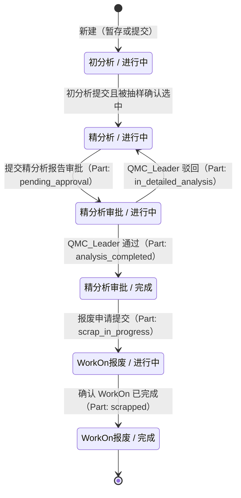

# 售后件与分析单状态联动 Implementation Plan

> **For agentic workers:** REQUIRED SUB-SKILL: Use superpowers:subagent-driven-development (recommended) or superpowers:executing-plans to implement this plan task-by-task. Steps use checkbox (`- [ ]`) syntax for tracking.

**Goal:** 让售后件（Part）状态与分析单（AnalysisOrder）状态保持一致：报告审批流更新 Part+AnalysisOrder 状态，报废流同步更新所有关联 Part 状态。

**Architecture:** 在 `AnalysisReportService` 注入 `PartRepository` 和 `AnalysisOrderRepository`，在 submit/approve/reject 时直接联动更新 Part 和 AnalysisOrder 状态；在 `AnalysisOrderService.scrap/workonConfirm` 中补充对所有关联 Part 的批量状态更新。

**Tech Stack:** Spring Boot 4 / Spring Data JPA / JUnit 5 / Mockito

---

## 文件变更一览

| 操作 | 文件 |
|---|---|
| 修改 | `backend/src/main/java/.../service/AnalysisReportService.java` |
| 修改 | `backend/src/main/java/.../service/AnalysisOrderService.java` |
| 修改 | `backend/src/main/java/.../service/PartService.java`（updateQcNo 允许状态补充） |
| 新建 | `backend/src/test/java/.../service/AnalysisReportServiceTest.java` |
| 新建 | `backend/src/test/java/.../service/AnalysisOrderServiceStatusSyncTest.java` |
| 修改 | `doc/01-设计文档/开发设计文档.md` |
| 修改 | `doc/02-工作进度/测试文档.md` |

---

## Task 1: PartService — 补充 `pending_approval` 状态常量并更新 updateQcNo 校验

**Files:**
- Modify: `backend/src/main/java/com/bosch/rbcc/aftermarketpartsmanagementsystem/service/PartService.java`

- [ ] **Step 1: 在 PartService 中添加 `STATUS_PENDING_APPROVAL` 常量并更新 `QC_ALLOWED_STATUSES`**

在文件顶部常量区，将：
```java
private static final String STATUS_ANALYSIS_COMPLETED = "analysis_completed";
private static final String STATUS_SCRAP_IN_PROGRESS = "scrap_in_progress";
private static final String STATUS_SCRAPPED = "scrapped";
private static final Set<String> QC_ALLOWED_STATUSES = Set.of(
        STATUS_ANALYSIS_COMPLETED, STATUS_SCRAP_IN_PROGRESS, STATUS_SCRAPPED);
```
改为：
```java
private static final String STATUS_PENDING_APPROVAL = "pending_approval";
private static final String STATUS_ANALYSIS_COMPLETED = "analysis_completed";
private static final String STATUS_SCRAP_IN_PROGRESS = "scrap_in_progress";
private static final String STATUS_SCRAPPED = "scrapped";
private static final Set<String> QC_ALLOWED_STATUSES = Set.of(
        STATUS_PENDING_APPROVAL, STATUS_ANALYSIS_COMPLETED, STATUS_SCRAP_IN_PROGRESS, STATUS_SCRAPPED);
```

- [ ] **Step 2: Commit**

```bash
git add backend/src/main/java/com/bosch/rbcc/aftermarketpartsmanagementsystem/service/PartService.java
git commit -m "feat: add pending_approval status constant and allow QC No update in pending_approval"
```

---

## Task 2: AnalysisOrderService — scrap 联动更新所有 Part 状态

**Files:**
- Modify: `backend/src/main/java/com/bosch/rbcc/aftermarketpartsmanagementsystem/service/AnalysisOrderService.java`
- Test: `backend/src/test/java/com/bosch/rbcc/aftermarketpartsmanagementsystem/service/AnalysisOrderServiceStatusSyncTest.java`

- [ ] **Step 1: 新建测试文件，写 scrap 联动的失败测试**

创建 `backend/src/test/java/com/bosch/rbcc/aftermarketpartsmanagementsystem/service/AnalysisOrderServiceStatusSyncTest.java`：

```java
package com.bosch.rbcc.aftermarketpartsmanagementsystem.service;

import com.bosch.rbcc.aftermarketpartsmanagementsystem.entity.AnalysisOrder;
import com.bosch.rbcc.aftermarketpartsmanagementsystem.entity.Part;
import com.bosch.rbcc.aftermarketpartsmanagementsystem.repository.AnalysisOrderRepository;
import com.bosch.rbcc.aftermarketpartsmanagementsystem.repository.PartRepository;
import com.bosch.rbcc.aftermarketpartsmanagementsystem.repository.ReturnOrderRepository;
import org.junit.jupiter.api.BeforeEach;
import org.junit.jupiter.api.Test;
import org.junit.jupiter.api.extension.ExtendWith;
import org.mockito.ArgumentCaptor;
import org.mockito.InjectMocks;
import org.mockito.Mock;
import org.mockito.junit.jupiter.MockitoExtension;

import java.util.List;
import java.util.Optional;

import static org.assertj.core.api.Assertions.assertThat;
import static org.mockito.Mockito.*;

@ExtendWith(MockitoExtension.class)
class AnalysisOrderServiceStatusSyncTest {

    @Mock AnalysisOrderRepository analysisOrderRepo;
    @Mock PartRepository partRepo;
    @Mock ReturnOrderRepository returnOrderRepo;

    @InjectMocks AnalysisOrderService service;

    private AnalysisOrder order;
    private Part part1, part2;

    @BeforeEach
    void setUp() {
        order = AnalysisOrder.builder()
                .id("ao-1").orderId("order-1").analyst("analyst1")
                .status("in_detailed_analysis").build();

        part1 = Part.builder().id("p-1").orderId("order-1").analyst("analyst1")
                .isSample(1).status("in_detailed_analysis").build();
        part2 = Part.builder().id("p-2").orderId("order-1").analyst("analyst1")
                .isSample(0).status("in_initial_analysis").build();
    }

    @Test
    void scrap_shouldUpdateAllPartsToScrapInProgress() {
        when(analysisOrderRepo.findById("ao-1")).thenReturn(Optional.of(order));
        when(partRepo.findByOrderIdAndAnalyst("order-1", "analyst1"))
                .thenReturn(List.of(part1, part2));
        when(analysisOrderRepo.save(any())).thenReturn(order);
        when(returnOrderRepo.findById(any())).thenReturn(Optional.empty());

        service.scrap("ao-1");

        assertThat(part1.getStatus()).isEqualTo("scrap_in_progress");
        assertThat(part2.getStatus()).isEqualTo("scrap_in_progress");
        verify(partRepo, times(2)).save(any(Part.class));
    }
}
```

- [ ] **Step 2: 运行测试，确认失败**

```bash
cd backend
./mvnw test -pl . -Dtest=AnalysisOrderServiceStatusSyncTest#scrap_shouldUpdateAllPartsToScrapInProgress -Dsurefire.failIfNoSpecifiedTests=false 2>&1 | tail -20
```

期望：测试失败（scrap 未更新 Part 状态）

- [ ] **Step 3: 修改 `AnalysisOrderService.scrap()`**

在 `analysisOrderRepo.save(ao);` 之后添加：
```java
// 联动更新所有关联 Part 状态
List<Part> parts = partRepo.findByOrderIdAndAnalyst(ao.getOrderId(), ao.getAnalyst());
for (Part part : parts) {
    part.setStatus(STATUS_SCRAP_IN_PROGRESS);
    part.setStatusChangedAt(LocalDateTime.now());
    partRepo.save(part);
}
```

注意：`AnalysisOrderService` 中已有 `STATUS_WORKON_SCRAP_IN_PROGRESS` 常量，还需在该类顶部添加：
```java
private static final String STATUS_SCRAP_IN_PROGRESS = "scrap_in_progress";
```

同时需要在类头部 import：
```java
import com.bosch.rbcc.aftermarketpartsmanagementsystem.entity.Part;
import java.util.List;
```
（`List` 和 `Part` 已导入，确认即可）

- [ ] **Step 4: 运行测试，确认通过**

```bash
./mvnw test -pl . -Dtest=AnalysisOrderServiceStatusSyncTest#scrap_shouldUpdateAllPartsToScrapInProgress -Dsurefire.failIfNoSpecifiedTests=false 2>&1 | tail -20
```

期望：`BUILD SUCCESS`，1 test passed

- [ ] **Step 5: Commit**

```bash
git add backend/src/main/java/com/bosch/rbcc/aftermarketpartsmanagementsystem/service/AnalysisOrderService.java
git add backend/src/test/java/com/bosch/rbcc/aftermarketpartsmanagementsystem/service/AnalysisOrderServiceStatusSyncTest.java
git commit -m "feat: scrap now syncs all related parts to scrap_in_progress"
```

---

## Task 3: AnalysisOrderService — workonConfirm 联动更新所有 Part 状态

**Files:**
- Modify: `backend/src/main/java/com/bosch/rbcc/aftermarketpartsmanagementsystem/service/AnalysisOrderService.java`
- Test: `backend/src/test/java/com/bosch/rbcc/aftermarketpartsmanagementsystem/service/AnalysisOrderServiceStatusSyncTest.java`

- [ ] **Step 1: 追加 workonConfirm 测试**

在 `AnalysisOrderServiceStatusSyncTest` 中追加：

```java
@Test
void workonConfirm_shouldUpdateAllPartsToScrapped() {
    order.setStatus("workon_scrap_in_progress");
    part1.setStatus("scrap_in_progress");
    part2.setStatus("scrap_in_progress");

    when(analysisOrderRepo.findById("ao-1")).thenReturn(Optional.of(order));
    when(partRepo.findByOrderIdAndAnalyst("order-1", "analyst1"))
            .thenReturn(List.of(part1, part2));
    when(analysisOrderRepo.save(any())).thenReturn(order);
    when(returnOrderRepo.findById(any())).thenReturn(Optional.empty());

    service.workonConfirm("ao-1");

    assertThat(part1.getStatus()).isEqualTo("scrapped");
    assertThat(part2.getStatus()).isEqualTo("scrapped");
    verify(partRepo, times(2)).save(any(Part.class));
}
```

- [ ] **Step 2: 运行测试，确认失败**

```bash
./mvnw test -pl . -Dtest=AnalysisOrderServiceStatusSyncTest#workonConfirm_shouldUpdateAllPartsToScrapped -Dsurefire.failIfNoSpecifiedTests=false 2>&1 | tail -20
```

期望：失败

- [ ] **Step 3: 修改 `AnalysisOrderService.workonConfirm()`**

在 `analysisOrderRepo.save(ao);` 之后添加：
```java
// 联动更新所有关联 Part 状态
List<Part> parts = partRepo.findByOrderIdAndAnalyst(ao.getOrderId(), ao.getAnalyst());
for (Part part : parts) {
    part.setStatus(STATUS_SCRAPPED);
    part.setStatusChangedAt(LocalDateTime.now());
    partRepo.save(part);
}
```

在类常量区添加：
```java
private static final String STATUS_SCRAPPED = "scrapped";
```

- [ ] **Step 4: 运行测试，确认通过**

```bash
./mvnw test -pl . -Dtest=AnalysisOrderServiceStatusSyncTest -Dsurefire.failIfNoSpecifiedTests=false 2>&1 | tail -20
```

期望：2 tests passed

- [ ] **Step 5: Commit**

```bash
git add backend/src/main/java/com/bosch/rbcc/aftermarketpartsmanagementsystem/service/AnalysisOrderService.java
git add backend/src/test/java/com/bosch/rbcc/aftermarketpartsmanagementsystem/service/AnalysisOrderServiceStatusSyncTest.java
git commit -m "feat: workonConfirm now syncs all related parts to scrapped"
```

---

## Task 4: AnalysisReportService — submit 联动 Part + AnalysisOrder 状态

**Files:**
- Modify: `backend/src/main/java/com/bosch/rbcc/aftermarketpartsmanagementsystem/service/AnalysisReportService.java`
- Test: `backend/src/test/java/com/bosch/rbcc/aftermarketpartsmanagementsystem/service/AnalysisReportServiceTest.java`

- [ ] **Step 1: 新建测试文件，写 submit 联动的失败测试**

创建 `backend/src/test/java/com/bosch/rbcc/aftermarketpartsmanagementsystem/service/AnalysisReportServiceTest.java`：

```java
package com.bosch.rbcc.aftermarketpartsmanagementsystem.service;

import com.bosch.rbcc.aftermarketpartsmanagementsystem.entity.AnalysisOrder;
import com.bosch.rbcc.aftermarketpartsmanagementsystem.entity.AnalysisReport;
import com.bosch.rbcc.aftermarketpartsmanagementsystem.entity.Part;
import com.bosch.rbcc.aftermarketpartsmanagementsystem.repository.AnalysisOrderRepository;
import com.bosch.rbcc.aftermarketpartsmanagementsystem.repository.AnalysisReportRepository;
import com.bosch.rbcc.aftermarketpartsmanagementsystem.repository.PartRepository;
import com.fasterxml.jackson.databind.ObjectMapper;
import org.junit.jupiter.api.BeforeEach;
import org.junit.jupiter.api.Test;
import org.junit.jupiter.api.extension.ExtendWith;
import org.mockito.InjectMocks;
import org.mockito.Mock;
import org.mockito.junit.jupiter.MockitoExtension;

import java.util.List;
import java.util.Optional;

import static org.assertj.core.api.Assertions.assertThat;
import static org.mockito.ArgumentMatchers.any;
import static org.mockito.Mockito.*;

@ExtendWith(MockitoExtension.class)
class AnalysisReportServiceTest {

    @Mock AnalysisReportRepository repository;
    @Mock PartRepository partRepository;
    @Mock AnalysisOrderRepository analysisOrderRepository;
    @Mock ObjectMapper objectMapper;

    @InjectMocks AnalysisReportService service;

    private AnalysisReport report;
    private Part sampledPart;
    private AnalysisOrder analysisOrder;

    @BeforeEach
    void setUp() {
        report = AnalysisReport.builder()
                .id("r-1").partId("p-1").status("draft").build();

        sampledPart = Part.builder()
                .id("p-1").orderId("order-1").analyst("analyst1")
                .isSample(1).status("in_detailed_analysis").build();

        analysisOrder = AnalysisOrder.builder()
                .id("ao-1").orderId("order-1").analyst("analyst1")
                .status("in_detailed_analysis").build();
    }

    @Test
    void submit_shouldSetPartToPendingApproval() {
        when(repository.findById("r-1")).thenReturn(Optional.of(report));
        when(repository.save(any())).thenReturn(report);
        when(partRepository.findById("p-1")).thenReturn(Optional.of(sampledPart));
        when(analysisOrderRepository.findByOrderIdAndAnalyst("order-1", "analyst1"))
                .thenReturn(Optional.of(analysisOrder));
        when(partRepository.findByOrderIdAndAnalyst("order-1", "analyst1"))
                .thenReturn(List.of(sampledPart));

        service.submit("r-1", "analyst1");

        assertThat(sampledPart.getStatus()).isEqualTo("pending_approval");
    }

    @Test
    void submit_allSampledPartsPendingApproval_shouldSetAnalysisOrderToPendingApproval() {
        when(repository.findById("r-1")).thenReturn(Optional.of(report));
        when(repository.save(any())).thenReturn(report);
        when(partRepository.findById("p-1")).thenReturn(Optional.of(sampledPart));
        when(analysisOrderRepository.findByOrderIdAndAnalyst("order-1", "analyst1"))
                .thenReturn(Optional.of(analysisOrder));
        // 只有这一个抽样件，提交后全部为 pending_approval
        sampledPart.setStatus("pending_approval"); // 模拟 submit 已更新 part 状态
        when(partRepository.findByOrderIdAndAnalyst("order-1", "analyst1"))
                .thenReturn(List.of(sampledPart));

        service.submit("r-1", "analyst1");

        assertThat(analysisOrder.getStatus()).isEqualTo("pending_approval");
        verify(analysisOrderRepository).save(analysisOrder);
    }

    @Test
    void submit_notAllSampledPartsSubmitted_shouldNotUpdateAnalysisOrder() {
        Part sampledPart2 = Part.builder()
                .id("p-2").orderId("order-1").analyst("analyst1")
                .isSample(1).status("in_detailed_analysis").build();

        when(repository.findById("r-1")).thenReturn(Optional.of(report));
        when(repository.save(any())).thenReturn(report);
        when(partRepository.findById("p-1")).thenReturn(Optional.of(sampledPart));
        when(analysisOrderRepository.findByOrderIdAndAnalyst("order-1", "analyst1"))
                .thenReturn(Optional.of(analysisOrder));
        // sampledPart2 仍是 in_detailed_analysis，未提交
        sampledPart.setStatus("pending_approval");
        when(partRepository.findByOrderIdAndAnalyst("order-1", "analyst1"))
                .thenReturn(List.of(sampledPart, sampledPart2));

        service.submit("r-1", "analyst1");

        assertThat(analysisOrder.getStatus()).isEqualTo("in_detailed_analysis"); // 不变
        verify(analysisOrderRepository, never()).save(any());
    }
}
```

- [ ] **Step 2: 运行测试，确认失败**

```bash
./mvnw test -pl . -Dtest=AnalysisReportServiceTest -Dsurefire.failIfNoSpecifiedTests=false 2>&1 | tail -30
```

期望：编译失败（AnalysisReportService 尚未注入 PartRepository / AnalysisOrderRepository）

- [ ] **Step 3: 修改 `AnalysisReportService`**

**3a. 添加依赖注入字段**（在类声明 `@RequiredArgsConstructor` 下方字段区）：

```java
// 在 AnalysisReportService 中添加：
private final PartRepository partRepository;
private final AnalysisOrderRepository analysisOrderRepository;
```

**3b. 添加常量**（类顶部）：

```java
private static final String STATUS_PENDING_APPROVAL = "pending_approval";
private static final String STATUS_IN_DETAILED_ANALYSIS = "in_detailed_analysis";
private static final String STATUS_ANALYSIS_COMPLETED = "analysis_completed";
```

**3c. 替换 `submit` 方法**：

```java
@Transactional
public AnalysisReportDTO submit(String reportId, String submittedBy) {
    AnalysisReport report = repository.findById(reportId)
        .orElseThrow(() -> new IllegalArgumentException("Report not found: " + reportId));
    report.setStatus("submitted");
    report.setSubmittedBy(submittedBy);
    report.setSubmittedAt(LocalDateTime.now());
    report = repository.save(report);
    log.info("Report submitted: id={}, by={}", reportId, submittedBy);

    // 联动：Part → pending_approval
    partRepository.findById(report.getPartId()).ifPresent(part -> {
        part.setStatus(STATUS_PENDING_APPROVAL);
        part.setStatusChangedAt(LocalDateTime.now());
        partRepository.save(part);

        // 联动：若所有抽样件均为 pending_approval → AnalysisOrder → pending_approval
        analysisOrderRepository.findByOrderIdAndAnalyst(part.getOrderId(), part.getAnalyst())
            .ifPresent(ao -> {
                List<Part> sampledParts = partRepository
                    .findByOrderIdAndAnalyst(part.getOrderId(), part.getAnalyst())
                    .stream().filter(p -> p.getIsSample() != null && p.getIsSample() == 1)
                    .toList();
                boolean allPendingApproval = !sampledParts.isEmpty()
                    && sampledParts.stream().allMatch(p -> STATUS_PENDING_APPROVAL.equals(p.getStatus()));
                if (allPendingApproval) {
                    ao.setStatus(STATUS_PENDING_APPROVAL);
                    ao.setStatusChangedAt(LocalDateTime.now());
                    analysisOrderRepository.save(ao);
                }
            });
    });

    return toDTO(report);
}
```

**3d. 添加缺少的 import**（如不存在）：

```java
import com.bosch.rbcc.aftermarketpartsmanagementsystem.entity.AnalysisOrder;
import com.bosch.rbcc.aftermarketpartsmanagementsystem.entity.Part;
import com.bosch.rbcc.aftermarketpartsmanagementsystem.repository.AnalysisOrderRepository;
import com.bosch.rbcc.aftermarketpartsmanagementsystem.repository.PartRepository;
import java.util.List;
```

- [ ] **Step 4: 运行测试，确认通过**

```bash
./mvnw test -pl . -Dtest=AnalysisReportServiceTest -Dsurefire.failIfNoSpecifiedTests=false 2>&1 | tail -20
```

期望：3 tests passed

- [ ] **Step 5: Commit**

```bash
git add backend/src/main/java/com/bosch/rbcc/aftermarketpartsmanagementsystem/service/AnalysisReportService.java
git add backend/src/test/java/com/bosch/rbcc/aftermarketpartsmanagementsystem/service/AnalysisReportServiceTest.java
git commit -m "feat: report submit syncs part and analysis order to pending_approval"
```

---

## Task 5: AnalysisReportService — approve 联动 Part + AnalysisOrder 状态

**Files:**
- Modify: `backend/src/main/java/com/bosch/rbcc/aftermarketpartsmanagementsystem/service/AnalysisReportService.java`
- Test: `backend/src/test/java/com/bosch/rbcc/aftermarketpartsmanagementsystem/service/AnalysisReportServiceTest.java`

- [ ] **Step 1: 追加 approve 测试**

在 `AnalysisReportServiceTest` 中追加：

```java
@Test
void approve_shouldSetPartToAnalysisCompleted() {
    report.setStatus("submitted");
    sampledPart.setStatus("pending_approval");

    when(repository.findById("r-1")).thenReturn(Optional.of(report));
    when(repository.save(any())).thenReturn(report);
    when(partRepository.findById("p-1")).thenReturn(Optional.of(sampledPart));
    when(analysisOrderRepository.findByOrderIdAndAnalyst("order-1", "analyst1"))
            .thenReturn(Optional.of(analysisOrder));
    sampledPart.setStatus("analysis_completed"); // 模拟 approve 更新后
    when(partRepository.findByOrderIdAndAnalyst("order-1", "analyst1"))
            .thenReturn(List.of(sampledPart));

    service.approve("r-1", "qmc-leader", null);

    assertThat(analysisOrder.getStatus()).isEqualTo("analysis_completed");
    verify(analysisOrderRepository).save(analysisOrder);
}

@Test
void approve_notAllPartsApproved_shouldNotUpdateAnalysisOrder() {
    report.setStatus("submitted");
    sampledPart.setStatus("pending_approval");
    Part sampledPart2 = Part.builder()
            .id("p-2").orderId("order-1").analyst("analyst1")
            .isSample(1).status("pending_approval").build();

    when(repository.findById("r-1")).thenReturn(Optional.of(report));
    when(repository.save(any())).thenReturn(report);
    when(partRepository.findById("p-1")).thenReturn(Optional.of(sampledPart));
    when(analysisOrderRepository.findByOrderIdAndAnalyst("order-1", "analyst1"))
            .thenReturn(Optional.of(analysisOrder));
    // sampledPart2 仍为 pending_approval
    sampledPart.setStatus("analysis_completed");
    when(partRepository.findByOrderIdAndAnalyst("order-1", "analyst1"))
            .thenReturn(List.of(sampledPart, sampledPart2));

    service.approve("r-1", "qmc-leader", null);

    assertThat(analysisOrder.getStatus()).isEqualTo("in_detailed_analysis"); // 不变
    verify(analysisOrderRepository, never()).save(any());
}
```

- [ ] **Step 2: 运行测试，确认失败**

```bash
./mvnw test -pl . -Dtest=AnalysisReportServiceTest -Dsurefire.failIfNoSpecifiedTests=false 2>&1 | tail -20
```

期望：新增 2 个测试失败

- [ ] **Step 3: 替换 `approve` 方法**

```java
@Transactional
public AnalysisReportDTO approve(String reportId, String approvedBy, String comment) {
    AnalysisReport report = repository.findById(reportId)
        .orElseThrow(() -> new IllegalArgumentException("Report not found: " + reportId));
    report.setStatus("approved");
    report.setApprovedBy(approvedBy);
    report.setApprovedAt(LocalDateTime.now());
    report = repository.save(report);
    log.info("Report approved: id={}, by={}", reportId, approvedBy);

    // 联动：Part → analysis_completed
    partRepository.findById(report.getPartId()).ifPresent(part -> {
        part.setStatus(STATUS_ANALYSIS_COMPLETED);
        part.setStatusChangedAt(LocalDateTime.now());
        partRepository.save(part);

        // 联动：若所有抽样件均为 analysis_completed → AnalysisOrder → analysis_completed
        analysisOrderRepository.findByOrderIdAndAnalyst(part.getOrderId(), part.getAnalyst())
            .ifPresent(ao -> {
                List<Part> sampledParts = partRepository
                    .findByOrderIdAndAnalyst(part.getOrderId(), part.getAnalyst())
                    .stream().filter(p -> p.getIsSample() != null && p.getIsSample() == 1)
                    .toList();
                boolean allCompleted = !sampledParts.isEmpty()
                    && sampledParts.stream().allMatch(p -> STATUS_ANALYSIS_COMPLETED.equals(p.getStatus()));
                if (allCompleted) {
                    ao.setStatus(STATUS_ANALYSIS_COMPLETED);
                    ao.setStatusChangedAt(LocalDateTime.now());
                    analysisOrderRepository.save(ao);
                }
            });
    });

    return toDTO(report);
}
```

- [ ] **Step 4: 运行测试，确认通过**

```bash
./mvnw test -pl . -Dtest=AnalysisReportServiceTest -Dsurefire.failIfNoSpecifiedTests=false 2>&1 | tail -20
```

期望：5 tests passed

- [ ] **Step 5: Commit**

```bash
git add backend/src/main/java/com/bosch/rbcc/aftermarketpartsmanagementsystem/service/AnalysisReportService.java
git add backend/src/test/java/com/bosch/rbcc/aftermarketpartsmanagementsystem/service/AnalysisReportServiceTest.java
git commit -m "feat: report approve syncs part and analysis order to analysis_completed"
```

---

## Task 6: AnalysisReportService — reject 联动 Part + AnalysisOrder 状态

**Files:**
- Modify: `backend/src/main/java/com/bosch/rbcc/aftermarketpartsmanagementsystem/service/AnalysisReportService.java`
- Test: `backend/src/test/java/com/bosch/rbcc/aftermarketpartsmanagementsystem/service/AnalysisReportServiceTest.java`

- [ ] **Step 1: 追加 reject 测试**

在 `AnalysisReportServiceTest` 中追加：

```java
@Test
void reject_shouldSetPartBackToInDetailedAnalysis() {
    report.setStatus("submitted");
    sampledPart.setStatus("pending_approval");
    analysisOrder.setStatus("pending_approval");

    when(repository.findById("r-1")).thenReturn(Optional.of(report));
    when(repository.save(any())).thenReturn(report);
    when(partRepository.findById("p-1")).thenReturn(Optional.of(sampledPart));
    when(analysisOrderRepository.findByOrderIdAndAnalyst("order-1", "analyst1"))
            .thenReturn(Optional.of(analysisOrder));

    service.reject("r-1", "qmc-leader", "需要补充数据");

    assertThat(sampledPart.getStatus()).isEqualTo("in_detailed_analysis");
    assertThat(analysisOrder.getStatus()).isEqualTo("in_detailed_analysis");
    verify(analysisOrderRepository).save(analysisOrder);
}

@Test
void reject_analysisOrderNotPendingApproval_shouldNotUpdateAnalysisOrder() {
    report.setStatus("submitted");
    sampledPart.setStatus("pending_approval");
    analysisOrder.setStatus("in_detailed_analysis"); // 已经回退过

    when(repository.findById("r-1")).thenReturn(Optional.of(report));
    when(repository.save(any())).thenReturn(report);
    when(partRepository.findById("p-1")).thenReturn(Optional.of(sampledPart));
    when(analysisOrderRepository.findByOrderIdAndAnalyst("order-1", "analyst1"))
            .thenReturn(Optional.of(analysisOrder));

    service.reject("r-1", "qmc-leader", "需要补充数据");

    assertThat(sampledPart.getStatus()).isEqualTo("in_detailed_analysis");
    verify(analysisOrderRepository, never()).save(any());
}
```

- [ ] **Step 2: 运行测试，确认失败**

```bash
./mvnw test -pl . -Dtest=AnalysisReportServiceTest -Dsurefire.failIfNoSpecifiedTests=false 2>&1 | tail -20
```

期望：2 个新测试失败

- [ ] **Step 3: 替换 `reject` 方法**

```java
@Transactional
public AnalysisReportDTO reject(String reportId, String approvedBy, String reason) {
    AnalysisReport report = repository.findById(reportId)
        .orElseThrow(() -> new IllegalArgumentException("Report not found: " + reportId));
    report.setStatus("rejected");
    report.setApprovedBy(approvedBy);
    report.setApprovedAt(LocalDateTime.now());
    report.setRejectReason(reason);
    report = repository.save(report);
    log.info("Report rejected: id={}, by={}, reason={}", reportId, approvedBy, reason);

    // 联动：Part → in_detailed_analysis
    partRepository.findById(report.getPartId()).ifPresent(part -> {
        part.setStatus(STATUS_IN_DETAILED_ANALYSIS);
        part.setStatusChangedAt(LocalDateTime.now());
        partRepository.save(part);

        // 联动：若 AnalysisOrder 当前为 pending_approval → 回退为 in_detailed_analysis
        analysisOrderRepository.findByOrderIdAndAnalyst(part.getOrderId(), part.getAnalyst())
            .ifPresent(ao -> {
                if (STATUS_PENDING_APPROVAL.equals(ao.getStatus())) {
                    ao.setStatus(STATUS_IN_DETAILED_ANALYSIS);
                    ao.setStatusChangedAt(LocalDateTime.now());
                    analysisOrderRepository.save(ao);
                }
            });
    });

    return toDTO(report);
}
```

- [ ] **Step 4: 运行所有 service 测试，确认全部通过**

```bash
./mvnw test -pl . -Dtest="AnalysisReportServiceTest,AnalysisOrderServiceStatusSyncTest" -Dsurefire.failIfNoSpecifiedTests=false 2>&1 | tail -20
```

期望：7 tests passed

- [ ] **Step 5: Commit**

```bash
git add backend/src/main/java/com/bosch/rbcc/aftermarketpartsmanagementsystem/service/AnalysisReportService.java
git add backend/src/test/java/com/bosch/rbcc/aftermarketpartsmanagementsystem/service/AnalysisReportServiceTest.java
git commit -m "feat: report reject syncs part and analysis order back to in_detailed_analysis"
```

---

## Task 7: 更新设计文档与测试文档

**Files:**
- Modify: `doc/01-设计文档/开发设计文档.md`
- Modify: `doc/02-工作进度/测试文档.md`

- [ ] **Step 1: 更新开发设计文档**

在 `doc/01-设计文档/开发设计文档.md` 的 **2.2.3 售后件状态转换图**（`stateDiagram-v2`）中，在 `da_ip --> ap_ip` 前的状态定义区补充 `pending_approval` 状态：



在 **2.2.4 分析单 与其他模块的交互** 表格中，更新交互说明：

| 交互目标模块 | 交互说明 |
|------|------|
| 售后件管理（M03） | 分析单通过 `ORDER_ID + ANALYST` 隐式关联售后件；抽样结果更新售后件 `IS_SAMPLE` 字段；报废申请/确认时联动更新所有关联售后件状态（`scrap_in_progress` / `scrapped`） |
| 精分析报告（M05） | 精分析报告 submit/approve/reject 联动更新 Part 状态（`pending_approval`/`analysis_completed`/`in_detailed_analysis`）；当所有抽样件状态满足条件时自动推进分析单状态 |

- [ ] **Step 2: 在测试文档新增测试用例**

在 `doc/02-工作进度/测试文档.md` 中新增以下测试用例（状态留空，由人工确认）：

```
| TC-SYNC-01 | 报告提交 → 单件 Part 状态变为 pending_approval | | |
| TC-SYNC-02 | 报告提交 → 所有抽样件均 pending_approval 时，分析单变为 pending_approval | | |
| TC-SYNC-03 | 报告提交 → 仍有抽样件未提交时，分析单状态不变 | | |
| TC-SYNC-04 | 报告通过 → 所有抽样件均 analysis_completed 时，分析单变为 analysis_completed | | |
| TC-SYNC-05 | 报告通过 → 仍有抽样件未通过时，分析单状态不变 | | |
| TC-SYNC-06 | 报告驳回 → Part 回退为 in_detailed_analysis，分析单（若为 pending_approval）回退为 in_detailed_analysis | | |
| TC-SYNC-07 | 报废申请 → 所有 Part（含未抽样件）变为 scrap_in_progress | | |
| TC-SYNC-08 | WorkON 确认 → 所有 Part 变为 scrapped | | |
```

- [ ] **Step 3: Commit**

```bash
git add doc/01-设计文档/开发设计文档.md doc/02-工作进度/测试文档.md
git commit -m "docs: update design doc and test doc for part-analysis order status sync"
```

---

## 验收标准

1. 所有 Mockito 单元测试通过（7 tests）
2. 分析单报废/确认时，所有关联 Part 状态同步更新
3. 精分析报告提交/通过/驳回时，对应 Part 状态同步更新，并在满足聚合条件时推进分析单状态
4. `pending_approval` 状态下可正常填写 QC No.
5. 设计文档和测试文档已同步更新
