# RBCC WFAM 售后件管理系统 — 开发设计文档

## 文档信息

| 项目 | 内容 |
|------|------|
| 项目名称 | RBCC WFAM 售后件管理系统 |
| 文档版本 | v1.8 |
| 创建日期 | 2026-03-02 |
| 文档状态 | 草稿（含少量待确认项） |

---

## 目录

1. [系统概述](#1-系统概述)
2. [功能模块设计](#2-功能模块设计)
3. [数据库设计](#3-数据库设计)
4. [其他设计](#4-其他设计)
5. [附录](#5-附录)
6. [更改记录](#6-更改记录)

---

## 1. 系统概述

### 1.1 系统目标

RBCC WFAM 售后件管理系统用于管理退货单和售后件的全生命周期，覆盖从退货登记、初分析、抽样、精分析、审批到报废的完整业务流程，并提供数据统计与分析功能。

核心目标：
- 提供退货单与售后件的全流程可视化追溯
- 通过 OCR 图像识别提高数据录入效率
- 支持基于 Excel 模板的精分析报告动态表单与导出
- 提供多维度统计报表，辅助质量改进决策

### 1.2 系统架构（必填）

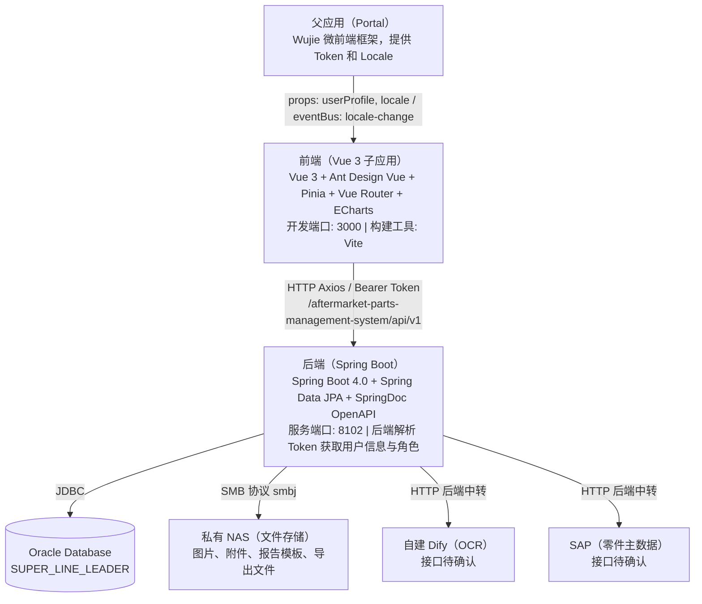

**部署架构：**

| 容器 | 基础镜像 | 说明 |
|------|------|------|
| 前端 | nginx:alpine | Vite 构建产物静态托管 |
| 后端 | JDK 21 | Spring Boot Fat JAR |

### 1.3 关键组件与模块划分

#### 前端组件划分

```
src/
├── views/          页面组件（按模块分目录）
├── components/     通用 UI 组件
├── composables/    业务逻辑复用（useOCR、useApprovalColumns 等）
├── services/       API 请求层（每模块独立文件）
├── stores/         Pinia 状态管理（userInfo）
├── router/         路由配置与守卫
├── i18n/           国际化（zh-CN / en-US）
├── types/          TypeScript 全局类型定义
└── layouts/        应用布局（MainLayout）
```

#### 后端包划分

```
com.bosch.rbcc.aftermarketpartsmanagementsystem
├── config/         配置类（WebMvc、JPA Auditor、SMB 连接池）
├── controller/     REST 控制器（按模块子包）
├── service/        业务逻辑层
├── repository/     Spring Data JPA Repository
├── entity/         JPA 实体
├── dto/            数据传输对象
├── util/           SMBFileHandler（文件读写）
├── header/         Token 解析与用户信息管理
└── interceptor/    拦截器
```

### 1.4 系统约束条件与假设（必填）

**技术约束：**

| 约束项 | 说明 |
|------|------|
| 浏览器 | Chrome 90+ / Edge 90+ / Firefox 88+ |
| 分辨率 | 最低 1366×768，推荐 1920×1080 |
| 文件上传 | 单张图片 ≤ 10 MB，最多 20 张；附件 ≤ 10 MB |
| 列表分页 | 单页最多 100 条 |
| 接口响应 | P95 < 500ms |

**系统假设：**

| 假设项 | 说明 |
|------|------|
| 认证 | 运行于 Wujie 微前端框架中，Token 由父应用注入；后端解析 Token 获取用户 ID、姓名、角色（已实现） |
| 角色管理 | 用户角色通过 IDM 系统统一分配，系统不维护用户注册与角色授权 |
| WorkON 集成 | 报废流程通过跳转链接集成 WorkON，不调用 WorkON API |
| 精分析报告导出 | 仅导出 Excel（.xlsx），不需要 Word/PDF |
| 预警超期配置 | 时限写在配置文件中，不在页面展示 |

**待确认事项：**

| # | 问题 | 影响模块 | 优先级 |
|---|------|---------|------|
| 1 | 哪些 BA 投诉类型代码属于"0km"（需隐藏信息卡）？ | 售后件表单 | 高 |
| 2 | NAS 连接信息（host、share-name、用户名/密码/domain） | 文件存储 | 高 |
| 3 | SAP 零件主数据查询接口（URL、鉴权、请求/响应格式） | 售后件表单自动填充 | 高 |
| 4 | Dify OCR 接口信息（URL、鉴权、请求/响应格式） | OCR 扫描 | 中 |

---

## 2. 功能模块设计

### 2.1 功能模块清单（必填）

| 模块编号 | 模块名称 | 菜单路径 | 可访问角色 |
|------|------|------|------|
| M01 | 工作台 | /dashboard | 全部角色 |
| M02 | 退货单管理 | /return-orders | 除访客外全部角色 |
| M03 | 分析管理（售后件） | /parts | 除访客外全部角色 |
| M04 | 精分析报告与模板系统 | /parts/:id/analysis | 分析员、分析主管、QMC 经理、系统管理员 |
| M05 | 审批管理 | /approval | 分析主管、系统管理员 |
| M06 | 统计报表 | /reports | 全部角色 |
| M07 | 配置管理 | /settings | 系统管理员 |

**角色定义：**

| IDM 角色名称 | 描述 | 菜单权限 |
|------|------|------|
| W_RBCC_AEP_WFAM_Customer_Quality_ENG | 客户质量工程师 | M01 M02 M03 M06 |
| W_RBCC_AEP_WFAM_Analyst | 分析员 | M01 M02 M03 M04 M06 |
| W_RBCC_AEP_WFAM_QMC_Leader | 分析主管 | M01 M02 M03 M04 M05 M06 |
| W_RBCC_AEP_WFAM_QMC_Manager | QMC 经理（数据校订权） | M01 M02 M03 M04 M06 |
| R_RBCC_AEP_WFAM_Visitor | 访客（只读） | M01 M06 |
| W_RBCC_AEP_WFAM_SystemAdmin | 系统管理员 | 全部模块 |

**功能权限矩阵：**

| 功能 | 客户质量工程师 | 分析员 | 分析主管 | QMC 经理 | 访客 | 系统管理员 |
|------|:---:|:---:|:---:|:---:|:---:|:---:|
| 查看工作台 | ✅ | ✅ | ✅ | ✅ | ✅ | ✅ |
| 查看退货单列表/详情 | ✅ | ✅ | ✅ | ✅ | ❌ | ✅ |
| 新建/编辑退货单 | ❌ | ✅ | ❌ | ❌ | ❌ | ✅ |
| 查看售后件详情 | ✅ | ✅ | ✅ | ✅ | ❌ | ✅ |
| 新建/编辑售后件 | ❌ | ✅ | ❌ | ❌ | ❌ | ✅ |
| 精分析报告审批 | ❌ | ❌ | ✅ | ❌ | ❌ | ✅ |
| 查看统计报表 | ✅ | ✅ | ✅ | ✅ | ✅ | ✅ |
| 配置管理 | ❌ | ❌ | ❌ | ❌ | ❌ | ✅ |
| 修改已提交表单（数据校订） | ❌ | ❌ | ❌ | ✅ | ❌ | ✅ |

### 2.2 核心功能模块详细设计

#### 2.2.1 工作台（M01）

##### 2.2.1.1 功能描述（必填）

工作台为系统首页，提供全局数据概览、任务中心和快捷操作入口。

- **数据卡片**：退货单总量 / 售后件总量 / 待处理任务数 / 分析完成率（%），点击跳转对应列表
- **趋势图表**：退货单数量趋势、售后件数量趋势，支持日/周/月/年粒度切换
- **任务中心**：按类型汇总待处理任务数量，标注优先级（紧急/高/中），点击跳转并自动应用筛选

| 任务类型 | 触发条件 | 优先级 |
|------|------|------|
| 待初分析 | 退货单提交后 | 中 |
| 待精分析 | 抽样确认后 | 中 |
| 精分析预警 | 进入精分析中状态 ≥ warning-days | 高（橙色） |
| 精分析超期 | 进入精分析中状态 ≥ overdue-days | 紧急（红色） |
| 精分析报告待审批 | 精分析报告提交后 | 中 |
| 报废审批确认 | 报废申请提交后 | 中 |

- **快捷入口**：内部跳转（新建退货单、新增售后件、统计报表）+ 外部链接（WorkON、IQIS、SAP、Lessons Learned）

##### 2.2.1.2 输入/输出数据流（必填）

| 接口 | 输入 | 输出 |
|------|------|------|
| GET /dashboard/stats | 无 | `{ returnOrderCount, partCount, pendingTaskCount, completionRate }` |
| GET /dashboard/trends | `type=order/part`, `granularity=day/week/month/year` | `[{ date, count }]` |
| GET /dashboard/tasks | 无 | `[{ taskType, count, priority }]`，预警/超期通过比较当前时间与 `STATUS_CHANGED_AT` 实时计算 |

##### 2.2.1.3 状态转换图（必填）

NA（工作台本身无状态）

##### 2.2.1.4 操作流程图（必填）

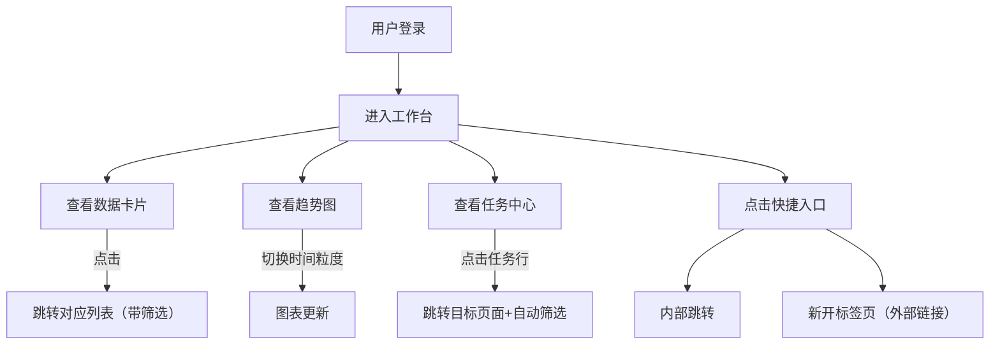

##### 2.2.1.5 数据实体（必填）

工作台数据为聚合查询，无专属实体表。数据来源：

- `APMS_RETURN_ORDER`（退货单总量、趋势）
- `APMS_PART`（售后件总量、趋势、预警/超期任务）
- `APMS_ANALYSIS_REPORT`（完成率、待审批任务）
- `APMS_SCRAP_APPLICATION`（报废确认任务）

##### 2.2.1.6 与其他模块的交互（必填）

| 交互目标模块 | 交互方式 |
|------|------|
| 退货单管理（M02） | 读取退货单数量与状态；点击卡片/任务跳转至退货单列表（带筛选） |
| 分析管理（M03） | 读取售后件数量与状态；预警/超期任务跳转至售后件详情 |
| 审批管理（M05） | 待审批任务数跳转至审批管理页 |
| 统计报表（M06） | 快捷入口跳转 |

##### 2.2.1.7 调用的内外部接口（必填）

| 接口类型 | 接口 | 说明 |
|------|------|------|
| 内部 | GET `/api/v1/dashboard/stats` | 统计卡片数据 |
| 内部 | GET `/api/v1/dashboard/trends` | 趋势图数据 |
| 内部 | GET `/api/v1/dashboard/tasks` | 任务中心数据 |
| 外部链接 | WorkON URL | 浏览器新标签页打开 |
| 外部链接 | Lessons Learned URL | 浏览器新标签页打开 |

---

#### 2.2.2 退货单管理（M02）

##### 2.2.2.1 功能描述（必填）

管理退货单的完整生命周期，包含：

- **列表与查询**：支持退货单号（模糊）、客户（精确）、收件日期范围、投诉日期范围、退回方式过滤；分页展示
- **CRUD**：新建（暂存/提交）、编辑（草稿状态或 SystemAdmin）、删除（草稿状态）、复制、导入/导出
- **抽样管理**：标准抽样/指定抽样/不抽样，确认后样本状态变为"待精分析"
- **报废申请**：填写报废理由和数量，跳转 WorkON 链接，确认后更新状态
- **流程追溯**：步骤条可视化当前状态

**退货单号规则**：提交时生成 `{年份}EM{4位序号}`，如 `2026EM0001`；草稿阶段无编号。

##### 2.2.2.2 输入/输出数据流（必填）

**新建/暂存退货单：**
- 输入：客户、收件日期、投诉日期、退回方式、快递单号（条件必填）、退回数量、退货描述
- 输出：ReturnOrderDTO（id、status=`退货登记/进行中`，无 ORDER_NUMBER）

**提交退货单：**
- 输入：id
- 输出：ReturnOrderDTO（ORDER_NUMBER=`2026EM0001`，status=`初分析/进行中`）

**抽样提交：**
- 输入：orderId、samplingMethod、selectedPartIds[]
- 输出：SamplingDTO（含样本编号列表），ReturnOrder 与相关 Part 状态同步变为 `精分析/进行中`

**报废申请：**
- 输入：orderId、quantity、reason、attachmentPaths[]
- 输出：ScrapApplicationDTO，ReturnOrder 状态变为 `WorkOn报废/进行中`，返回 WorkON 跳转链接

##### 2.2.2.3 状态转换图（必填）

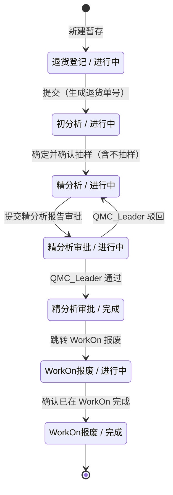

##### 2.2.2.4 操作流程图（必填）

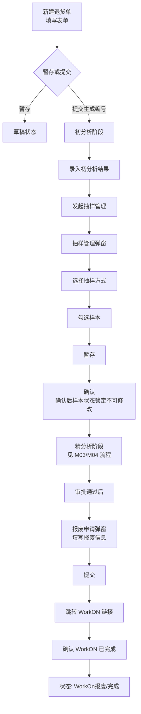

##### 2.2.2.5 数据实体（必填）

| 实体表 | 说明 |
|------|------|
| APMS_RETURN_ORDER | 退货单主表（详见 3.3） |
| APMS_SAMPLING | 抽样主记录 |
| APMS_SAMPLING_DETAIL | 抽样明细（选中样本列表） |
| APMS_SCRAP_APPLICATION | 报废申请 |

##### 2.2.2.6 与其他模块的交互（必填）

| 交互目标模块 | 交互说明 |
|------|------|
| 分析管理（M03） | 退货单内嵌售后件列表；抽样确认后触发 Part 状态变更 |
| 精分析报告（M04） | 精分析阶段关联报告提交后，退货单状态联动推进 |
| 审批管理（M05） | 报告提交审批后，由 M05 完成审批动作 |
| 工作台（M01） | 退货单数量、状态数据被 Dashboard 聚合展示 |
| 文件存储 | 报废附件上传至 SMB NAS |

##### 2.2.2.7 调用的内外部接口（必填）

| 类型 | 接口 | 说明 |
|------|------|------|
| 内部 | GET/POST/PUT/DELETE `/api/v1/return-orders` | 退货单 CRUD |
| 内部 | POST `/api/v1/return-orders/{id}/submit` | 提交生成编号 |
| 内部 | POST `/api/v1/return-orders/{id}/sampling` | 抽样提交 |
| 内部 | POST `/api/v1/return-orders/{id}/scrap` | 报废申请 |
| 内部 | POST `/api/v1/return-orders/{id}/scrap` | 报废申请 |
| 内部 | POST `/api/v1/return-orders/{id}/scrap/workon-confirm` | 确认 WorkON 完成 |
| 内部 | GET `/api/v1/return-orders/import/template` | 下载导入模板 |
| 内部 | POST `/api/v1/return-orders/import` | 批量导入（multipart/form-data） |
| 内部 | GET `/api/v1/return-orders/export` | 条件导出 Excel |
| 内部 | GET `/api/v1/lookup/customers` | 客户下拉 |
| 内部 | POST `/api/v1/files/upload` | 报废附件上传 |
| 外部 | WorkON URL（跳转链接） | 浏览器跳转，不调用 API |

---

#### 2.2.3 分析管理（售后件，M03）

##### 2.2.3.1 功能描述（必填）

管理售后件的录入、信息采集与初分析，包含：

- **列表与查询**：支持零件号、业务单元、产品平台、状态等筛选
- **CRUD**：新建（暂存/提交）、编辑（受权限控制）、删除（草稿状态）
- **基础信息录入**：零件号输入后调 SAP 接口自动填充业务单元和产品平台；投诉类型（BA 代码）；失效类别（有失效描述时必填）
- **信息卡（车辆信息）**：0km 类型隐藏；支持 OCR 拍照识别自动填入各字段
- **照片上传**：最多 20 张，上传至 SMB NAS
- **售后件编号规则**：提交时生成 `{BU代码}-{产品平台代码}-{4位序号}`，如 `BU1-PLT1-0001`

##### 2.2.3.2 输入/输出数据流（必填）

**新建/暂存售后件：**
- 输入：orderId、partCode、businessUnitId、productPlatformId、complaintType、failureCategoryId、customerDescription、vehicleInfo（非0km时）
- 输出：PartDTO（id、status=`初分析/进行中`，无 PART_NUMBER）

**提交售后件：**
- 输入：id
- 输出：PartDTO（PART_NUMBER=`BU1-PLT1-0001`，status=`初分析/进行中`）
- 注：提交后 status 不变仍为 `初分析/进行中`，通过 PART_NUMBER 是否为空区分草稿与已提交

**OCR 识别：**
- 输入：图片文件（multipart/form-data）
- 输出：`{ vehicleProductionDate: {value, confidence}, vehiclePurchaseDate: {value, confidence}, vehicleFailureDate: {value, confidence}, vehicleVIN: {value, confidence}, vehicleMileage: {value, confidence}, customerDescription: {value, confidence} }`

**照片上传：**
- 输入：partId、图片文件
- 输出：`{ imageId, nasPath, fileName }`

**零件号查询（SAP）：**
- 输入：partCode
- 输出：`{ businessUnitId, businessUnitName, productPlatformId, productPlatformName }`

##### 2.2.3.3 状态转换图（必填）

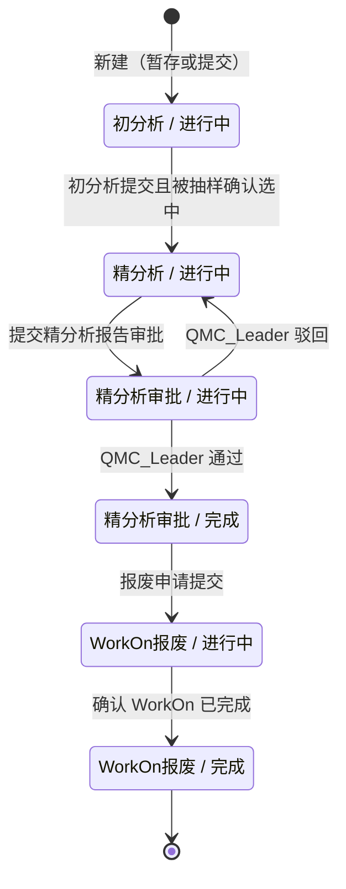

##### 2.2.3.4 操作流程图（必填）

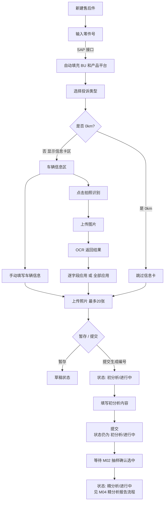

##### 2.2.3.5 数据实体（必填）

| 实体表 | 说明 |
|------|------|
| APMS_PART | 售后件主表（详见 3.3） |
| APMS_PART_IMAGE | 售后件照片（存 NAS 相对路径） |

##### 2.2.3.6 与其他模块的交互（必填）

| 交互目标模块 | 交互说明 |
|------|------|
| 退货单管理（M02） | 售后件隶属于退货单；抽样由 M02 触发 |
| 精分析报告（M04） | 售后件进入 `精分析/进行中` 后触发精分析报告录入 |
| 工作台（M01） | 售后件数量、状态、预警信息被 Dashboard 聚合 |
| 文件存储 | 照片上传至 SMB NAS，路径存 DB |

##### 2.2.3.7 调用的内外部接口（必填）

| 类型 | 接口 | 说明 |
|------|------|------|
| 内部 | GET/POST/PUT/DELETE `/api/v1/parts` | 售后件 CRUD |
| 内部 | POST `/api/v1/parts/{id}/submit` | 提交生成编号 |
| 内部 | POST `/api/v1/parts/{id}/images` | 上传照片 |
| 内部 | DELETE `/api/v1/parts/{id}/images/{imageId}` | 删除照片 |
| 内部 | GET `/api/v1/parts/import/template` | 下载导入模板 |
| 内部 | POST `/api/v1/parts/import` | 批量导入（multipart/form-data） |
| 内部 | GET `/api/v1/parts/export` | 条件导出 Excel |
| 内部 | POST `/api/v1/ocr/recognize` | OCR 识别（后端中转 Dify） |
| 内部 | GET `/api/v1/lookup/part-info?partCode=` | 零件号查询 BU/平台 |
| 外部 | SAP 零件主数据接口 | 由后端 `/lookup/part-info` 中转，接口待确认 |
| 外部 | 自建 Dify OCR | 由后端 `/ocr/recognize` 中转，接口待确认 |

---

#### 2.2.4 精分析报告与模板系统（M04）

##### 2.2.4.1 功能描述（必填）

基于 Excel 模板的动态精分析报告录入与导出系统：

- **模板驱动表单**：系统管理员上传含占位符的 Excel 模板，后端解析占位符生成 JSON 字段描述，前端动态渲染对应表单
- **报告录入**：分析员选择模板，填写动态表单，支持暂存草稿
- **报告提交**：提交后自动路由给 `QMC_Leader` 角色进行审批
- **报告导出**：后端从 NAS 读取模板，将用户填写内容渲染回 Excel 单元格并返回文件流

**占位符格式：**

```
[[type:name:labelZh:labelEn:required:options]]
```

支持字段类型：`text` / `textarea` / `select` / `date` / `image` / `list_text` / `list_image`

占位符示例：

```
[[text:failureMode:失效模式:Failure Mode:true:]]
[[textarea:rootCause:根本原因分析:Root Cause Analysis:true:]]
[[select:responsibleDept:责任部门:Responsible Dept.:true:BU1|BU2|BU3|BU4]]
[[date:expectedDate:预计完成时间:Expected Completion Date:false:]]
[[image:partPhoto:零件照片:Part Photo:false:]]
[[list_text:improvementSteps:改进措施列表:Improvement Steps:false:]]
[[list_image:evidencePhotos:证据照片:Evidence Photos:false:]]
```

##### 2.2.4.2 输入/输出数据流（必填）

**上传模板（SystemAdmin）：**
- 输入：Excel 文件（.xlsx）、模板名称
- 输出：模板元数据（id、name、nasPath）+ 解析出的 FIELDS_JSON 存入 DB
- FIELDS_JSON 示例：
```json
[
  { "name": "failureMode", "labelZh": "失效模式", "labelEn": "Failure Mode",
    "type": "text", "required": true, "options": null, "sheetIndex": 0, "cellRef": "B3" },
  { "name": "responsibleDept", "labelZh": "责任部门", "labelEn": "Responsible Dept.",
    "type": "select", "required": true, "options": ["BU1","BU2","BU3","BU4"], "sheetIndex": 0, "cellRef": "B5" }
]
```

**获取模板详情（前端渲染表单）：**
- 输入：templateId
- 输出：`{ id, name, fieldsJson: [...] }`

**提交精分析报告：**
- 输入：partId、templateId、content（JSON）、summary、attachmentPaths[]
- content 示例：`{ "failureMode": "噪音", "responsibleDept": "BU2", "improvementSteps": ["步骤1", "步骤2"] }`
- 输出：AnalysisReportDTO（status=`submitted`）

**导出精分析报告：**
- 输入：partId / reportId
- 输出：Excel 文件流（Content-Disposition: attachment）

##### 2.2.4.3 状态转换图（必填）

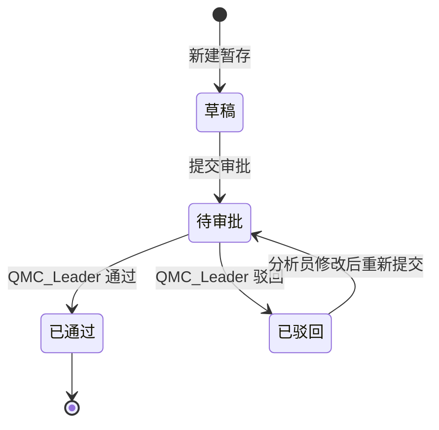

##### 2.2.4.4 操作流程图（必填）

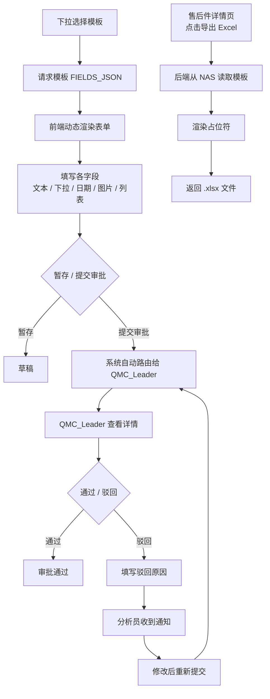

##### 2.2.4.5 数据实体（必填）

| 实体表 | 说明 |
|------|------|
| APMS_ANALYSIS_REPORT | 精分析报告（含 CONTENT_JSON、status） |
| APMS_REPORT_TEMPLATE | 报告模板元数据（含 FIELDS_JSON） |
| APMS_REPORT_ATTACHMENT | 报告附件（NAS 路径） |

##### 2.2.4.6 与其他模块的交互（必填）

| 交互目标模块 | 交互说明 |
|------|------|
| 分析管理（M03） | 报告关联 Part；提交审批后 Part 状态联动 |
| 审批管理（M05） | 提交后报告进入 M05 审批队列 |
| 配置管理（M07） | 模板由 M07 上传维护，M04 消费 |
| 文件存储 | 模板文件和附件存于 SMB NAS |

##### 2.2.4.7 调用的内外部接口（必填）

| 类型 | 接口 | 说明 |
|------|------|------|
| 内部 | GET `/api/v1/templates/{id}` | 获取模板及 FIELDS_JSON |
| 内部 | POST `/api/v1/parts/{id}/analysis` | 保存/更新报告（暂存） |
| 内部 | POST `/api/v1/parts/{id}/analysis/submit` | 提交审批 |
| 内部 | GET `/api/v1/parts/{id}/analysis` | 查看报告详情 |
| 内部 | GET `/api/v1/parts/{id}/analysis/export` | 导出 Excel |
| 内部 | POST `/api/v1/files/upload` | 报告附件上传 |

---

#### 2.2.5 审批管理（M05）

##### 2.2.5.1 功能描述（必填）

提供两类审批操作，仅 `QMC_Leader` 和 `SystemAdmin` 可访问：

- **精分析报告审批**：查看待审批报告列表 → 查看报告详情 → 审批通过 / 驳回（需填驳回原因）
- **报废审批确认**：查看待确认报废列表 → 确认"已在 WorkON 完成报废"

##### 2.2.5.2 输入/输出数据流（必填）

**审批通过：**
- 输入：reportId
- 输出：AnalysisReportDTO（status=`approved`）；关联 Part 状态变为 `精分析审批/完成`；关联 ReturnOrder 状态变为 `精分析审批/完成`

**审批驳回：**
- 输入：reportId、rejectReason
- 输出：AnalysisReportDTO（status=`rejected`）；关联 Part 状态回退到 `精分析/进行中`；关联 ReturnOrder 状态回退到 `精分析/进行中`

**确认报废：**
- 输入：scrapApplicationId
- 输出：ScrapApplicationDTO（workonConfirmed=true）；关联 ReturnOrder 状态变为 `WorkOn报废/完成`

##### 2.2.5.3 状态转换图（必填）

NA（状态变更在 AnalysisReport 和 ReturnOrder 实体中，见 2.2.4.3 和 2.2.2.3）

##### 2.2.5.4 操作流程图（必填）

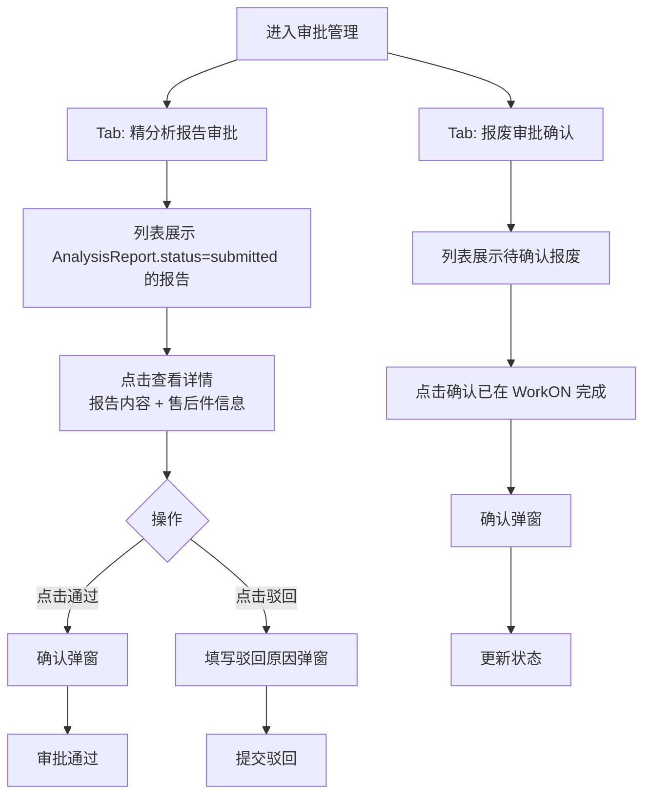

##### 2.2.5.5 数据实体（必填）

| 实体表 | 涉及字段 |
|------|------|
| APMS_ANALYSIS_REPORT | STATUS、APPROVED_BY、APPROVED_AT、REJECT_REASON |
| APMS_SCRAP_APPLICATION | WORKON_CONFIRMED、CONFIRMED_BY、CONFIRMED_AT |

##### 2.2.5.6 与其他模块的交互（必填）

| 交互目标模块 | 交互说明 |
|------|------|
| 精分析报告（M04） | 审批操作直接修改 AnalysisReport 状态 |
| 分析管理（M03） | 审批结果触发 Part 状态联动 |
| 退货单管理（M02） | 报废确认触发 ReturnOrder 状态联动 |
| 工作台（M01） | 待审批任务数由 M05 数据提供 |

##### 2.2.5.7 调用的内外部接口（必填）

| 类型 | 接口 | 说明 |
|------|------|------|
| 内部 | GET `/api/v1/approvals/analysis` | 待审批报告列表 |
| 内部 | POST `/api/v1/approvals/analysis/{reportId}/approve` | 审批通过 |
| 内部 | POST `/api/v1/approvals/analysis/{reportId}/reject` | 审批驳回 |
| 内部 | GET `/api/v1/approvals/scrap` | 待确认报废列表 |
| 内部 | POST `/api/v1/approvals/scrap/{appId}/confirm` | 确认报废 |

---

#### 2.2.6 统计报表（M06）

##### 2.2.6.1 功能描述（必填）

提供多维度数据可视化报表，支持全部角色查看：

| 报表名称 | 图表类型 | 分析维度 |
|------|------|------|
| 退货趋势分析 | 折线图 | 日/周/月/年 |
| 处理时效统计 | 柱状图 | 各流程阶段平均天数 |
| 售后件类型分布 | 饼图 | 业务单元 / 产品平台 |
| 客户投诉排名 | 横向柱状图 | Top 10 客户 |
| 失效模式分析 | 饼图 | 失效类别分布 |

筛选条件：时间范围 / 客户 / 业务单元 / 产品平台

导出：固定模板 Excel（.xlsx），不支持字段自定义

##### 2.2.6.2 输入/输出数据流（必填）

| 接口 | 输入 | 输出 |
|------|------|------|
| GET /reports/data | `chartType`、筛选参数（dateRange、customerId 等） | 图表数据数组 `[{label, value}]` |
| GET /reports/export | 同上 | Excel 文件流 |

##### 2.2.6.3 状态转换图（必填）

NA（统计报表无状态）

##### 2.2.6.4 操作流程图（必填）


##### 2.2.6.5 数据实体（必填）

统计报表为聚合查询，无专属实体表。数据来源：

- `APMS_RETURN_ORDER`、`APMS_PART`、`APMS_ANALYSIS_REPORT`（状态、时间字段聚合）
- `APMS_FAILURE_CATEGORY`、`APMS_BUSINESS_UNIT`、`APMS_CUSTOMER`（分组维度）

##### 2.2.6.6 与其他模块的交互（必填）

统计报表为只读模块，不修改其他模块数据，仅聚合查询。

##### 2.2.6.7 调用的内外部接口（必填）

| 类型 | 接口 | 说明 |
|------|------|------|
| 内部 | GET `/api/v1/reports/data` | 图表数据 |
| 内部 | GET `/api/v1/reports/export` | 导出 Excel |

---

#### 2.2.7 配置管理（M07）

##### 2.2.7.1 功能描述（必填）

仅 `SystemAdmin` 可访问，负责精分析报告模板的维护：

- **上传模板**：上传 Excel（.xlsx）文件，后端自动解析占位符并持久化 FIELDS_JSON
- **查看列表**：展示所有已上传模板（名称、上传时间、状态）
- **下载模板**：下载原始 Excel 文件
- **删除模板**：软删除（ENABLED=0），已使用模板不物理删除

**模板解析流程（后端）：**
1. Apache POI 遍历所有 Sheet 的所有单元格
2. 正则匹配 `\[\[([^\]]+)\]\]` 提取占位符
3. 按 `[[type:name:labelZh:labelEn:required:options]]` 解析为结构化 JSON
4. 存入 `APMS_REPORT_TEMPLATE.FIELDS_JSON`

##### 2.2.7.2 输入/输出数据流（必填）

**上传模板：**
- 输入：Excel 文件（multipart/form-data）、模板名称
- 输出：ReportTemplateDTO（id、name、nasPath、fieldsJson）

**模板列表：**
- 输入：无（分页可选）
- 输出：`[{ id, name, createdAt, enabled }]`

##### 2.2.7.3 状态转换图（必填）

NA（模板无状态流转，仅 enabled/disabled 开关）

##### 2.2.7.4 操作流程图（必填）

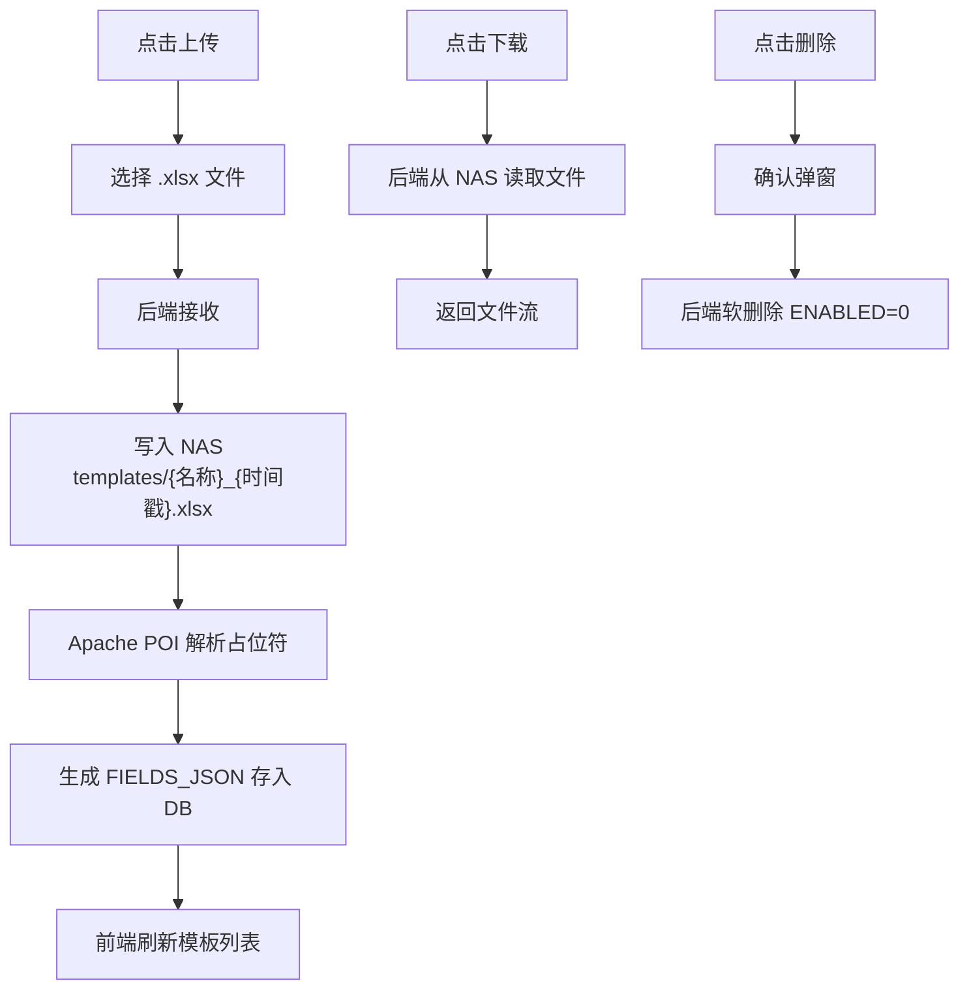

##### 2.2.7.5 数据实体（必填）

| 实体表 | 说明 |
|------|------|
| APMS_REPORT_TEMPLATE | 模板元数据（name、nasPath、FIELDS_JSON、enabled） |

##### 2.2.7.6 与其他模块的交互（必填）

| 交互目标模块 | 交互说明 |
|------|------|
| 精分析报告（M04） | M04 消费 M07 上传并解析的模板 FIELDS_JSON |
| 文件存储 | 模板文件上传/下载通过 SMB NAS |

##### 2.2.7.7 调用的内外部接口（必填）

| 类型 | 接口 | 说明 |
|------|------|------|
| 内部 | GET `/api/v1/templates` | 模板列表 |
| 内部 | POST `/api/v1/templates` | 上传模板 |
| 内部 | GET `/api/v1/templates/{id}` | 模板详情（含 fieldsJson） |
| 内部 | DELETE `/api/v1/templates/{id}` | 删除模板 |
| 内部 | GET `/api/v1/templates/{id}/download` | 下载原始文件 |
| 内部 | POST `/api/v1/files/upload` | 写入 NAS |
| 内部 | GET `/api/v1/files/**` | 从 NAS 读取文件 |

---

## 3. 数据库设计

### 3.1 数据库选型（必填）

| 项目 | 内容 |
|------|------|
| 数据库类型 | Oracle Database |
| 连接地址 | cngorarac01.apac.bosch.com:38000 |
| Schema | SUPER_LINE_LEADER |
| 版本管理 | Flyway（迁移脚本存于 `src/main/resources/db/migration/`） |
| 表名前缀 | `APMS_` |
| 主键策略 | VARCHAR2(36) UUID，由应用层生成 |

### 3.2 关系模型设计（必填）

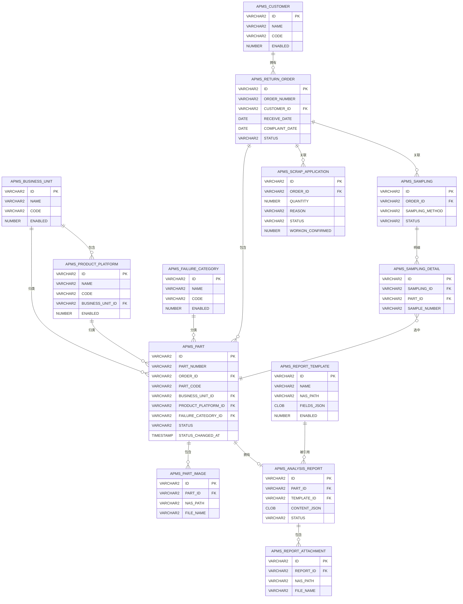

### 3.3 数据表结构设计（必填）

#### APMS_RETURN_ORDER（退货单）

| 列名 | 类型 | 约束 | 说明 |
|------|------|------|------|
| ID | VARCHAR2(36) | PK | UUID |
| ORDER_NUMBER | VARCHAR2(20) | UNIQUE, NULL | 提交时生成，如 `2026EM0001` |
| CUSTOMER_ID | VARCHAR2(36) | FK→APMS_CUSTOMER | 客户 |
| RECEIVE_DATE | DATE | NOT NULL | 收件日期 |
| COMPLAINT_DATE | DATE | NOT NULL | 投诉日期 |
| RETURN_METHOD | VARCHAR2(20) | NOT NULL | express/pickup/other |
| TRACKING_NUMBER | VARCHAR2(50) | — | 快递单号 |
| RETURN_QUANTITY | NUMBER(10) | NOT NULL | 退回数量 |
| INITIAL_ANALYSIS_QTY | NUMBER(10) | DEFAULT 0 | 初分析数量 |
| DETAILED_ANALYSIS_QTY | NUMBER(10) | DEFAULT 0 | 精分析数量（计算值） |
| SCRAPPED_QTY | NUMBER(10) | DEFAULT 0 | 已报废数量（计算值） |
| QC_CREATED_QTY | NUMBER(10) | DEFAULT 0 | 已创 QC 数量 |
| QC_NOT_CREATED_QTY | NUMBER(10) | DEFAULT 0 | 未创 QC 数量（计算值） |
| DESCRIPTION | VARCHAR2(500) | — | 退货描述 |
| STATUS | VARCHAR2(50 CHAR) | NOT NULL | 阶段/子状态格式（见 3.4），如 `初分析/进行中` |
| CREATED_BY | VARCHAR2(100) | NOT NULL | 创建人 |
| CREATED_AT | TIMESTAMP | NOT NULL | 创建时间 |
| UPDATED_BY | VARCHAR2(100) | — | 更新人 |
| UPDATED_AT | TIMESTAMP | — | 更新时间 |

#### APMS_PART（售后件）

| 列名 | 类型 | 约束 | 说明 |
|------|------|------|------|
| ID | VARCHAR2(36) | PK | UUID |
| PART_NUMBER | VARCHAR2(30) | UNIQUE, NULL | 提交时生成，如 `BU1-PLT1-0001` |
| ORDER_ID | VARCHAR2(36) | FK→APMS_RETURN_ORDER | 关联退货单 |
| PART_CODE | VARCHAR2(50) | NOT NULL | 零件号 |
| BUSINESS_UNIT_ID | VARCHAR2(36) | FK→APMS_BUSINESS_UNIT | 业务单元 |
| PRODUCT_PLATFORM_ID | VARCHAR2(36) | FK→APMS_PRODUCT_PLATFORM | 产品平台 |
| PRODUCTION_SHIFT | VARCHAR2(20) | — | 生产班次 |
| COMPLAINT_TYPE | VARCHAR2(20) | NOT NULL | BA10~BA79 / Co-investigation |
| FAILURE_CATEGORY_ID | VARCHAR2(36) | FK→APMS_FAILURE_CATEGORY | 失效类别 |
| VEHICLE_PRODUCTION_DATE | DATE | — | 汽车生产日期 |
| VEHICLE_PURCHASE_DATE | DATE | — | 汽车购买日期 |
| VEHICLE_FAILURE_DATE | DATE | — | 汽车失效日期 |
| VEHICLE_VIN | VARCHAR2(17) | — | VIN 码 |
| VEHICLE_MILEAGE | NUMBER(10) | — | 行驶里程（km） |
| CUSTOMER_DESCRIPTION | VARCHAR2(500) | — | 客户失效描述 |
| OTHER_DESCRIPTION | VARCHAR2(500) | — | 其他描述 |
| IS_SAMPLE | NUMBER(1) | DEFAULT 0 | 是否被选为抽样样本 |
| STATUS_CHANGED_AT | TIMESTAMP | — | 当前状态进入时间（用于预警计算） |
| STATUS | VARCHAR2(50 CHAR) | NOT NULL | 阶段/子状态格式（见 3.4），如 `精分析/进行中` |
| CREATED_BY | VARCHAR2(100) | NOT NULL | 创建人 |
| CREATED_AT | TIMESTAMP | NOT NULL | 创建时间 |
| UPDATED_BY | VARCHAR2(100) | — | 更新人 |
| UPDATED_AT | TIMESTAMP | — | 更新时间 |

#### APMS_PART_IMAGE（售后件照片）

| 列名 | 类型 | 约束 | 说明 |
|------|------|------|------|
| ID | VARCHAR2(36) | PK | UUID |
| PART_ID | VARCHAR2(36) | FK→APMS_PART, NOT NULL | 关联售后件 |
| NAS_PATH | VARCHAR2(500) | NOT NULL | NAS 相对路径 |
| FILE_NAME | VARCHAR2(200) | NOT NULL | 原始文件名 |
| FILE_SIZE | NUMBER(15) | — | 文件大小（字节） |
| SORT_ORDER | NUMBER(5) | DEFAULT 0 | 排序 |
| CREATED_BY | VARCHAR2(100) | NOT NULL | 上传人 |
| CREATED_AT | TIMESTAMP | NOT NULL | 上传时间 |

#### APMS_SAMPLING（抽样主记录）

| 列名 | 类型 | 约束 | 说明 |
|------|------|------|------|
| ID | VARCHAR2(36) | PK | UUID |
| ORDER_ID | VARCHAR2(36) | FK→APMS_RETURN_ORDER, NOT NULL | 关联退货单 |
| SAMPLING_METHOD | VARCHAR2(20) | NOT NULL | standard/designated/none |
| SAMPLED_BY | VARCHAR2(100) | NOT NULL | 抽样人 |
| SAMPLED_AT | TIMESTAMP | NOT NULL | 抽样时间 |
| TOTAL_COUNT | NUMBER(10) | NOT NULL | 抽样数量 |
| STATUS | VARCHAR2(20) | NOT NULL | draft/confirmed |
| CREATED_AT | TIMESTAMP | NOT NULL | 创建时间 |

#### APMS_SAMPLING_DETAIL（抽样明细）

| 列名 | 类型 | 约束 | 说明 |
|------|------|------|------|
| ID | VARCHAR2(36) | PK | UUID |
| SAMPLING_ID | VARCHAR2(36) | FK→APMS_SAMPLING, NOT NULL | 关联抽样 |
| PART_ID | VARCHAR2(36) | FK→APMS_PART, NOT NULL | 关联售后件 |
| SAMPLE_NUMBER | VARCHAR2(30) | NOT NULL | 样本编号 |
| SORT_ORDER | NUMBER(5) | DEFAULT 0 | 排序 |

#### APMS_SCRAP_APPLICATION（报废申请）

| 列名 | 类型 | 约束 | 说明 |
|------|------|------|------|
| ID | VARCHAR2(36) | PK | UUID |
| ORDER_ID | VARCHAR2(36) | FK→APMS_RETURN_ORDER | 关联退货单 |
| QUANTITY | NUMBER(10) | NOT NULL | 报废数量 |
| REASON | VARCHAR2(1000) | NOT NULL | 报废理由 |
| STATUS | VARCHAR2(20) | NOT NULL | draft/pending/confirmed |
| APPLICANT | VARCHAR2(100) | NOT NULL | 申请人 |
| APPLIED_AT | TIMESTAMP | — | 提交时间 |
| WORKON_CONFIRMED | NUMBER(1) | DEFAULT 0 | 是否已在 WorkON 操作 |
| CONFIRMED_BY | VARCHAR2(100) | — | 确认人 |
| CONFIRMED_AT | TIMESTAMP | — | 确认时间 |
| CREATED_AT | TIMESTAMP | NOT NULL | 创建时间 |

#### APMS_ANALYSIS_REPORT（精分析报告）

| 列名 | 类型 | 约束 | 说明 |
|------|------|------|------|
| ID | VARCHAR2(36) | PK | UUID |
| PART_ID | VARCHAR2(36) | FK→APMS_PART, NOT NULL | 关联售后件 |
| TEMPLATE_ID | VARCHAR2(36) | FK→APMS_REPORT_TEMPLATE | 使用的模板 |
| CONTENT_JSON | CLOB | NOT NULL | 用户填写内容 JSON |
| SUMMARY | VARCHAR2(500) | — | 报告摘要 |
| STATUS | VARCHAR2(20) | NOT NULL | draft/submitted/approved/rejected |
| SUBMITTED_BY | VARCHAR2(100) | — | 提交人 |
| SUBMITTED_AT | TIMESTAMP | — | 提交时间 |
| APPROVED_BY | VARCHAR2(100) | — | 审批人 |
| APPROVED_AT | TIMESTAMP | — | 审批时间 |
| REJECT_REASON | VARCHAR2(500) | — | 驳回原因 |
| CREATED_BY | VARCHAR2(100) | NOT NULL | 创建人 |
| CREATED_AT | TIMESTAMP | NOT NULL | 创建时间 |
| UPDATED_BY | VARCHAR2(100) | — | 更新人 |
| UPDATED_AT | TIMESTAMP | — | 更新时间 |

#### APMS_REPORT_TEMPLATE（报告模板）

| 列名 | 类型 | 约束 | 说明 |
|------|------|------|------|
| ID | VARCHAR2(36) | PK | UUID |
| NAME | VARCHAR2(200) | NOT NULL | 模板名称 |
| NAS_PATH | VARCHAR2(500) | NOT NULL | 原始 Excel NAS 路径 |
| FIELDS_JSON | CLOB | NOT NULL | 占位符解析结果 JSON 数组 |
| ENABLED | NUMBER(1) | DEFAULT 1 | 是否启用（软删除） |
| CREATED_BY | VARCHAR2(100) | NOT NULL | 上传人 |
| CREATED_AT | TIMESTAMP | NOT NULL | 上传时间 |

#### APMS_REPORT_ATTACHMENT（报告附件）

| 列名 | 类型 | 约束 | 说明 |
|------|------|------|------|
| ID | VARCHAR2(36) | PK | UUID |
| REPORT_ID | VARCHAR2(36) | FK→APMS_ANALYSIS_REPORT, NOT NULL | 关联报告 |
| NAS_PATH | VARCHAR2(500) | NOT NULL | 附件 NAS 路径 |
| FILE_NAME | VARCHAR2(200) | NOT NULL | 原始文件名 |
| FILE_SIZE | NUMBER(15) | — | 文件大小（字节） |
| CREATED_BY | VARCHAR2(100) | NOT NULL | 上传人 |
| CREATED_AT | TIMESTAMP | NOT NULL | 上传时间 |

#### 字典表

```sql
APMS_CUSTOMER         (ID VARCHAR2(36) PK, NAME VARCHAR2(100), CODE VARCHAR2(50), ENABLED NUMBER(1))
APMS_BUSINESS_UNIT    (ID VARCHAR2(36) PK, NAME VARCHAR2(100), CODE VARCHAR2(20), ENABLED NUMBER(1))
APMS_PRODUCT_PLATFORM (ID VARCHAR2(36) PK, NAME VARCHAR2(100), CODE VARCHAR2(20),
                        BUSINESS_UNIT_ID VARCHAR2(36) FK, ENABLED NUMBER(1))
APMS_FAILURE_CATEGORY (ID VARCHAR2(36) PK, NAME VARCHAR2(100), CODE VARCHAR2(50), ENABLED NUMBER(1))
```

### 3.4 数据字典定义（必填）

#### 退货单状态枚举（APMS_RETURN_ORDER.STATUS）

状态格式为 `阶段/子状态`，共 7 个值：

| 状态值 | 触发动作 | 说明 |
|------|------|------|
| `退货登记/进行中` | 新建暂存 | 草稿，无退货单号 |
| `初分析/进行中` | 提交退货单 | 生成退货单号，初分析进行中 |
| `精分析/进行中` | 确定并确认抽样（含不抽样）/ 审批驳回 | 抽样确认与进入精分析同步发生 |
| `精分析审批/进行中` | 提交精分析报告审批 | 等待 QMC_Leader 审批 |
| `精分析审批/完成` | QMC_Leader 审批通过 | 精分析结果已确认 |
| `WorkOn报废/进行中` | 跳转 WorkOn 报废链接 | 报废流程进行中 |
| `WorkOn报废/完成` | 确认已在 WorkOn 完成 | 终态 |

#### 售后件状态枚举（APMS_PART.STATUS）

状态格式为 `阶段/子状态`，共 6 个值：

| 状态值 | 触发动作 | 说明 |
|------|------|------|
| `初分析/进行中` | 新建（暂存或提交） | 草稿与已提交共用此状态，通过 `PART_NUMBER IS NULL` 区分；初分析表单提交后状态不变，等待 M02 抽样选中 |
| `精分析/进行中` | 被抽样确认选中 / 审批驳回 | 初分析提交与抽样选中同步完成，精分析报告撰写中 |
| `精分析审批/进行中` | 提交精分析报告审批 | 等待 QMC_Leader 审批 |
| `精分析审批/完成` | QMC_Leader 审批通过 | 精分析结果已确认 |
| `WorkOn报废/进行中` | 报废申请提交 | 报废流程进行中 |
| `WorkOn报废/完成` | 确认已在 WorkOn 完成 | 终态 |

#### 精分析报告状态枚举（APMS_ANALYSIS_REPORT.STATUS）

| 枚举值 | 中文 |
|------|------|
| `draft` | 草稿 |
| `submitted` | 待审批 |
| `approved` | 已通过 |
| `rejected` | 已驳回 |

#### 抽样方式枚举（APMS_SAMPLING.SAMPLING_METHOD）

| 枚举值 | 中文 |
|------|------|
| `standard` | 标准抽样 |
| `designated` | 指定抽样 |
| `none` | 不抽样 |

#### 退回方式枚举（APMS_RETURN_ORDER.RETURN_METHOD）

| 枚举值 | 中文 |
|------|------|
| `express` | 快递 |
| `pickup` | 自提 |
| `other` | 其他 |

#### 失效类别枚举（APMS_FAILURE_CATEGORY，暂定）

噪音 / 断裂 / 变形 / 异响 / 渗漏

#### 投诉类型（APMS_PART.COMPLAINT_TYPE）

BA10 / BA20 / BA21 / BA30 / BA31 / BA35 / BA40 / BA41 / BA42 / BA43 / BA50 / BA60 / BA61 / BA70 / BA76 / BA77 / BA78 / BA79 / Co-investigation（详见附录 5.2）

#### 前端步骤条展示逻辑

前端步骤条的各步骤状态（进行中 / 完成 / 未开始）由后端 `STATUS` 字段**派生计算**，不单独存储。数据库仅保存当前阶段状态，前端根据以下映射规则渲染步骤条：

**退货单步骤条映射**

| 步骤节点 | 显示"进行中" | 显示"完成" |
|------|------|------|
| 退货登记 | `退货登记/进行中` | 其余所有状态 |
| 初分析 | `初分析/进行中` | `精分析/进行中` 及之后所有状态 |
| 精分析 | `精分析/进行中` | `精分析审批/进行中` 及之后所有状态 |
| 精分析审批 | `精分析审批/进行中` | `精分析审批/完成` 及之后所有状态 |
| WorkOn 报废 | `WorkOn报废/进行中` | `WorkOn报废/完成` |

**售后件步骤条映射**

| 步骤节点 | 显示"进行中" | 显示"完成" |
|------|------|------|
| 初分析 | `初分析/进行中` | `精分析/进行中` 及之后所有状态 |
| 精分析 | `精分析/进行中` | `精分析审批/进行中` 及之后所有状态 |
| 精分析审批 | `精分析审批/进行中` | `精分析审批/完成` 及之后所有状态 |
| WorkOn 报废 | `WorkOn报废/进行中` | `WorkOn报废/完成` |

> **说明**：`精分析审批/进行中` 的"不通过"情况在步骤条上可附加"驳回"标记，但步骤节点仍归属精分析审批步骤；驳回后状态回退到 `精分析/进行中`，精分析步骤恢复"进行中"显示。

### 3.5 触发器、事务、存储过程设计

**编号生成并发控制：**

退货单号和售后件编号在提交时生成，使用数据库行锁（`SELECT ... FOR UPDATE`）防止并发重复：

```sql
-- 退货单号生成（示意）
SELECT NVL(MAX(TO_NUMBER(SUBSTR(ORDER_NUMBER, 7))), 0) + 1
FROM APMS_RETURN_ORDER
WHERE ORDER_NUMBER LIKE :year || 'EM%'
FOR UPDATE;
```

**状态变更事务：**

所有状态变更由 Spring `@Transactional` 保证原子性。

触发器、存储过程：NA（当前设计不使用）

### 3.6 视图设计

NA（当前阶段不设计数据库视图，统计报表通过应用层聚合查询实现）

### 3.7 索引设计

| 表 | 索引列 | 类型 | 用途 |
|------|------|------|------|
| APMS_RETURN_ORDER | ORDER_NUMBER | UNIQUE | 编号唯一性及查询 |
| APMS_RETURN_ORDER | STATUS, CREATED_AT | 复合 | 列表状态筛选 |
| APMS_RETURN_ORDER | CUSTOMER_ID | 普通 | 客户筛选 |
| APMS_PART | PART_NUMBER | UNIQUE | 编号唯一性 |
| APMS_PART | ORDER_ID | 普通 | 退货单关联查询 |
| APMS_PART | STATUS, STATUS_CHANGED_AT | 复合 | 预警/超期实时计算 |
| APMS_PART | BUSINESS_UNIT_ID, PRODUCT_PLATFORM_ID | 复合 | 编号序号查询 |
| APMS_ANALYSIS_REPORT | PART_ID | 普通 | 售后件关联查询 |
| APMS_ANALYSIS_REPORT | STATUS | 普通 | 审批列表筛选 |

### 3.8 权限管理设计（必填）

数据库层权限：应用使用专用数据库账号，仅授予 `APMS_` 前缀表的 SELECT/INSERT/UPDATE/DELETE 权限，禁止 DDL。

应用层权限控制（服务层 `CommonHeaderManager.getCurrentUserRoles()` 校验）：

| 场景 | 校验逻辑 |
|------|------|
| 编辑已提交表单（数据校订） | 必须是 `QMC_Manager` 或 `SystemAdmin`，否则返回 403 |
| 精分析报告审批 | 必须是 `QMC_Leader` 或 `SystemAdmin` |
| 配置管理接口 | 必须是 `SystemAdmin` |
| 删除操作 | 仅草稿状态，且仅创建者或 `SystemAdmin` |
| 统计报表导出 | 全角色均可 |

### 3.9 备份

数据库备份策略由 DBA/IT 团队负责，应用层不干预。建议：
- 生产环境每日全量备份
- 开启 Oracle Archive Log（归档日志）支持时间点恢复

---

## 4. 其他设计

### 4.1 系统配置说明（必填）

#### 后端 application.yml 关键配置

```yaml
server:
  port: 8102
  servlet:
    context-path: /aftermarket-parts-management-system

spring:
  datasource:
    url: jdbc:oracle:thin:@cngorarac01.apac.bosch.com:38000/...
    hikari:
      max-lifetime: 1200000      # 连接最大存活 20 分钟

custom:
  smb:
    enabled: true
    host: ${SMB_HOST}            # 待 IT 提供
    share-name: ${SMB_SHARE}     # 待 IT 提供
    user: ${SMB_USER}            # 待 IT 提供（通过环境变量注入）
    password: ${SMB_PASSWORD}    # 待 IT 提供（通过环境变量注入）
    domain: ${SMB_DOMAIN}        # 待 IT 提供
    env: prod                    # prod/test
    prefix: wfam                 # NAS 根目录前缀

  analysis:
    warning-days: 14             # 精分析预警天数（进入 精分析/进行中 后）
    overdue-days: 21             # 精分析超期天数
```

#### 前端环境变量（.env 文件）

```env
VITE_BACKEND_URL=http://backend:8102
VITE_GATEWAY_URL=<网关地址>
```

#### SMB NAS 目录结构

```
wfam/{env}/
├── return-orders/{退货单号}/scrap/         报废附件
├── parts/{售后件编号}/images/              零件照片
├── parts/{售后件编号}/analysis/attachments/ 精分析附件
├── parts/{售后件编号}/analysis/exports/    导出报告
└── templates/                             报告模板原始文件
```

#### 非功能性约束

| 项目 | 要求 |
|------|------|
| 接口响应 | P95 < 500ms |
| 页面首屏加载 | < 2s |
| 文件上传安全 | 后端校验 MIME 类型（非依赖文件名后缀） |
| XSS 防护 | 前端富文本输出使用 DOMPurify |
| SQL 注入防护 | 全程使用 JPA Specification，禁止拼接原生 SQL |

### 4.2 编程语言和开发环境选择（必填）

#### 前端开发环境

| 项目 | 内容 |
|------|------|
| 语言 | TypeScript 5.3（严格模式） |
| 框架 | Vue 3.4（Composition API） |
| 构建工具 | Vite 5.0 |
| UI 组件库 | Ant Design Vue 4.1 |
| 状态管理 | Pinia 2.1 |
| HTTP 客户端 | Axios 1.6 |
| 图表 | ECharts 5.4 + vue-echarts |
| 国际化 | vue-i18n 9.14（zh-CN / en-US） |
| 日期处理 | Day.js 1.11 |
| CSS 预处理 | Less 4.2 |
| Node.js 版本 | 20+（开发环境要求） |
| 本地开发端口 | 3000，访问 `http://localhost:3000/?dev=1` 启用开发模式 |

#### 后端开发环境

| 项目 | 内容 |
|------|------|
| 语言 | Java 21 |
| 框架 | Spring Boot 4.0.1 |
| ORM | Spring Data JPA |
| 数据库驱动 | Oracle JDBC (ojdbc11) |
| 数据库迁移 | Flyway |
| API 文档 | SpringDoc OpenAPI（Swagger UI：/swagger-ui.html） |
| 文件访问 | smbj + Apache Commons Pool2 |
| Excel 处理 | Apache POI |
| 代码生成 | Lombok |
| 构建工具 | Maven 3.x |
| JDK 版本 | 21（开发及运行时要求） |
| 本地服务端口 | 8102 |

#### API 通用规范

- Base Path：`/aftermarket-parts-management-system/api/v1`
- 数据格式：`application/json`，时间：ISO 8601（`yyyy-MM-dd'T'HH:mm:ss`）
- 分页：`?page=0&size=20&sort=createdAt,desc`
- 统一错误响应：`{ "code": "BUSINESS_ERROR", "message": "...", "timestamp": "..." }`

---

### 4.3 批量导入导出设计

#### 通用约定

| 项目 | 规则 |
|------|------|
| 文件格式 | Excel（.xlsx），UTF-8 编码 |
| 最大导入行数 | 500 行/次；超出时接口返回 `FILE_TOO_LARGE` 错误，前端提示分批导入 |
| 最大导出行数 | 5000 行；超出时接口返回 `EXPORT_LIMIT_EXCEEDED` 错误，前端提示缩小筛选范围 |
| 导入处理模式 | **同步处理**（500 行以内通常 < 10 s）；采用**部分成功策略**：有效行入库，无效行不导入并返回错误清单 |
| 导出实现 | Apache POI `SXSSFWorkbook`（流式写入），避免大数据量 OOM |
| 导入结果响应 | JSON + 可选错误 Excel 下载（仅含出错行） |

---

#### 导入错误报告格式

**HTTP 响应体（ImportResultDTO）：**

```json
{
  "totalRows": 100,
  "successCount": 85,
  "failureCount": 15,
  "errors": [
    {
      "row": 3,
      "column": "退回方式",
      "errorType": "INVALID_ENUM",
      "message": "值 '航空' 不在允许范围内，应为：快递 / 自提 / 其他"
    },
    {
      "row": 7,
      "column": "收件日期",
      "errorType": "FORMAT_ERROR",
      "message": "日期格式错误，应为 YYYY-MM-DD，实际值：2026/3/1"
    },
    {
      "row": 12,
      "column": "客户编码",
      "errorType": "REFERENCE_NOT_FOUND",
      "message": "客户编码 'CUST_999' 不存在"
    }
  ],
  "errorFileUrl": "/api/v1/files/import-errors/abc123.xlsx"
}
```

> `errorFileUrl` 仅在 `failureCount > 0` 时出现；错误 Excel 内容为原始数据行 + 末列追加"错误信息"，仅包含出错行，保留原始行号（Row 列）便于对照原文件。

**错误类型（errorType）枚举：**

| errorType | 含义 | 示例 |
|------|------|------|
| `REQUIRED` | 必填字段为空 | 退回数量为空 |
| `FORMAT_ERROR` | 数据格式不符 | 日期格式错误、非整数 |
| `INVALID_ENUM` | 枚举值不合法 | 退回方式不在允许列表 |
| `CONDITIONAL_REQUIRED` | 条件必填字段缺失 | 退回方式=快递时快递单号为空 |
| `REFERENCE_NOT_FOUND` | 外键对应记录不存在 | 客户编码不存在、退货单号不存在 |
| `FILE_FORMAT_ERROR` | 文件级错误 | 表头列不匹配、文件损坏 |

---

#### 退货单导入（M02）

**导入后状态**：`初分析/进行中`，同步生成退货单号（等同于手动提交）。

**Excel 模板列定义：**

| 列 | 字段名 | 类型 | 必填 | 说明 |
|------|------|------|------|------|
| A | 客户编码 | 文本 | ✅ | 必须已存在于系统客户列表 |
| B | 收件日期 | 日期 | ✅ | 格式 YYYY-MM-DD |
| C | 投诉日期 | 日期 | ✅ | 格式 YYYY-MM-DD |
| D | 退回方式 | 枚举 | ✅ | 快递 / 自提 / 其他 |
| E | 快递单号 | 文本 | 条件 | 退回方式=快递时必填 |
| F | 退回数量 | 整数 | ✅ | 正整数 |
| G | 退货描述 | 文本 | — | 最长 500 字 |

**验证顺序**：文件级校验（表头匹配、行数上限）→ 逐行格式校验 → 逐行枚举校验 → 逐行条件校验 → 批量外键校验（一次查询所有客户编码，避免 N+1）→ 事务批量插入有效行。

---

#### 售后件导入（M03）

**导入后状态**：`初分析/进行中`，PART_NUMBER = NULL（草稿，需用户逐条或批量提交生成编号）。照片需导入后在页面单独上传。

**Excel 模板列定义：**

| 列 | 字段名 | 类型 | 必填 | 说明 |
|------|------|------|------|------|
| A | 退货单号 | 文本 | ✅ | 必须已存在，且处于 `初分析/进行中` |
| B | 零件号 | 文本 | ✅ | 用于 SAP 查询 BU/产品平台（离线导入时手动填写 C/D 列） |
| C | BU 编码 | 文本 | ✅ | 与零件号二选其一填写后，另一列可为空；后端优先用零件号查 SAP |
| D | 产品平台编码 | 文本 | ✅ | 同上 |
| E | 投诉类型 | 枚举 | ✅ | BA10~BA79 / Co-investigation |
| F | 失效类别 | 文本 | ✅ | 必须存在于失效类别列表 |
| G | 客户描述 | 文本 | ✅ | 最长 1000 字 |
| H | 车辆生产日期 | 日期 | 条件 | 非 0km 投诉类型时必填，格式 YYYY-MM-DD |
| I | 车辆购买日期 | 日期 | 条件 | 同上 |
| J | 车辆故障日期 | 日期 | 条件 | 同上 |
| K | VIN 码 | 文本 | — | 17 位，非 0km 时建议填写 |
| L | 行驶里程（km） | 整数 | — | 非 0km 时建议填写 |

> **0km 判断**：投诉类型 BA10 / BA20 / BA21 / BA30 / BA31 为 0km，车辆信息列为非必填；其余类型为 field，H~J 列必填。

**验证顺序**：文件级 → 逐行格式 → 枚举 → 条件必填 → 批量外键校验（退货单号、投诉类型、失效类别）→ 批量插入有效行。

---

#### 退货单导出（M02）

**筛选条件（Query Params）：**

| 参数 | 类型 | 说明 |
|------|------|------|
| `orderNumber` | 文本 | 退货单号模糊匹配 |
| `customerId` | UUID | 客户精确筛选 |
| `receivedDateStart` / `receivedDateEnd` | 日期 | 收件日期范围 |
| `complaintDateStart` / `complaintDateEnd` | 日期 | 投诉日期范围 |
| `returnMethod` | 枚举（多值） | 退回方式，可多选 |
| `status` | 枚举（多值） | 状态，可多选 |

**导出列：**

退货单号 / 客户名称 / 收件日期 / 投诉日期 / 退回方式 / 快递单号 / 退回数量 / 退货描述 / 当前状态 / 关联售后件数 / 创建人 / 创建时间

**文件命名**：`退货单导出_yyyyMMdd_HHmmss.xlsx`

---

#### 售后件导出（M03）

**筛选条件（Query Params）：**

| 参数 | 类型 | 说明 |
|------|------|------|
| `partNumber` | 文本 | 售后件编号模糊匹配 |
| `orderNumber` | 文本 | 退货单号模糊匹配 |
| `partCode` | 文本 | 零件号模糊匹配 |
| `businessUnitId` | UUID | BU 精确筛选 |
| `productPlatformId` | UUID | 产品平台精确筛选 |
| `complaintType` | 枚举（多值） | 投诉类型，可多选 |
| `status` | 枚举（多值） | 状态，可多选 |

**导出列：**

售后件编号 / 退货单号 / 零件号 / BU / 产品平台 / 投诉类型 / 失效类别 / 客户描述 / 当前状态 / 精分析报告状态 / 创建人 / 创建时间

**文件命名**：`售后件导出_yyyyMMdd_HHmmss.xlsx`

---

## 5. 附录

### 5.1 图形及表格索引

| 编号 | 名称 | 所在章节 |
|------|------|------|
| 图 1 | 系统架构图 | 1.2 |
| 图 2 | 退货单状态转换图 | 2.2.2.3 |
| 图 3 | 售后件状态转换图 | 2.2.3.3 |
| 图 4 | 精分析报告状态转换图 | 2.2.4.3 |
| 图 5 | 数据库关系模型 | 3.2 |
| 表 1 | 功能模块清单 | 2.1 |
| 表 2 | 功能权限矩阵 | 2.1 |
| 表 3 | 数据表清单 | 3.3 |
| 表 4 | 索引设计 | 3.7 |

### 5.2 术语表

| 术语 | 英文 | 说明 |
|------|------|------|
| 退货单 | Return Order | 客户退货的批次单据，包含多个售后件 |
| 售后件 | After-sales Part / Part | 单个退货零件 |
| 初分析 | Initial Analysis | 对退货件进行初步分类和信息登记 |
| 精分析 | Detailed Analysis | 对抽样样本进行深度失效分析 |
| 抽样 | Sampling | 从退货件中选取代表性样本 |
| 报废 | Scrap | 零件经分析后确认报废处理 |
| OCR | Optical Character Recognition | 光学字符识别，用于自动识别信息卡内容 |
| VIN | Vehicle Identification Number | 车辆识别码（17位） |
| WorkON | — | Bosch 内部工单系统，用于报废审批 |
| IQIS | — | 外部质量信息系统 |
| Wujie | 无界 | 微前端框架，本系统作为子应用嵌入 |
| IDM | Identity Management | 博世身份管理系统，提供角色管理 |
| NAS | Network Attached Storage | 网络附加存储，用于文件存储（SMB 协议） |
| Dify | — | 自建 AI 工作流平台，用于 OCR 服务 |
| BA10~BA79 | Complaint Mode | IQIS 投诉类型代码，区分 0km 和 field 产品 |

**外部系统链接：**

| 系统 | URL |
|------|------|
| WorkON 报废申请 | https://rb-wam-ap.bosch.com/workon01ap/secure/CreateIssue.jspa?pid=10360&issuetype=162 |
| Lessons Learned | https://cng-edlls.apac.bosch.com:10443/www/index.html#/ |
| IQIS | 待确认 |
| SAP | 待确认 |

**投诉类型（BA 代码）完整列表：**

| 代码 | IQIS 描述 | 是否 0km |
|------|------|------|
| BA10 | 0-mlg, provisional rework/accept. back | 待确认 |
| BA20 | 0-km, uninstalled | 待确认 |
| BA21 | QM01 | 待确认 |
| BA30 | stock product of AA volume (0-km) | 待确认 |
| BA31 | Stock product of IAM Vol.(0-km, uninst) | 待确认 |
| BA35 | Logistics complaint original equipment | 待确认 |
| BA40 | field product | 否 |
| BA41 | Field campaign | 否 |
| BA42 | goodwill | 否 |
| BA43 | Field product outside partial market | 否 |
| BA50 | Internal Complaint | 待确认 |
| BA60 | commercial processing, 0-km | 待确认 |
| BA61 | commercial processing, field | 否 |
| BA70 | product for exam. w/o warranty claim | 待确认 |
| BA76 | Technical sample complaint | 待确认 |
| BA77 | Sample product analysis due to contract | 待确认 |
| BA78 | Sample product analysis customer request | 待确认 |
| BA79 | Logistics sample complaint | 待确认 |
| Co-investigation | — | 待确认 |

### 5.3 技术参考文献

| 技术 | 参考链接 |
|------|------|
| Vue 3 | https://vuejs.org/guide/ |
| Ant Design Vue | https://antdv.com/docs/vue/introduce-cn |
| Spring Boot | https://spring.io/projects/spring-boot |
| smbj (SMB 客户端) | https://github.com/hierynomus/smbj |
| Apache POI | https://poi.apache.org/ |
| Flyway | https://flywaydb.org/documentation/ |
| ECharts | https://echarts.apache.org/zh/index.html |

---

## 6. 更改记录

| 版本 | 章节 | 关键词 | 变更概述 | 日期 |
|------|------|------|------|------|
| v1.0 | 全文 | 初始版本 | 基于需求文档和现有代码生成初稿，列出 15 条待确认事项 | 2026-03-02 |
| v1.1 | 全文 | 澄清更新 | 整合待确认事项澄清：补充 6 角色体系、SMB 文件存储设计、精分析报告模板系统（占位符格式设计）、退货单号改为 EM 格式、明确仅导出 Excel | 2026-03-02 |
| v1.2 | 全文 | 格式重构 | 按开发设计模板重构文档结构（1.系统概述 / 2.功能模块设计 / 3.数据库设计 / 4.其他设计 / 5.附录 / 6.更改记录） | 2026-03-02 |
| v1.3 | 2.1, 3.4, 3.8 | 权限澄清 | 明确 QMC_Manager 拥有数据校订权（可修改已提交表单）；新增 M04 访问；抽样状态归入"初分析"阶段说明 | 2026-03-02 |
| v1.4 | 全文 | 状态编码重构 | 将所有状态枚举值替换为"阶段/子状态"格式（如 `退货登记/进行中`、`初分析/进行中`）；STATUS 列改为 VARCHAR2(50 CHAR)；Part 新增 `精分析审批/进行中` 状态；合并冗余状态（抽样两态→`初分析/完成`，精分析进行中两态→`精分析/进行中`） | 2026-03-02 |
| v1.5 | 2.2.2, 2.2.3, 3.4, 状态.md | 状态合并 | `初分析/完成` 与 `精分析/进行中` 同时达成，合并为 `精分析/进行中`；ReturnOrder 由 8 态→7 态，Part 由 7 态→6 态；初分析表单提交后 Part 状态不变（仍为 `初分析/进行中`），由 M02 抽样确认触发统一跳转 | 2026-03-02 |
| v1.6 | 2.2.2, 2.2.3, 3.3, 3.5, 3.7, 4.1 | 移除日志设计 | 删除操作日志与状态变更日志（APMS_STATUS_LOG）：移除表定义、ER 图实体、数据实体引用、API 接口、索引条目及安全设计中的审计日志条目 | 2026-03-02 |
| v1.7 | 3.4 | 前端展示说明 | 新增步骤条展示逻辑：DB/后端仅存当前阶段状态，前端步骤条状态（进行中/完成）由 STATUS 派生计算；补充退货单与售后件的完整映射表及驳回场景说明 | 2026-03-03 |
| v1.8 | 2.2.2.7, 2.2.3.7, 4.3 | 批量导入导出设计 | 新增 4.3 节：通用约定（500行/次同步、5000行导出上限、部分成功策略）、ImportResultDTO 错误报告格式（含 errorType 枚举）、退货单与售后件导入模板列定义及验证规则、条件导出字段与筛选参数；M02/M03 接口表补充导入导出 API | 2026-03-03 |

---

*文档结束*
